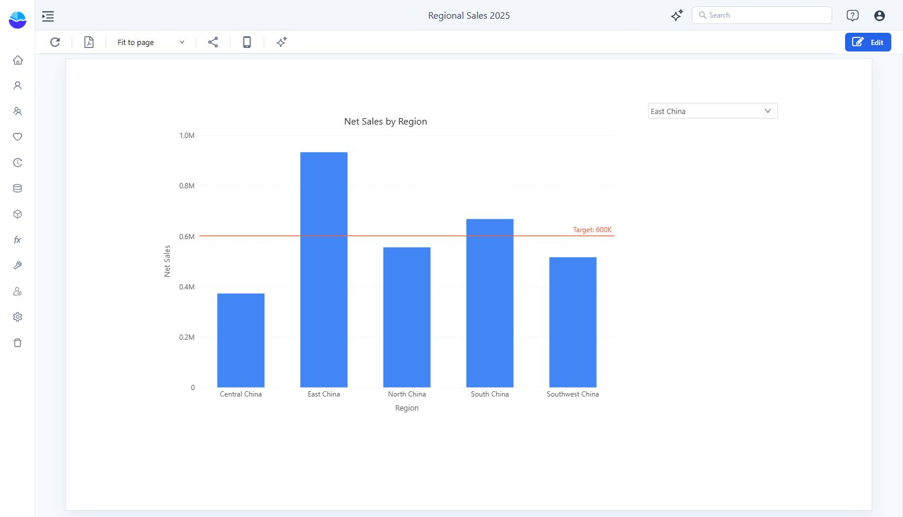

# Visualizer audit: findings and handoff

Date: 2026-10-06. Work stopped at the user's request. Do not run another build unless requested.

**Later verification:** Work resumed on 2026-10-08. See [the follow-up report](../visualizer-2026-10-08/README.md) for current findings. The dropdown issue below was not reproduced in the later session; Numeric slider now exposes Model field and Parameter modes. The report below remains a historical record. Some documentation screenshots linked from it have since been replaced; its local defect screenshot is retained.

This is an internal audit and handoff report, not a declaration that the documentation rewrite or product verification is complete.

## Scope and evidence

- Product inspected: `http://localhost:28080/datafor/console/`, English UI, administrator session supplied by the user.
- Documentation repository: `D:/github_projects/docs-datafor`.
- Supplementary source: `D:/github_projects/datafor-plugin-ui-sources`. Its package version is not proof of the deployed product version.
- Primary evidence: actual UI observations, saved example reports, and screenshots captured during this session.
- No product code was changed. No documentation was published and no Git commit was created.

Earlier access-check files in `audits/` describe the initial connection failure. The service subsequently became available; those historical blocked statuses do not describe this session's final state.

## 1. Product behavior requiring investigation

### P1 — Region dropdown selection did not update its linked chart

**Status:** observed twice in the same example, including after explicitly reselecting and saving the target. Root cause is unknown. This has not been established as a general defect across all filters or reports.

**Example location:** Personal → Visualizer Guide 2026 → Regional Sales 2025.

**Configuration observed:**

- Chart: Clustered column, titled **Net Sales by Region**.
- Analysis model: **Retail Chain Operations**.
- Chart data: **Region** and **Net Sales**, with a component **Year = 2025** filter.
- Dropdown: the same analysis model, with **Region** selected from the field picker.
- Dropdown **Actions → Interactions → Linked components** showed **1 linked**, with **Net Sales by Region** checked.

**Reproduction performed:**

1. Open the report in Edit mode and inspect the dropdown's linked target.
2. Save and open Preview.
3. Select **East China** in the dropdown.
4. Observe that the chart still shows Central China, East China, North China, South China, and Southwest China.
5. Return to Edit; use **Deselect all**, then **Select all** to explicitly reselect the only target. Save and repeat the selection in Preview.
6. The same unchanged five-region chart was observed.

**Expected from the UI's description:** changing the selection filters the checked target component. In this example, the chart should reflect the selected region.

**Actual evidence:** the dropdown displays East China while the chart retains all five regions.

[Target-selection screenshot](../../docs/documentation/Visualization/images/current/filter-interactions.jpg)

**Impact:** a reader may believe a report is filtered when a target has not changed. The interaction cannot be marked as successfully verified for this build.

**Suggested next investigation, not performed:** trace the selection event, persisted target identifier, query filter construction, field matching, and query response. A UI observation alone cannot distinguish those causes.

The example was returned to **All** before stopping. The saved dropdown and its target configuration remain available for reproduction.

## 2. Confirmed documentation mismatches

These are documentation issues, not product defects. Draft corrections have been written locally, but the full rewrite has not completed final review.

| Area | Previous guidance or gap | Current UI observed |
| --- | --- | --- |
| Component names | Measure, Dimension Value, Progress, and older chart names | **Measure card**, **Dimension field**, **Ring progress**, and the reorganized Charts catalog |
| Filter linkage | Subscription terminology and older entry points | **Actions → Interactions → Linked components**; filters also expose **Cascade other filters** |
| Row limits | A **Top/Bottom N** field-menu entry | **Row limit → Enable row limit**, with **Type**, **Sort measure**, and **Row limit** |
| Aggregation | **Aggregation type setting** | Field **More → Aggregation** |
| Conditional colors | **Color Scale / Rule-Based** and older dialog screenshots | **Format style → Gradient / Rules**, plus **Apply to**, **Based on**, **Empty values**, and **Scope** |
| Numeric controls | Parameter slider and numeric-field filtering were not clearly separated | **Numeric slider** selects a parameter; **Range filter** binds **Analysis model → Numeric field** |
| Parameter controllers | **Components → Parameters** | Controllers are in **Components → Filters** |
| Report calculations | **Create calculated measure** as the report-picker button | **New measure** menu with **New measure** and **New quick measure** |
| Tabs | **Dynamic tab display** | **Actions → Default tab rules → Settings**; Data also has **Default tab** |
| Shapes | Separate Rectangle, Ellipse, and Line insertion instructions | **Assists → Shape → Type**, including lines, arrows, and other shapes |
| Tables | Older field/style workflows | Table uses **Fields**; Pivot table uses **Rows / Columns / Measures**; Tree table uses **Hierarchy fields / Fields**; Parent-child table has **Parent / Child / Caption / Fields** |
| Table presentation | Older formatting screenshots | **Table style** presets, accent/density controls, and field-menu **Data bars**, **Icons**, **Font color**, and **Background color** |
| Maps | Older GIS settings path and service examples | **Settings → Data → Maps**, with Mapbox, OpenStreetMap, Google Maps, and Amap settings |
| Console Home | Four task shortcuts described | This deployment shows **Create Report**, **Connect Data**, and **Create Model** |
| Coverage | Missing dedicated guides for several current components | Added draft guides for KPI trend card, Gauge, Area, Heat matrix, Box plot, Funnel, Sunburst, Shapes, Action button, and Web page |

The former axis explanation also incorrectly described continuous points as equally spaced. The replacement distinguishes value/time-based spacing from equally spaced categories and avoids claiming that missing observations become zero.

## 3. Verification completed

| Check | Result and limits |
| --- | --- |
| Create and save the regional sales chart | Completed; reopened from Personal. Region, Net Sales, and the 2025 result remained visible. |
| Table conversion and formatting | Table example saved and reopened with the regional values, a table preset, and data bars. |
| Reference line | A fixed value of **600000** rendered as **Target: 600K** and was saved. |
| Mobile layout | Added the chart, resized it on the phone canvas, and saved. Actual-device verification was not performed. |
| Parameter input | Created a Numeric parameter in a temporary editing session and bound a Numeric slider. The later unsaved scratch changes were discarded. A full parameter-to-formula runtime test was not completed. |
| Tabs names | Overview and Details were entered; Overview remained after switching away from and back to the Data panel. Temporary Tabs changes were discarded. |
| Chart and map configuration | Inspected Data/Style panels for the current catalog. This is configuration evidence, not an end-to-end data test of every chart. |
| Drill-through, row limit, conditional colors, quick measures | Inspected the actual configuration dialogs. Destination navigation, ranking results, and all formula/template outputs were not exhaustively tested. |
| Export | Inspected Excel, CSV, image, and report PDF actions. Output-file correctness was not verified. |
| Lineage | The example graph displayed the report, Retail Chain Operations model, and its source. |

Screenshots are actual English UI captures. No generated mockup has been presented as a product screenshot.

## 4. Repository state at handoff

- **77 existing Markdown files modified**, **10 new guide files added**, and the navigation configuration changed.
- **48 captured image files** currently reside in `docs/documentation/Visualization/images/current/`. Some are working captures and are not referenced by the final draft.
- Existing guide permalinks were retained; new guides received new routes.
- Static link check: **89 scoped pages**, **47 image references**, **0 missing local references** at the recorded check. See [link-check.json](./link-check.json). This check does not validate external links, anchor targets, runtime behavior, or screenshot meaning.
- The already-started build ended unsuccessfully with **EPERM during realpath resolution of a VuePress dependency**. See [build.log](./build.log). This does not prove a Markdown error or a working build. Per the user's instruction, there was no retry.
- The earlier audit's successful baseline build does not validate the current rewrite.

## 5. Work intentionally left unfinished

1. **Final editorial and screenshot review.** In particular, the What-if draft still names `Price Adjustment Rate`, while its replacement parameter screenshot shows `GrowthRate`. Align the example and screenshot before release.
2. **Advanced-guide depth review.** Several long chart guides were condensed substantially. Histogram, Bullet, and Decomposition tree details were partially restored from the inspected source; their complete behavior and instructional coverage still need review.
3. **Terminology and title consistency.** Some preserved frontmatter titles may still use older wording. The Decomposition tree draft also contains an empty intermediate heading that needs cleanup.
4. **Evidence cleanup.** `panels.json` is a raw investigation log. Some early entries were captured under an incorrect intended-component label, and later corrected entries were appended. Do not treat every raw entry as independently verified evidence.
5. **Asset cleanup.** Remove unused working captures only after checking all references. `filter-result.jpg` is not a successful filter-result demonstration and must not be published as one.
6. **Script cleanup.** The temporary rewrite scripts contain copied draft text; some subsequent direct edits are newer. Rerunning them could overwrite corrections. Review or remove them before continuing.
7. **Remaining runtime checks.** Cross-model interactions, parameter-driven formulas/titles, default-tab rule behavior, drill-through destinations, provider-backed maps, and exported files are not covered by a completed end-to-end test in this session.
8. **Site render review.** The final documentation site has not been visually verified. No further build is authorized by the latest instruction.

The two saved example reports are **Regional Sales 2025** and **Regional Sales Table**, under **Personal / Visualizer Guide 2026**. They can be used when work resumes. Temporary unsaved component experiments were discarded; no unrelated reports or system map settings were intentionally changed.
