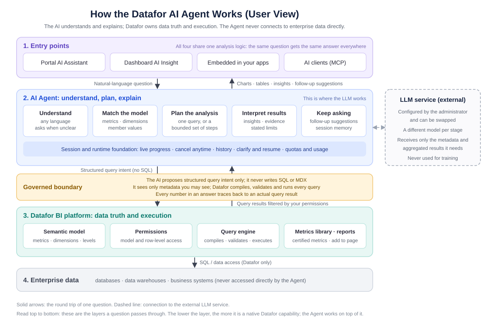

# AI Agent Overview and Roadmap

This page is for everyone who uses the Datafor AI Agent: business users, analysts, and managers who want to know where the product is heading. It answers three questions: **what the Agent can do today, how it works, and what comes next**.

Document date: 2026-09-04. It is updated with each product release; the exact features depend on the version you are running. The console currently labels the AI Agent as **Preview**.

## 1. The Agent in one sentence

The Datafor AI Agent is a data-analysis assistant built on top of Datafor's data models and permission system. You ask in your own words; it answers with charts, tables and conclusions backed by evidence, and you can keep asking follow-up questions.

What separates it from a general-purpose chatbot are three commitments:

- **It only uses data you are allowed to see.** Whatever you cannot see in Datafor, the Agent cannot see either.
- **It never invents.** Metrics and definitions that do not exist in the data model are not made up; when something cannot be done, the Agent says so.
- **Every number has a source.** Each figure in an answer traces back to a query that actually ran.

Today the Agent is not an automatic monitoring or report-writing robot (those are directions on the roadmap, see section 6), and it is not a tool for bypassing BI permissions to reach the database directly.

## 2. What it can do today

### 2.1 Ask a question

| Type of question | Example |
| --- | --- |
| Look up a figure | What is this year's sales by product line? |
| Compare | This year versus last year; online channels versus offline channels |
| Rank | The top 10 customers by sales last quarter |
| Share | Each region's share of total sales |
| Trend | Gross margin over the last 12 months |
| Filter / threshold | Products with a gross margin below 10% |
| Count | How many distinct customers placed an order last month? |
| Ratios and averages | Cost ratio by month compared with last year; average spend per customer |
| Ask about a definition | "How is net sales calculated?" explains the definition without running a query |

While you ask, you will notice:

- **Answers come in the language of the question.** The interface itself is available in eight languages: Chinese, English, Japanese, German, French, Spanish, Italian and Portuguese.
- **Vague time phrases still work.** "Recently" is read as the last 30 days and "the last few days" as the last 7 days. The answer states the date range it used, and one sentence is enough to correct it. A phrase that gives no usable range at all, such as "a while ago", makes the Agent ask.
- **The analysis is visible while it runs:** understanding the question, matching it to your data, querying, concluding. Every step shows on screen, and you can cancel at any time.
- **When something essential is missing, the Agent asks (a clarification).** It offers a few options; you can also answer in your own words, and the analysis continues without re-asking the question.

### 2.2 Complex questions: bounded multi-step analysis

A question that no single query can answer, such as "where did the sales decline come from?" or "which stores have both high sales and a high return rate?", is handled as a plan. The Agent breaks it into a few steps, runs them, shows the result and the evidence of each step, and then combines them into a conclusion.

"Bounded" is deliberate: a limited number of steps, a plan set before execution, and no open-ended automatic exploration. This keeps results checkable and waiting times predictable. If one step cannot be completed, the answer is marked **partial** and says what is missing; everything shown has been verified.

### 2.3 Keep asking

- **Follow-up suggestions**: a few next questions appear under each answer, drawn from the specific objects and findings in that result. One click asks the next question.
- **Build on the previous turn**: "only East China", "break it down by month", "exclude returned orders". There is no need to restate the question.
- **Change the chart without a new query**: "switch to a bar chart", "show it as a pie chart". The chart switches in seconds; nothing is re-analysed.
- **History**: conversations can be reopened. The data model used at the time is restored automatically, and cancelled questions are labelled as cancelled.
- **One failed question does not break the conversation.** Rephrase and ask again.

### 2.4 Working with results

- **Charts, tables and KPI cards** are chosen automatically and can be switched.
- **Insights**: conclusions cite their evidence; hover over or click a citation to reach the exact figure. Each answer also states its **Evidence and boundaries**: how the time window was read, what data was covered, and what limits apply. Read it before quoting a number.
- **Export**: charts as images (**Export image**) and tables as Excel (**Export Excel**). The screen shows only the first rows by default; an export takes the complete result.
- **Add to page**: in the dashboard editor, the Agent's result can be added to the page as a component. The component runs the very query the answer ran.

### 2.5 Dashboard Insights

Click the AI insight button on a dashboard and the Agent explains the data already loaded in the page's charts; **Generate business brief** produces a management brief from the same context. It only analyses what is on the page and never runs extra queries behind the scenes. If the page data is truncated or missing, it says so instead of pretending to have seen everything.

### 2.6 Getting to know a data model

- After you choose a data model, the welcome screen immediately shows an overview of the model (its metrics and dimensions) and **Common Questions**. Common questions can be configured by an administrator or generated by the Agent; neither makes you wait.
- Pick a metric on the welcome screen and use **Quick Actions** to start an analysis directly: **Metric change check**, **Generate metric report**, **View trends**, **Breakdown analysis**, **Compare and rank**, with a time range of your choice.
- Ask "how is metric X defined?" and you get an explanation based on the model's declared definition, without any query being run.

### 2.7 Enterprise metric definitions

If your organisation has registered and certified enterprise metrics in the Datafor Metrics Library (for example "net sales" or "average order value"), the Agent calculates by the certified definition rather than by a similarly named raw field in the model. When a definition is not certified, not bound to the model, ambiguous, or out of step with its actual implementation, the answer says so. The definition-drift check in the Metrics Library is also provided by the Agent.

The chain from a Metrics Library definition, to its binding in the model, to the figure in an answer has been verified end to end: raw fields with deliberately different values sit next to the governed definitions, and which side an answer lands on shows whether the governed definition was applied.

### 2.8 Where you can use it

| Entry point | Notes |
| --- | --- |
| AI Assistant in the portal | The main entry: **Home → AI Agent** |
| Dashboard AI insight | The insight button on a dashboard |
| Embedded in your own applications | Delivered through Datafor's embedding options |
| AI clients (MCP) | Ask Datafor directly from Claude Desktop, Claude Code and other clients that support the MCP protocol |

All four entry points share one analysis logic, the same permissions and the same rules. The same question gets the same answer wherever it is asked.

### 2.9 What administrators see

- **LLM configuration**: set up models from a template or by hand; a model must pass verification before it can be used; each internal stage of the Agent can be assigned a different model; complete schemes can be exported, imported and switched, and API keys are never included.
- **Quotas**: a daily call limit per model and per person, and a daily question quota that can be set by role and user type. Failed and cancelled questions are not counted.
- **Usage**: number of questions, response time, success rate and total tokens, by time range.
- **Vector indexes**: build or rebuild the index of a data model. The console shows the index status, the embedding model used, and the build progress: which stage it is in, how far along it is, whether it is still running, and the reason if it failed. When an index is missing, the chat page shows a notice at the top.
- **Common Questions**: maintain the welcome-screen questions for each model.

## 3. How the Agent works

From top to bottom, these are the layers a question passes through:

1. **Entry points**: the AI Assistant in the portal, dashboard AI insight, embedded applications, and AI clients. The four entry points are only doors; behind them is one and the same Agent.
2. **AI Agent (understand, plan, explain)**: this is the layer where the large language model works. It understands your question, matches the words in it to the metrics, dimensions and member values of your data model, decides whether one query or a few steps are needed, and, once the results are back, writes the insights, marks the evidence and the limits, and suggests follow-up questions. Session memory, clarification, live progress, cancellation, history, quotas and usage statistics also live in this layer. The LLM service is external: your administrator configures it and can swap it. It receives only the metadata and aggregated results needed to answer the question, and nothing is used for training.
3. **Governed boundary**: a clear line between the Agent and Datafor. The AI only proposes a structured "query intent"; it never writes SQL or MDX. The metadata it can see is already filtered by your permissions, and the actual query is compiled, validated and executed by Datafor. This boundary is the root of the Agent's trustworthiness: however capable the AI is, it cannot step over your permissions or change how the data is calculated.
4. **Datafor BI platform**: the semantic model and its metadata, permissions, the query engine, the Metrics Library, dashboards and reports. These are native platform capabilities; the Agent works on top of them.
5. **Enterprise data**: databases, data warehouses and business systems. The Agent never connects to them; all data access goes through Datafor.

The journey of one question in a sentence: **you ask → the Agent understands the question and matches it to the model → the Agent proposes a structured query intent → Datafor executes it under your permissions → the Agent interprets the result and writes the conclusion → you ask the next question**.

## 4. How we keep it trustworthy

| Commitment | How it is kept |
| --- | --- |
| Your permissions, exactly | The metadata and query results the Agent receives are already filtered by your Datafor permissions. There is no side door. |
| Nothing invented | Only metrics, dimensions and member values that really exist in the model can be used. When a phrase cannot be matched, the Agent says so rather than picking something similar. |
| Traceable | Every number corresponds to a query that actually ran, and the citations in an insight point to the exact cell. |
| No unauthorised execution | The AI never writes SQL or MDX. Datafor compiles, validates and executes every query within the platform's complexity policy. |
| Data is used only to answer | The LLM receives only the metadata and aggregated results needed for the question, and nothing is used for training. Which model service is used is your administrator's decision. |
| Careful wording | Correlation is never presented as causation, and the Agent does not forecast the future unless plan or budget data already exists in the model. |
| Limits stated | How the time window was read, what data was covered, and what was left incomplete are all written in the answer's Evidence and boundaries. |

## 5. Current limits

To save you from trying the same thing repeatedly, here is what the Agent cannot do today, or can do only in part:

| Scenario | Today | Suggestion |
| --- | --- | --- |
| Map display | Not supported; regional results are shown as tables or charts | On the roadmap |
| Value distributions and histograms (for example, orders by weight band) | Not supported | On the roadmap |
| A complete report from a single request | Not supported; use the **Generate metric report** quick action or ask step by step | On the roadmap |
| Forecasting | The Agent does not forecast | Compare against plan or budget data that already exists in the model |
| Attribution and causation | The Agent does not claim causes; it presents evidence and leads | Use multi-step analysis to see the breakdown |
| Several data models at once | One conversation works on one data model | Switch the model and ask again |
| Problems in the data itself | The Agent does not correct, fill in or redefine data | Follow your data governance process |
| Very complex combined questions | The Agent may suggest splitting the question in two | Doing so usually gets the answer |

The quality of the data model sets the ceiling for answer quality. Readable field names, synonyms in descriptions, complete time hierarchies and well-formed member values are what make the Agent accurate. That work happens on the Datafor semantic-model side; the Agent does not replace modelling. See [Business Semantics for AI](/documentation/Model/Business-Semantics-for-AI/).

## 6. Roadmap

The ordering principle: **make existing capabilities solid first (the share of questions answered correctly at the first attempt, waiting time, and smoothness across turns), then extend**. No dates are promised below; the release notes of each version are the authority.

### Next

- **Map display**: regional results, such as provinces and cities, drawn directly on a map.
- **More calculation definitions**: value bands and histograms ("orders by weight band"), year-over-year and month-over-month for calculated metrics inside the model, filtering and ranking by calculated definitions, and share within a group. These need the Datafor platform to provide the underlying capabilities first; the Agent then connects to them.
- **Analysis reports**: confirm an outline → analyse section by section → revise → save and share, so the Agent can produce a deliverable report rather than a single answer.
- **AI-drafted metric definitions**: when a new metric is created in the Metrics Library, the AI drafts the definition text for a person to review and certify.
- **More forms of multi-step analysis**: premise checks, breakdowns from several angles, and trade-off analysis.

### Further out (depends on the enterprise semantic layer)

The capabilities below require the Agent to know "what matters": metric targets and baselines, reporting calendars, default analysis dimensions, and priority rules. These belong to the enterprise semantic layer and have to be built on the Datafor platform side first. Until then the Agent will not substitute guesses.

- **Insight briefs and prioritised insight cards**: proactively spot changes worth attention and deliver them ranked by importance.
- **Scheduled analysis and metric change monitoring**: run analyses on a schedule and detect metric anomalies.
- **Subscriptions and delivery**: send conclusions to the channels you already use, with de-duplication, approval and delivery confirmation.
- **Semantic improvement suggestions**: the Agent identifies naming, alias and definition improvements from everyday questions; they take effect after governance review.
- **Triggering external actions**: connect analysis conclusions to business processes, subject to approval and audit.

### Continuous improvement

- **Multi-turn conversation**: a test set that measures whether the Agent "gets smoother with use" is in place; longer follow-up chains and fewer, more precise clarifications improve release by release.
- **First-attempt success rate and response time**: a fixed question bank is run continuously so that a new version is never worse than the previous one.
- **Better models, immediately**: the Agent's analysis logic is not tied to any single model. When a stronger model is connected, capability improves without rework.
- **More languages in documentation and interface details.**

## 7. Feedback

When an answer is wrong, missing, or the experience feels off, give your administrator three things: **the question in your own words, the approximate time, and a screenshot of the answer** including the Evidence and boundaries section at the bottom. That is enough to locate the problem, and it is the most important input for how the roadmap is ordered.

## Related documents

- [How to Enable the AI Feature](/documentation/AI-Agent/AI-Feature/)
- [LLM Configuration](/documentation/AI-Agent/LLM-Configuration/)
- [Preparing Data for AI](/documentation/AI-Agent/Preparing-Data-for-AI/)
- [AI Assistant](/documentation/AI-Agent/AI-Chat/)
- [Common Questions](/documentation/AI-Agent/Common-Questions/)
- [AI Operations and Quotas](/documentation/AI-Agent/LLM-Permission-Management/)
- [Business Semantics for AI](/documentation/Model/Business-Semantics-for-AI/)
- [Metrics Library](/documentation/Metrics-Library/Metrics-Library/)
- [Data Security](/documentation/Datasource/Data-Security/)
