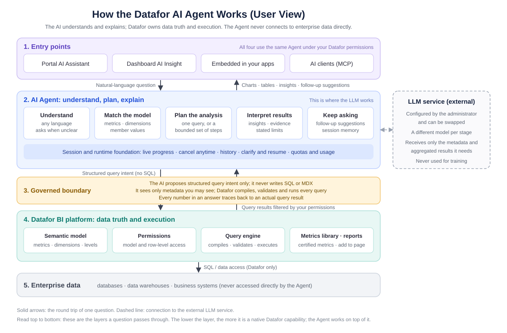

# AI Agent Overview

## 1. The Agent in one sentence

The Datafor AI Agent is a data-analysis assistant built on top of Datafor's data models and permission system. You ask in your own words; it answers with charts, tables and conclusions backed by evidence, and you can keep asking follow-up questions.

What separates it from a general-purpose chatbot are three commitments:

- **It only uses data you are allowed to see.** Whatever you cannot see in Datafor, the Agent cannot see either.
- **It never invents.** Metrics and definitions that do not exist in the data model are not made up; when something cannot be done, the Agent says so.
- **Every number has a source.** Each figure in an answer traces back to a query that actually ran.

The Agent is not an automatic monitoring or report-writing tool, and it is not a way to bypass BI permissions and reach the database directly.

## 2. What it can do today

### 2.1 Ask a question

| Type of question | Example |
| --- | --- |
| Look up a figure | What is this year's sales by product line? |
| Compare | This year versus last year; online channels versus offline channels |
| Rank | The top 10 customers by sales last quarter |
| Share | Each region's share of total sales |
| Trend | Gross margin over the last 12 months |
| Filter / threshold | Products with a gross margin below 10% |
| Count | How many distinct customers placed an order last month? |
| Ratios and averages | Cost ratio by month compared with last year; average spend per customer |
| Explain a change | Why did net sales fall this quarter? Which stores caused the drop? |
| Ask about a definition | "How is net sales calculated?" explains the definition without running a query |

### 2.2 Where to go next

| To | See |
| --- | --- |
| Ask questions in the portal: model selection, change breakdowns, multi-step analyses, clarifications, views, export and **Add to page** | [AI Assistant](/documentation/AI-Agent/AI-Chat/) |
| Explain the data on a dashboard or report page | [AI Insight Component](/documentation/AI-Agent/Insight-Component/) |
| Ask Datafor from Claude Desktop, Claude Code, Codex and other MCP clients | [Connect AI Clients](/documentation/AI-Agent/Connect-AI-Clients/) |
| Turn the AI Agent on and give users access | [How to Enable the AI Feature](/documentation/AI-Agent/AI-Feature/) |
| Assign the LLM stages and the embedding model | [LLM Configuration](/documentation/AI-Agent/LLM-Configuration/) |
| Build and monitor knowledge indexes | [Preparing Data for AI](/documentation/AI-Agent/Preparing-Data-for-AI/) |
| Set question quotas and read usage | [AI Operations and Quotas](/documentation/AI-Agent/AI-Operations-and-Quotas/) |
| Maintain the welcome-screen questions | [Common Questions](/documentation/AI-Agent/Common-Questions/) |
| Make answers more accurate | [Improving AI Agent Answers](/documentation/AI-Agent/Improving-Answer-Quality/) |
| Govern metric definitions the Agent must follow | [Metrics Library](/documentation/Metrics-Library/Metrics-Library/) |

All entry points use the same permissions, the same governed queries and the same rules.

## 3. How the Agent works

From top to bottom, these are the layers a question passes through:

1. **Entry points**: the AI Assistant in the portal, dashboard AI insight, embedded applications, and AI clients. Behind all four is the same Agent.
2. **AI Agent (understand, plan, explain)**: the layer where the large language model works. It understands the question, picks the data model when you have not chosen one, matches your words to the model's metrics, dimensions and member values, decides between one query and a few steps, and, once the results are back, writes the insights, marks the evidence and limits, and suggests follow-up questions. The LLM service is external and chosen by your administrator.
3. **Governed boundary**: the AI only proposes a structured query intent; it never writes SQL or MDX. The metadata it sees is already filtered by your permissions, and Datafor compiles, validates and executes the query. However capable the AI is, it cannot step over your permissions or change how the data is calculated.
4. **Datafor BI platform**: the semantic model, permissions, the query engine, the Metrics Library, dashboards and reports.
5. **Enterprise data**: databases, data warehouses and business systems. The Agent never connects to them; all data access goes through Datafor.

## 4. How we keep it trustworthy

| Commitment | How it is kept |
| --- | --- |
| Your permissions, exactly | The metadata and query results the Agent receives are already filtered by your Datafor permissions. There is no side door. Automatic model selection only considers models you can see, and never names the others. |
| Nothing invented | Only metrics, dimensions and member values that really exist in the model can be used. When a phrase cannot be matched, the Agent says so rather than picking something similar. |
| Traceable | Every number corresponds to a query that actually ran, and the citations in an insight point to the exact cell. |
| No unauthorised execution | The AI never writes SQL or MDX. Datafor compiles, validates and executes every query within the platform's complexity policy. |
| Data is used only to answer | The LLM receives only the metadata and aggregated results needed for the question, and nothing is used for training. Which model service is used is your administrator's decision. |
| Careful wording | Correlation is never presented as causation: a change decomposition reports contributions, not causes. The Agent does not forecast the future unless plan or budget data already exists in the model. |
| Limits stated | How the question was read, including the date basis, is shown under **Technical details**, and what limits the answer is listed in its **Limitations**. |

## 5. Current limits

To save you from trying the same thing repeatedly, here is what the Agent cannot do today, or can do only in part:

| Scenario | Today | Suggestion |
| --- | --- | --- |
| Map display | Not supported; regional results are shown as tables or charts | Use a map chart in a dashboard |
| Value distributions and histograms (for example, orders by weight band) | Not supported | Use a histogram chart in a dashboard |
| A complete report from a single request | Not supported | Use the **Generate metric report** quick action, or ask step by step |
| Forecasting | The Agent does not forecast | Compare against plan or budget data that already exists in the model |
| Attribution and causation | Change questions get a contribution breakdown across up to three dimensions, plus factor splits for declared ratio and difference metrics. Contributions are not causes, and causes outside the data are not claimed. | Name the dimensions or the factors you want in the question |
| Ratios without a declared numerator and denominator (for example a formula with `*100` or a function) | Period comparisons and decompositions of such a ratio may be partial | Ask the model author to write the ratio as numerator / denominator; see [Write ratios as numerator and denominator](/documentation/Model/Business-Semantics-for-AI/#write-ratios-as-numerator-and-denominator) |
| Several data models at once | One conversation works on one data model; the model can be picked automatically from the question | Change the model in the selector or start **New Chat** |
| Long multi-step analyses | Query steps stop at the time limit (180 seconds in the AI Assistant); finished steps are returned as a partial answer | Ask a narrower question, or one dimension at a time |
| Problems in the data itself | The Agent does not correct, fill in or redefine data | Follow your data governance process |
| Very complex combined questions | The Agent may suggest splitting the question in two | Doing so usually gets the answer |

The quality of the data model sets the ceiling for answer quality. Readable field names, synonyms in descriptions, complete time hierarchies and well-formed member values are what make the Agent accurate. That work happens on the Datafor semantic-model side; the Agent does not replace modelling. See [Business Semantics for AI](/documentation/Model/Business-Semantics-for-AI/).

## 6. Feedback

When an answer is wrong, missing, or the experience feels off, give your administrator three things: **the question in your own words, the approximate time, and a screenshot of the answer**, with **Technical details** expanded. That is enough to locate the problem.

## Related documents

- [Business Semantics for AI](/documentation/Model/Business-Semantics-for-AI/)
- [Data Security](/documentation/Datasource/Data-Security/)
