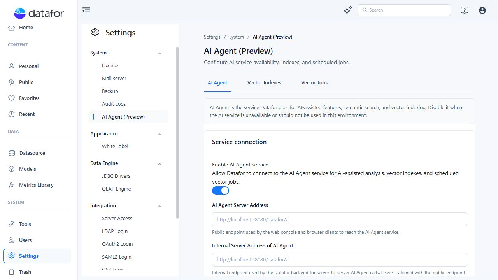

# How to Enable the AI Feature

Datafor uses the AI Agent service for conversational analysis, semantic search, vector indexes, and scheduled vector jobs. An administrator can enable the service and configure the public and internal endpoints from one page.

## 1. Open the AI Agent settings

1. Sign in to the Datafor console with an administrator account.
2. Go to **Settings → System → AI Agent (Preview)**.
3. Open the **AI Agent** tab.

## 2. Enable the service

Turn on **Enable AI Agent service**. This allows Datafor to use the AI Agent for AI-assisted analysis, vector indexes, and scheduled vector jobs.

## 3. Configure the service endpoints

The current settings page has two endpoint fields:

| Field | Used by | Configuration |
| --- | --- | --- |
| **AI Agent Server Address** | The web console and browser clients | Enter the public URL that users' browsers can reach. |
| **Internal Server Address of AI Agent** | The Datafor backend | Keep it aligned with the public endpoint unless the backend must use a separate private address. |

In the locally verified deployment, both fields are empty and the AI Assistant uses the unified Datafor service successfully. The UI shows `http://localhost:28080/datafor/ai` as a placeholder, not as a value that must be copied to every environment.

If your deployment supplies explicit endpoints, use the addresses provided by the deployment administrator. The public address must be reachable by browser clients. Use a different internal address only when the Datafor backend has a separate server-to-server route.

## 4. Save and verify

1. Click **Save changes**.
2. Return to **Home**.
3. Open **AI Agent**.
4. Confirm that the **AI Assistant** page loads and that **New Chat**, **History**, **Common Questions**, **Ops**, and **LLM** are available.

## Troubleshooting

| Symptom | Check |
| --- | --- |
| AI Assistant does not open | Confirm that **Enable AI Agent service** is on and the configured public endpoint is reachable from the browser. |
| Backend AI requests fail but the page loads | Check **Internal Server Address of AI Agent** and server-to-server network access. |
| **Save changes** is disabled | The form has no unsaved changes. Modify a setting only when the deployment configuration needs to change. |
