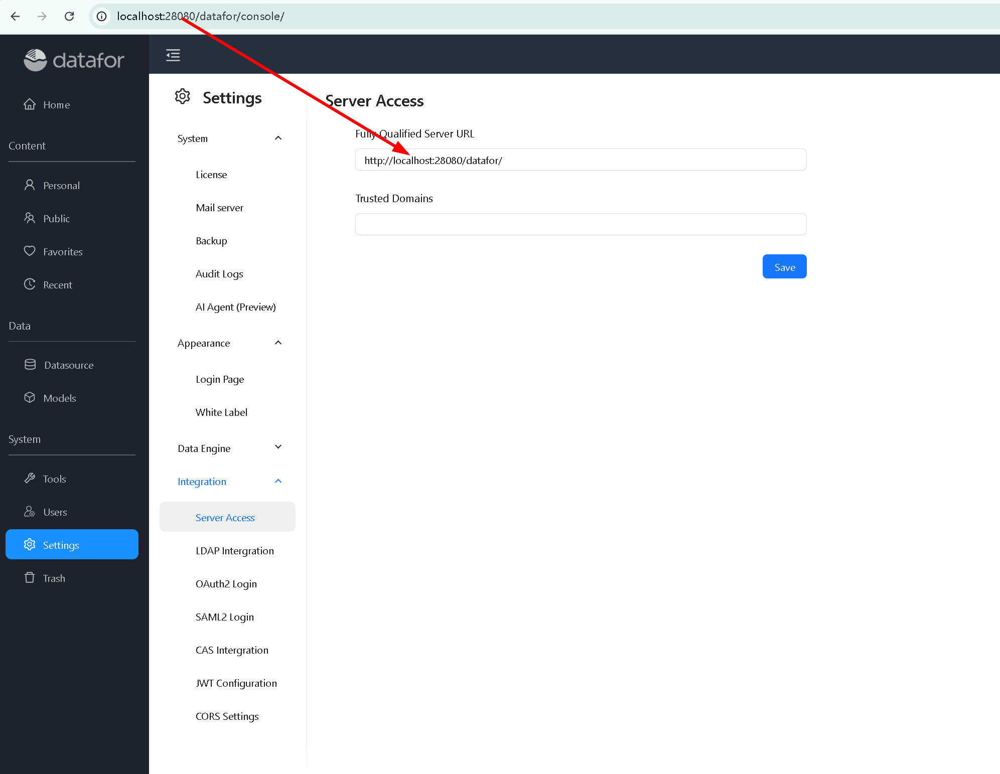

# How to Enable the AI Feature

This guide explains how to enable the **AI feature** in the Datafor application. The steps vary depending on whether you are using **Nginx as a reverse proxy** or accessing the AI service **directly**.

## 1. Enable the AI Agent in Datafor

1. In the Datafor console, go to:
   **Settings → System → AI Agent (Preview)**

2. Switch **AI Agent Status** to **On**.

3. Click **Save**.

## 2. Without a Proxy

If you are **not using a reverse proxy** (such as Nginx), you can keep the default configuration.

<div align="left"></div>  

* The **AI Agent Server** should be set to the `Fully Qualified Server URL` (up to but not including the port) with **port 28081** appended.

<div align="left"></div>  

* If your configuration uses `localhost`, replace it with your actual **server IP address**.
* Ensure that port **28081** is open and accessible from client machines. Clients must be able to connect directly to the AI Agent service on this port.

## 3. Using Nginx as a Reverse Proxy

If you are using **Nginx** as a reverse proxy, add the following block to your configuration to support AI features:

```nginx
location ~ ^/(chat|llm|configure|prompt|user) {
    client_max_body_size 1000m;
    client_body_buffer_size 128k;
    fastcgi_intercept_errors on;
    proxy_pass http://localhost:28081;
    proxy_redirect http:// https://;

    proxy_set_header Host $host:$server_port;
    proxy_set_header X-Real-IP $remote_addr;
    proxy_set_header X-Real-PORT $remote_port;
    proxy_set_header X-Forwarded-For $proxy_add_x_forwarded_for;
    proxy_set_header X-Forwarded-Proto $scheme;
}
```

### Notes:

* `client_max_body_size 1000m;` allows large payloads required for AI operations.
* `proxy_pass` should point to your backend AI service (e.g., `http://localhost:28081`).
* The header settings ensure that client and protocol information is correctly forwarded.

When using Nginx, set the **AI Agent Server Address** to the **proxy URL**.

<div align="left"></div>  

## 4. Completion

After completing these steps, the AI feature in Datafor will be enabled successfully, whether you are accessing the service **directly** or through **Nginx**.
