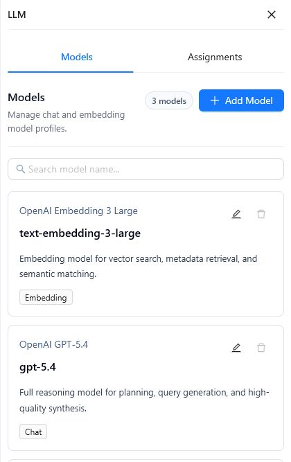
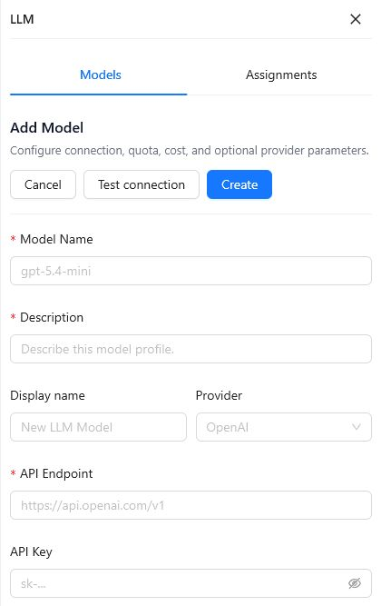
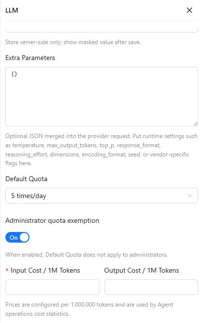
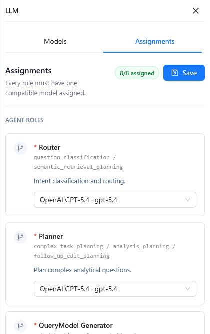

# LLM Configuration

This guide is for administrators who need to configure Large Language Models (LLMs) for Datafor AI Agent. After configuration, the Agent can use LLM-backed capabilities such as question understanding, analysis planning, query model generation, result interpretation, follow-up question generation, and semantic retrieval.

## 1. Open the LLM Configuration Panel

1. Open the Datafor console.
2. Sign in with an administrator account.
3. Open AI Agent.
4. Click **LLM** in the top toolbar.

The **LLM** panel opens on the right side. It contains two tabs:

- **Models**: Manage model profiles, including model name, API endpoint, API key, quota, and cost.
- **Assignments**: Assign model profiles to the Agent roles that use them at runtime.

<div align="left"></div>

## 2. Prepare the Required Information

Before adding a model, prepare the following information:

- Model provider, such as OpenAI, Qwen, DeepSeek, Gemini, Anthropic, or a custom OpenAI-compatible service.
- Model name, such as `gpt-5.4-mini` or `text-embedding-3-large`. Use the exact model ID required by the provider.
- API endpoint. For OpenAI-compatible services, this is usually a base URL such as `https://api.openai.com/v1`.
- API key.
- Input and output token prices per 1,000,000 tokens. These values are used for Agent operations cost statistics.
- An embedding model, if you need semantic retrieval, metadata recall, or semantic matching.

## 3. Add a Model Profile

On the **Models** tab, click **Add Model** and fill in the model profile form.

<div align="left"></div>

Field reference:

| Field | Required | Description |
| --- | --- | --- |
| **Model Name** | Yes | The provider-specific model ID. Chat models and embedding models should be created as separate profiles. |
| **Description** | Yes | Describes how the model should be used. It is recommended to clearly state whether the profile is for Chat or Embedding. |
| **Display name** | No | The name shown in the UI. It does not affect model calls. |
| **Provider** | No | Select OpenAI, Qwen, DeepSeek, Gemini, Anthropic, or Custom. |
| **API Endpoint** | Yes | The model service endpoint. OpenAI-compatible services usually use the base `/v1` endpoint. |
| **API Key** | No | The key used to access the model service. After saving, the key is stored on the server and shown as a masked value in the UI. |

The current UI does not provide a separate **Capability** selector. The system infers model capability from the model name, display name, or description. A model containing `embedding` or `embed` is usually recognized as an Embedding model; otherwise, it is treated as a Chat model by default. When configuring an embedding model, include `embedding` or `embed` in the model name or description so it appears in the **Embedding Model** assignment list.

## 4. Configure Advanced Parameters, Quota, and Cost

Scroll down in the **Add Model** form to configure optional runtime parameters, quota, and cost.

<div align="left"></div>

**Extra Parameters** accepts an optional JSON object. These values are merged into the provider request. Example:

```json
{
  "temperature": 0.1,
  "max_output_tokens": 4096,
  "response_format": { "type": "json_object" }
}
```

Important notes:

- **Extra Parameters** must be a valid JSON object. Arrays and plain text are not allowed.
- Do not put connection secrets or endpoint fields such as `api_key`, `Authorization`, `endpoint`, or `base_url` in **Extra Parameters**. Use the dedicated fields instead.
- **Default Quota** supports `5`, `10`, `20`, or `50` calls per day.
- When **Administrator quota exemption** is enabled, the default quota does not apply to administrators.
- **Input Cost / 1M Tokens** is required. **Output Cost / 1M Tokens** is optional. Both values are used for Agent operations cost statistics.

After filling in the form:

1. Click **Create** to save the model profile.
2. To test provider connectivity after saving, click the edit icon on the model card and then click **Test connection**.

In the current UI, **Test connection** on the new-model form mainly validates required fields and JSON format. The real backend connectivity test is available from the edit page of an already saved model. If the real test fails, check the API key, endpoint, model name, and provider compatibility parameters.

## 5. Assign Models to Agent Roles

After creating model profiles, open the **Assignments** tab. Every role must have one compatible model assigned before assignments can be saved.

<div align="left"></div>

Roles are divided into two groups:

| Group | Role | Required model type | Purpose |
| --- | --- | --- | --- |
| Agent Roles | Router | Chat | Classifies questions, identifies intent, and routes requests. |
| Agent Roles | Planner | Chat | Plans complex analytical questions. |
| Agent Roles | QueryModel Generator | Chat | Generates the governed `SimplifiedQueryModel`. |
| Agent Roles | Query Repair | Chat | Reserved for future query repair stages. |
| Agent Roles | Answer Writer | Chat | Explains query results, dashboard insights, visualization recommendations, and complex analysis synthesis. |
| Agent Roles | Follow-up Generator | Chat | Generates follow-up questions and alternative analysis suggestions. |
| Agent Roles | Reference Evaluator | Chat | Reserved for offline or manual evaluation. |
| System Roles | Embedding Model | Embedding | Used for vector search, metadata retrieval, and semantic matching. |

Recommended setup:

- For an initial setup, assign all **Agent Roles** to one stable Chat model to reduce configuration complexity.
- For quality-sensitive roles such as **Planner**, **QueryModel Generator**, and **Answer Writer**, use a stronger Chat model.
- For cost-sensitive or latency-sensitive roles such as **Router** and **Follow-up Generator**, you may switch to a lighter Chat model after validating quality.
- **Embedding Model** must use an Embedding model. It cannot use a regular Chat model.

When every role is assigned, click **Save**.

## 6. Verify That the Configuration Works

After saving, run a basic validation:

1. Go back to **New Chat**.
2. Select an analysis model.
3. Ask a simple analytical question, such as a monthly trend for a metric.
4. Confirm that the Agent can understand the question, run the query, and return an interpreted result.

If the Agent reports that the LLM is unavailable, the connection failed, authentication failed, or roles are not configured, return to the **LLM** panel and check both the model profiles and role assignments.

## 7. Troubleshooting

| Problem | How to fix it |
| --- | --- |
| Creating a model fails | Check that **Model Name**, **Description**, **API Endpoint**, and **Input Cost / 1M Tokens** are filled in, and that **Extra Parameters** is a valid JSON object. |
| Assignments cannot be saved | Every role must have a model assigned. Agent Roles require Chat models, and **Embedding Model** requires an Embedding model. |
| A new embedding model does not appear in the Embedding dropdown | Check whether the model name, display name, or description contains `embedding` or `embed`. The current UI uses these terms to infer model capability. |
| The delete button is disabled | The model is currently assigned to one or more roles. Reassign those roles to another model, save the assignments, and then delete the model. |
| The API key is not visible after saving | This is expected. The key is stored on the server and shown as a masked value. To replace it, edit the model and enter a new key. |
| Connection test returns 401 or 403 | The API key is usually invalid, lacks permission, or the provider account is not available. |
| Connection test returns 400 or 404 | The endpoint, model name, API mode, or provider compatibility parameter is usually incorrect. |
| Connection test times out | Check network connectivity from the server to the model provider, including firewall and proxy settings. |

## 8. Security Recommendations

- Only administrators should maintain model profiles and role assignments.
- Do not put API keys in **Extra Parameters**, screenshots, support tickets, or ordinary chat messages.
- After changing provider, model name, or endpoint, run the connection test again and validate the Agent with a simple analytical question.
- In production, use clear descriptions for Chat and Embedding model profiles so that auditing, troubleshooting, and cost analysis are easier.
