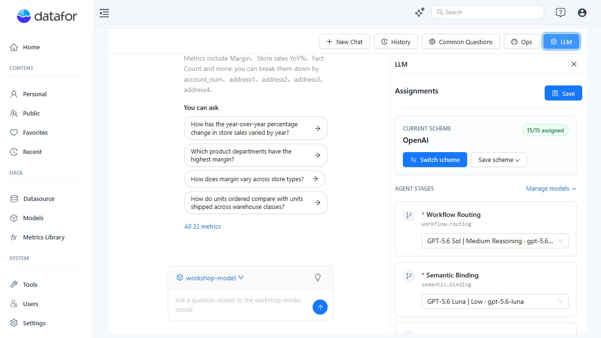
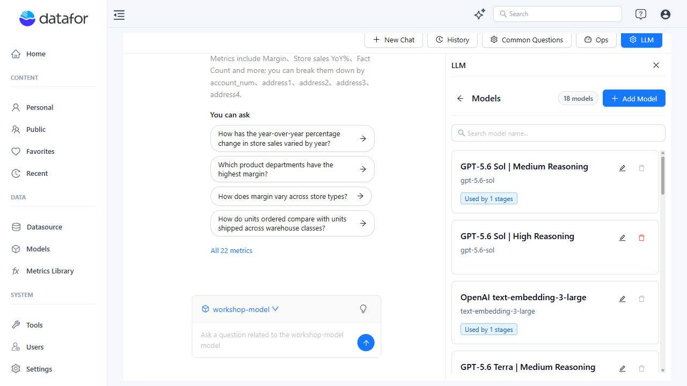
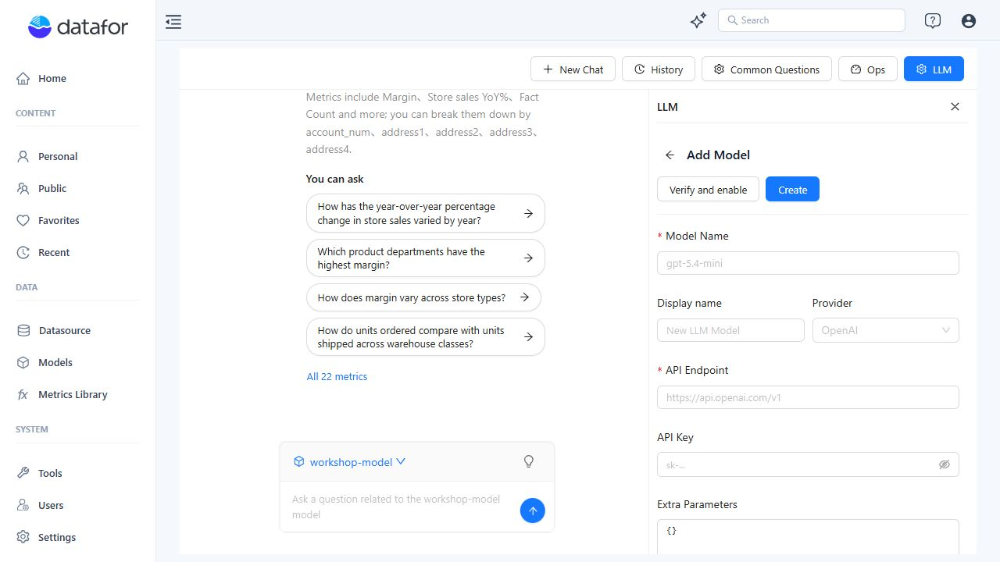
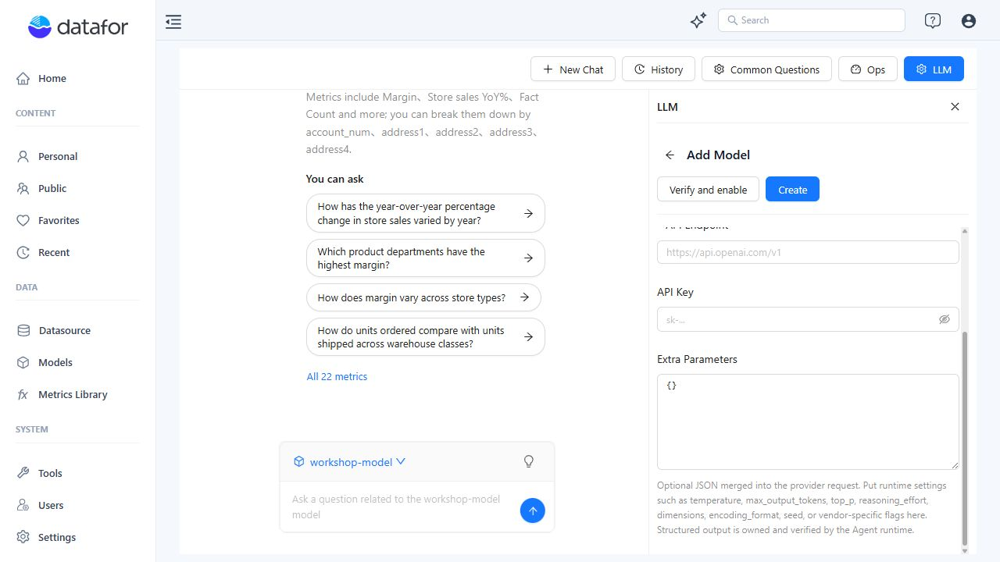
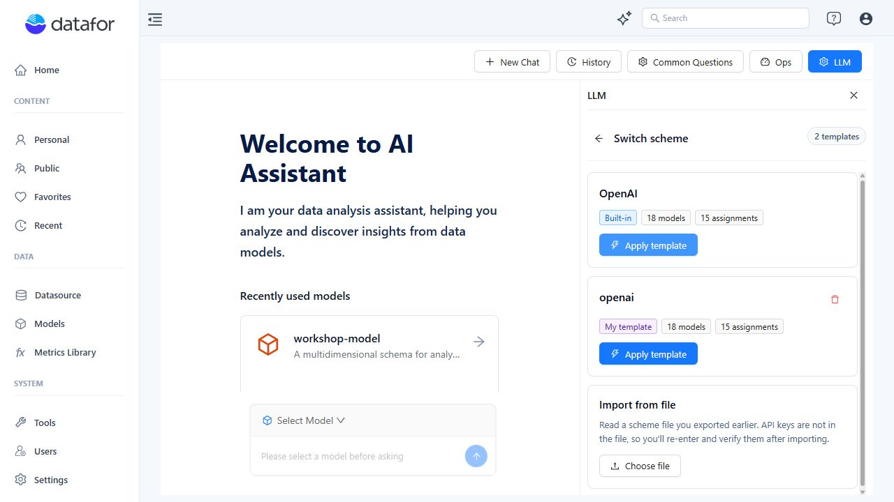

# LLM Configuration

LLM configuration has three layers:

| Layer | What it controls |
| --- | --- |
| **Model profile** | Provider connection, model ID, API key, and request parameters. |
| **Assignment** | The profile used by each Agent stage and by the embedding system role. |
| **Scheme** | A reusable snapshot of profiles and assignments. |

## 1. Open LLM configuration

1. Open **Home → AI Agent**.
2. Click **LLM** in the top toolbar.

The LLM panel is available to administrators in the full AI Agent view. It opens on **Assignments** and shows the current scheme and assignment status.

The current configuration has 14 Agent stages and one **Embedding Model** role. **15/15 assigned** means that every role has a compatible profile and every chat profile has current structured-output verification. It is not a continuous provider-health check.

## 2. Create and enable a model profile

From **Assignments**, click **Manage models →**, then click **Add Model**.

| Field | Required | Description |
| --- | --- | --- |
| **Model Name** | Yes | Exact provider model ID used at runtime. |
| **Display name** | No | Label shown in model lists and assignment selectors. |
| **Provider** | No | Endpoint preset and provider identifier. Options are OpenAI, Qwen, DeepSeek, Gemini, Anthropic, and Custom; OpenAI is the default. |
| **API Endpoint** | Yes | HTTP(S) provider base endpoint. |
| **API Key** | To verify | Required by **Verify and enable**. When editing, leave it blank to keep the saved key. |
| **Extra Parameters** | No | Valid JSON object merged into the provider request. The default is `{}`. |

For Agent stages, use an OpenAI Responses or OpenAI-compatible Chat endpoint. A provider appearing in the menu does not guarantee that its native API is compatible; **Verify and enable** is the acceptance check.

The form has no capability selector. A new profile is classified as an embedding profile when its name or display name contains `embed` or `embedding`; otherwise it is classified as chat. Prefer a supplied scheme or import file when you need an explicitly defined capability.

### Correct activation order

1. Click **Create** for a new profile, or **Update** after editing an existing profile.
2. Open the saved profile and click **Verify and enable**.
3. Wait for the live provider verification to succeed.
4. Assign the profile to the required stages.

Verification of an unsaved draft is not retained. Changing the provider, model ID, endpoint, API key, or effective request parameters clears the previous verification; save the change and run **Verify and enable** again.

For chat profiles, verification checks real structured output against the provider. It is not a local ping and can make multiple provider calls. Unverified chat profiles cannot be assigned to Agent stages.

## 3. Configure Extra Parameters

Use **Extra Parameters** only for provider request settings such as `temperature`, `max_output_tokens`, `top_p`, reasoning effort, embedding `dimensions`, `encoding_format`, `seed`, or vendor-specific flags.

The value must be a JSON object. Do not put credentials, authorization headers, endpoints, `response_format`, `tools`, `tool_choice`, or structured-output controls here; the runtime removes those keys. Do not set both `reasoning_effort` and `thinking_budget`.

Parameter shape depends on the adapter. For example, OpenAI Responses uses `{"reasoning":{"effort":"medium"}}`, while an OpenAI-compatible Chat endpoint may use `{"reasoning_effort":"medium"}`.

## 4. Manage model profiles

Model cards show the display name, provider model ID, assignment usage, missing-key status, and structured-output verification status.

- **Structured output not verified**: save the profile, then run **Verify and enable**.
- **Used by _n_ stages**: reassign those stages and save before deleting the profile.
- **No API key**: edit the profile and provide a key before verification.

Saved keys are masked in the UI and API. Leaving the API Key field blank while editing preserves the saved key.

## 5. Assign models to runtime stages

Return to **Assignments**. All 15 rows are currently required.

| Assignment | Runtime key | Used for |
| --- | --- | --- |
| Workflow Routing | `workflow.routing` | Choosing the governed workflow for the request. |
| Semantic Binding | `semantic.binding` | Checking business meaning against model implementation. |
| Semantic Draft | `semantic.draft` | Producing the semantic query draft. |
| Analysis Strategy | `analysis.strategy` | Planning a bounded multi-step investigation. |
| Investigation Step Query | `analysis.investigation_step_query` | Generating the governed query for one investigation step. |
| Evidence Analysis | `analysis.evidence` | Interpreting query results as evidence-backed findings. |
| Follow-up Suggestions | `analysis.follow_up` | Proposing bounded next questions. |
| Investigation Observation | `analysis.investigation_observation` | Normalizing one investigation result into an observation. |
| Investigation Replan | `analysis.investigation_replan` | Deciding whether the investigation plan needs adjustment. |
| Investigation Synthesis | `analysis.investigation_synthesis` | Producing the final answer from investigation evidence. |
| Model Brief | `model.brief` | Summarizing model metadata and analytical capabilities. |
| Dashboard Review | `dashboard.review` | Analyzing the supplied dashboard context. |
| Question Suggestions | `model.question_suggestions` | Generating model-grounded sample questions. |
| Failure Explanation | `workflow.failure_explanation` | Wording a failure that the workflow has already decided. |
| Embedding Model | `retrieval_embedding` | Vector search, metadata retrieval, and semantic matching. |

Agent-stage selectors list verified chat profiles. The **Embedding Model** selector lists embedding profiles. A profile can be reused across multiple stages.

Click the **Save** button at the top of **Assignments** after any change. Assignment changes are not saved automatically. Saved assignments are read for each subsequent stage call and do not require a service restart. A required stage does not fall back to an old model ID or an unassigned spare profile.

## 6. Use schemes

**Current scheme** records the template that was last applied or saved. Later manual assignment changes do not rename it, so the scheme name is not proof that the live configuration still matches the template.

Use the controls as follows:

- Top **Save**: saves the live stage and system-role assignments.
- **Save scheme → Save current configuration**: saves the current profiles and assignments as a custom template.
- **Save scheme → Export to file**: downloads the current profiles and resolvable assignments as JSON.
- **Switch scheme**: applies a built-in or custom template, or imports a previously exported JSON file.

Save live assignments before saving a scheme. Schemes and exports never contain API keys.

When applying a scheme, review the stage changes, enter the provider API key, and change the shared endpoint only if the deployment uses a gateway or proxy. Datafor creates or overwrites profiles referenced by the scheme, verifies them, and writes assignments last; unrelated profiles are untouched. If verification is incomplete, assignments can remain pending. Return to **Assignments**, resolve any warnings, confirm **15/15 assigned**, and click **Save**.

After importing, add the missing API keys and run **Verify and enable** on the saved profiles before saving assignments.

If a scheme changes the **Embedding Model**, rebuild the vector index for every data model immediately. An index built with the previous embedding model is not compatible with the new one.

## 7. Verify the configuration

1. Confirm **15/15 assigned** with no verification warning.
2. Click the top **Save** button.
3. Open **New Chat**, select an analysis model, and confirm that its brief and suggested questions load.
4. Run a representative analytical question that exercises routing, query generation, and answer synthesis.

| Symptom | Action |
| --- | --- |
| A model is absent from an Agent-stage selector | Confirm it is a chat profile, save it, and run **Verify and enable**. |
| **Structured output not verified** | Check provider access, endpoint, API key, model ID, and parameters; then verify the saved profile again. |
| The Assignments **Save** button is disabled | Complete all 15 rows and resolve every compatibility or verification warning. |
| A previously assigned stage becomes unavailable after a profile edit | Save the profile and rerun **Verify and enable**; verification is tied to the effective runtime configuration. |
| Imported assignments remain pending | Add API keys, verify imported chat profiles, review all roles, then click **Save**. |
| Retrieval fails after changing the Embedding Model | Rebuild every model's vector index with the new embedding profile. |
