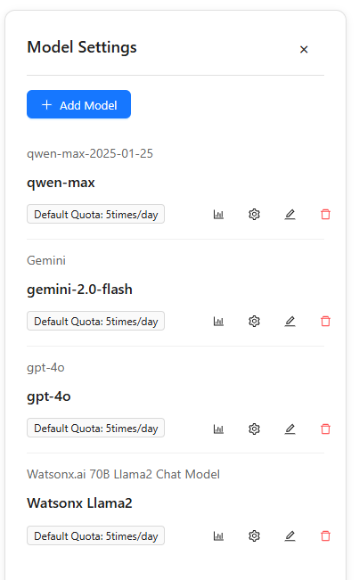

# LLM Configuration

This guide explains how to connect and manage Large Language Models (LLMs) in Datafor so the AI Assistant can use providers such as OpenAI, Google Gemini, IBM watsonx, and Alibaba Qwen.

------

## 1) Open the Model Settings panel

1. Click **Model Settings** on the top toolbar.

   <div align="left"></div>

2. In the right-side panel you can:

   - **Add Model** to create a new connection,
   - **Edit** an existing model,
   - **View usage** (chart icon),
   - **Delete** a model (trash icon).

   <div align="left"></div>

You can switch the **Current LLM** from the drop-down at the top of the page before starting a new conversation.

## 2) Add or edit a model

Open **Add Model** or **Edit** on a listed model to see the form. Fill the fields as below:

- **Model Name** *(required)*
   A human-friendly name (e.g., `gpt-4o-mini`, `gemini-2.0-flash`, `qwen-max-2025-01-25`).

- **Description** *(required)*
   Short text to help teammates recognize the model (e.g., `OpenAI gpt-4o-mini`, `IBM llama-3.3-70B instruct`).

- **API Endpoint (Base URL)** *(required)*
   The provider base URL (see reference in Section 3).

- **API Key** *(required)*
   Your provider key with permission to call the selected model.

- **Extra Parameters (JSON, optional)**
   Provider-specific fields (e.g., project/workspace ID). Must be valid JSON, for example:

  ```json
  {"project_id": "311f8a30-df8f-4bb4-9c30-d64b4fc2358e"}
  ```

- **Input Cost / Output Cost** *(currently unused)*
   These are placeholders for future budgeting/quotas. They **do not affect** model usage yet.
   **Recommendation:** leave both as `0`.


<div align="left"></div>

Click **OK** to save.


## 3) Provider quick reference

| Provider                                | Typical Base URL (API Endpoint)                            | Extra Parameters                                    |
| --------------------------------------- | ---------------------------------------------------------- | --------------------------------------------------- |
| **OpenAI**                              | `https://api.openai.com/v1/`                               | None in most cases                                  |
| **Google Gemini (OpenAI-compatible)**   | `https://generativelanguage.googleapis.com/v1beta/openai/` | None; ensure the key has Generative Language access |
| **IBM watsonx**                         | `https://eu-de.ml.cloud.ibm.com`                           | `{"project_id":"<your-project-id>"}` (required)     |
| **Alibaba Qwen (DashScope compatible)** | `https://dashscope.aliyuncs.com/compatible-mode/v1`        | Usually none                                        |

> Tip: If a provider offers an **OpenAI-compatible** endpoint, use it to simplify setup.


## 4) Switch and manage models

- **Switch default model**
   Use the **Current LLM** drop-down at the top of the page. New chats will use this model by default.

- **Per-model actions** (in the right list):

  - **Usage** (chart icon): view call counts/usage trends.
  - **Edit** (gear/pencil): update endpoint, key, extra parameters.
  - **Delete** (trash): remove the connection.
  - **Quota badge** (e.g., *Default Quota: 5 times/day*): shows the default call allowance for that model (if configured by admins).

  <div align="left"></div>


## 5) Validate the connection

1. Save the model and set it as **Current LLM**.
2. Start a **New Conversation** and ask a sample question.
3. If the call fails, check:
   - The **API Endpoint** matches the provider format (e.g., includes `/v1` or `/openai/` where required).
   - The **API Key** is valid, active, and has product access.
   - Required **Extra Parameters** are present (e.g., watsonx `project_id`).
   - Your network allows outbound HTTPS to the provider (proxy/firewall rules).
