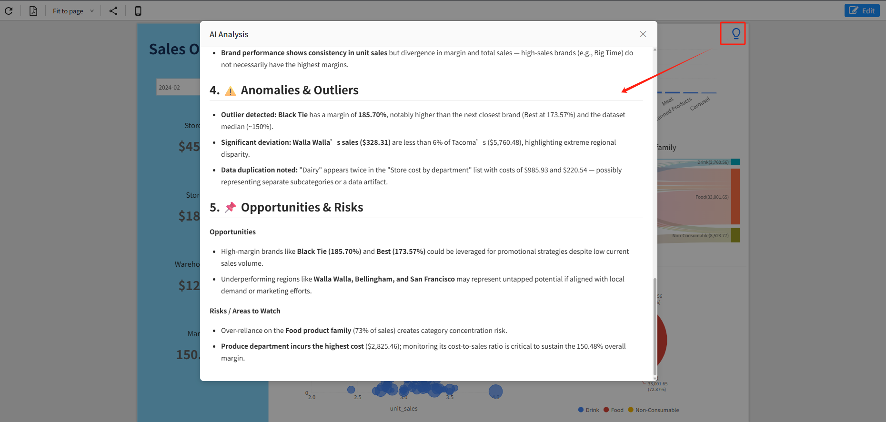

# Insight Component

## 1. Feature Overview

The **Insight component** is the intelligent analysis entry point in the Datafor Dashboard.  
In dashboard design mode, you can place the Insight button (lightbulb icon) anywhere on the dashboard.

In **Preview mode**, when a user clicks the Insight button, the system automatically collects data from all visible charts on the dashboard and sends it to the AI model. The AI then generates a structured and professional insight report.  
All insights are strictly based on dashboard data and do not use any external information.

## 2. Adding the Insight Component to the Dashboard

In the component panel on the right side of the Dashboard:

1. Open the **Assists** category  
2. Locate the **Insight** component  
3. Drag it onto the dashboard  
4. Adjust the size and position so it fits the layout naturally

## 3. Configuring Insight Component Styles

When the Insight component is selected, its property settings will appear in the panel on the right:

### **3.1 Border**

- Border style  
- Border width  
- Shadow (enable or disable)  
- Round edges  

These settings allow you to customize the overall look of the Insight button.

### **3.2 Description of the Image (Label Text)**

You can add a text label to the Insight button, for example:

> “Click to see AI Insights”

Supported configurations:

- Font size  
- Bold / Italic  
- Font color  
- X / Y offset to control the label’s position within the button

### **3.3 Image Options**

- **Show Image**: Toggle display of the default lightbulb icon  
- **Button Image**: Upload a custom icon (PNG/SVG)

These options can be used for branding or replacing the default icon.

### **3.4 Hover Style**

- Hover Background Color  
  Controls the background color when the mouse hovers over the Insight button, enhancing the interaction experience.

## 4. Triggering AI Insights in Preview Mode

After finishing the design, click the **“Preview”** button at the top-right corner to enter dashboard viewing mode.

In Preview mode:

1. The user clicks the Insight button  
2. The system automatically collects data from all visible charts  
3. The data is sent to the AI model for processing  
4. The insight report is generated and displayed in a popup window

The insight report usually includes:

- **Key Takeaways**  
- **Metrics Breakdown**
- **Trend & Pattern Analysis**
- **Anomalies & Outliers**
- **Opportunities & Risks**

All conclusions are based entirely on the dashboard’s data and reflect the current filter selections.

## 5. Summary

The Insight component enables AI-powered data interpretation within dashboards.  
During the design phase, you can:

- Place the Insight button anywhere  
- Customize its appearance, icon, and label text  
- Keep its visual style consistent with the dashboard

During usage, users only need to click once to obtain insights based on the current view—making dashboards not only display data, but also automatically interpret and summarize it.
