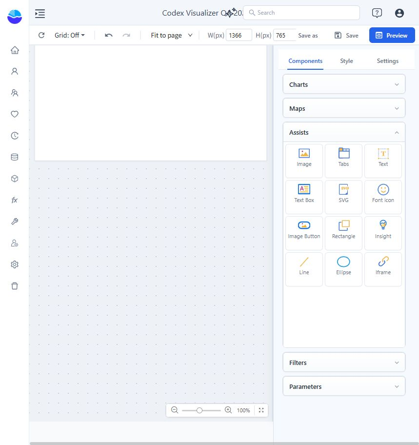
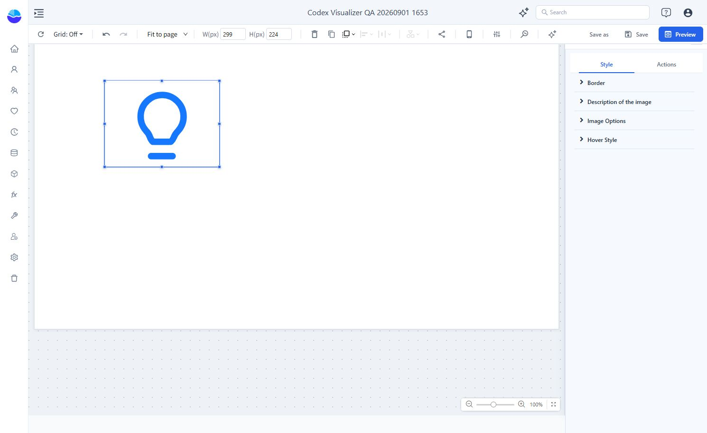

# Insight Component

The **Insight** component is an AI insight button that report authors can place on a report page. It remains available in the current report editor under **Components → Assists**.

## 1. Add the component

1. Open a report and click **Edit**.
2. In the right panel, open **Components**.
3. Expand **Assists**.
4. Select **Insight** and draw the component on the canvas.

## 2. Configure its appearance

Select the component on the canvas. The current **Style** panel contains these sections:

- **Border**
- **Description of the image**
- **Image Options**
- **Hover Style**

Use these settings to control the button border, image description, icon options, and hover appearance. Resize and position the component like any other report component.

## 3. Use the component

1. Save the report.
2. Click **Preview**.
3. Click the Insight button to start the report's AI insight action.

If the report has unsaved changes, Datafor asks whether to save before entering Preview. The exact generated output depends on the report and the environment's AI configuration. Treat generated text as an interpretation, not as a replacement for governed metric definitions or source-data validation.

## Troubleshooting

| Symptom | Check |
| --- | --- |
| Insight is not available in the palette | Confirm that you are editing a report and have expanded **Components → Assists**. |
| Preview asks whether to save | Choose whether to save the current report changes before continuing. |
