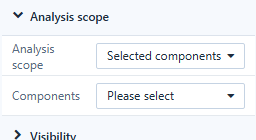

# AI Insight Component

**AI insight** (called *Insight* before 10.00) is a button on the report page. A click sends the data of the page, a tab or selected components to the AI Agent, which returns an overview and key insights.

## Add it

1. In the report editor, open **Components → Assists** and click **AI insight**, then click the canvas (default 400 × 240 px).
2. On **Actions → Analysis scope**, choose what it reads:

| Analysis scope | Reads |
| --- | --- |
| **Whole page** (default) | All data components on the page |
| **Current tab page** | The components on the same tab of the same Tabs component; the whole page if the button is not on a tab |
| **Selected components** | The components you pick in **Components**; the whole page if none are picked |

3. Style the button under **Style**: **Border** (with background and effects), **Description of the image**, **Image Options** and **Hover Style**.
4. Optionally set **Actions → Visibility** to show it only to some users, roles or parameter values.

Clicking the component opens the insight, also in the editor; you do not need to preview first. The insight leaves out the AI insight component itself, empty components and Rich text value blocks, and says which components it skipped.

The insight analyses only the data already loaded in the page's components and runs no extra queries. When that data is truncated or incomplete, the answer says so. **Generate business brief** writes a management brief from the same data.

## Open insight from other components

Any Text, Rich text, Image, Icon, Shape or Action button can open the same insight: set its click action to **Open AI insight** and choose an **Analysis scope**. See [Click Actions and Visibility](/documentation/Visualization/Click-Actions-and-Visibility/).

## Requirements

- The AI Agent must be configured and the reader must be allowed to use it. See [How to Enable the AI Feature](/documentation/AI-Agent/AI-Feature/) and [AI Operations and Quotas](/documentation/AI-Agent/AI-Operations-and-Quotas/).
- The insight reads the data the reader is allowed to see, under the current filters.
- Treat the text as an interpretation of the numbers on the page, not as a replacement for governed metric definitions.

## Troubleshooting

| Symptom | Check |
| --- | --- |
| *The AI insight component is not loaded, so insight cannot be opened* | A button uses **Open AI insight** on a page where the insight extension could not load. Reload the report; check that the AI insight component is installed. |
| The insight ignores a chart | The chart was empty, or it is outside the chosen **Analysis scope**. |
| Nothing happens on click | Check that the AI Agent service is running and configured. |
