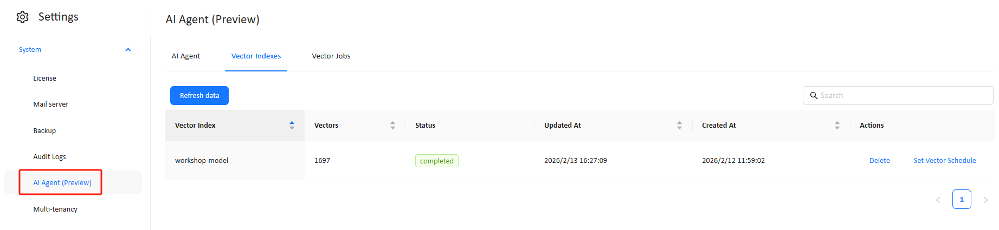
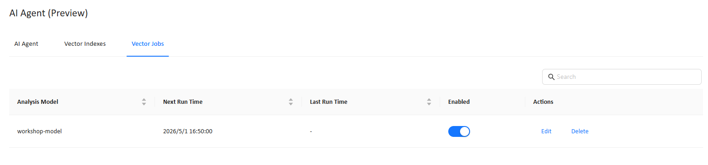

# **Preparing Data for AI**

Datafor AI Agent (Preview) relies on vectorized metadata and level values to understand business semantics, improve natural language reasoning, and provide accurate analytical insights. This document explains how to configure embedding models, run **Prep Data for AI**, set up scheduled vectorization, and inspect stored vector indexes.

# **0. Prerequisite: Configure Embedding Model**

Before performing any vectorization task—including **Prep Data for AI**, **Vector Schedules**, or **Vector Indexes**—you must configure an embedding model.

**Location:**
 **AI Agent (Preview) → Embedding Model**

### **Steps**

1. Open the **Embedding Model** configuration panel.
2. Select an embedding provider and model:

#### **OpenAI Models**

- `text-embedding-3-small`
- `text-embedding-3-large`

#### **Qwen Models**

- `text-embedding-v3`
- `text-embedding-v4`

3. Enter the corresponding **API Key**.
4. Click **Save**.

### **Why This Matters**

- All semantic search, metadata understanding, and vector indexing depend on the embedding model.
- Incorrect or missing configuration may cause:
  - Prep Data for AI to fail
  - Scheduled vectorization to fail
  - Vector indexes to remain empty
- Higher-quality embedding models typically improve the AI Agent’s natural language interpretation accuracy.

# **1. Prep Data for AI (On-Demand Vector Index Build)**

When you update an **analysis model** and want the AI to recognize the latest business semantics immediately, use **Prep Data for AI** to build or refresh the vector index on demand.

**Entry point:** **Models** → (⋯) action menu on an analysis model → **Prep data for AI**

### **What Prep Data for AI does**

- Creates (first run) or refreshes (subsequent runs) the **vector index** for the selected **analysis model**
- Vectorizes:
  - **Model metadata** (dimensions, levels, captions/names, business descriptions)
  - **Text-based level values** (e.g., product names, regions, brands—when applicable)
- Stores embeddings in **ChromaDB** for semantic retrieval by AI Agent

### **When to run it**

Run **Prep Data for AI** after you manually change or publish updates such as:

- Dimension / level names (captions)
- Level definitions / hierarchies
- Business descriptions / glossary text
- Text-based level values the AI should understand (new products, regions, brands, customers, etc.)

> Tip: This is the fastest “refresh now” option. Scheduling (automation) is configured via **Vector Indexes → Set Vector Schedule**.

# **2. Vector Indexes (View & Manage Vector Data + Scheduling)**

**Location:**
 **Settings → AI Agent (Preview) → Vector Indexes**

This page lists the vector indexes created by **Prep Data for AI** and shows their current state and scale.

### **2.1 Information displayed**

- **Vector Index** name (typically mapped to model ID/name)
- **Vectors** (number of embeddings stored)
- **Status** (e.g., completed / failed)
- **Updated At** timestamp
- **Created At** timestamp

> **Refresh data** only refreshes the table display—it does not trigger re-vectorization.

### **2.2 Available actions**

| Action                  | Description                                                  |
| ----------------------- | ------------------------------------------------------------ |
| **Delete**              | Permanently deletes the vector index                         |
| **Set Vector Schedule** | Creates/updates an automated vectorization schedule for this index |

**After deletion:**

- The analysis model remains usable
- AI semantic understanding may decrease (because vectors are removed)
- You must rerun **Prep Data for AI** to rebuild vectors

# **3. Set Vector Schedule (Automated Refresh for an Index)**

Scheduling is configured **from the vector index**, not as a separate “create job” flow.

**How to configure:** **Vector Indexes** → **Set Vector Schedule**

### **3.1 Schedule configuration**

| Field                    | Description                                                  |
| ------------------------ | ------------------------------------------------------------ |
| **Circulate**            | Execution frequency: **Run once / Daily / Weekly / Monthly / Yearly / Cron** |
| **Start time**           | Time of day the job should run                               |
| **Date commenced**       | The effective start date of the schedule                     |
| **Cron** (when selected) | Use a cron expression for advanced timing control            |

**Typical usage**

- **Daily/Weekly**: best for frequently changing master data (products, customers, stores, etc.)
- **Run once**: schedule a single future refresh (e.g., after a planned ETL load)
- **Cron**: precise control (e.g., run after upstream pipelines complete)

# **4. Vector Jobs (Monitor Scheduled Runs)**

**Location:**
 **Settings → AI Agent (Preview) → Vector Jobs**

This page shows all schedules created via **Set Vector Schedule**, including runtime information and enablement status.

### **4.1 Information displayed**

- **Analysis Model**
- **Next Run Time**
- **Last Run Time**
- **Enabled**
- **Actions**: **Edit**, **Delete**

### **4.2 Job behavior**

- Scheduled runs refresh the model’s vector index automatically based on the configured frequency
- You can **disable** a schedule temporarily without deleting it
- Use **Edit** to change frequency/time (or cron), and **Delete** to remove the schedule

# **5. Technical Notes: ChromaDB Integration**

Datafor uses **ChromaDB** as its vector storage engine to support:

- Semantic similarity search over model metadata and text values
- Faster matching between user questions and business concepts/fields
- Better grounding for AI Agent’s “intent → field” mapping

# **6. Best Practices**

1. **Run Prep Data for AI after model/schema changes**  
   Ensures the AI recognizes updated names, hierarchies, and business descriptions immediately.

2. **Use schedules for fast-changing level values**  
   If products/brands/customers/stores change frequently, configure **Daily/Weekly/Cron**.

3. **Monitor Vector Jobs regularly**  
   Track **Next Run Time / Last Run Time** to ensure automation is working.

4. **Clean unused vector indexes**  
   Keep only what you use to reduce storage and operational clutter.

# **Conclusion**

Vectorization is essential for enabling Datafor AI Agent to **understand your business semantics**. By combining:

- **Prep Data for AI** (on-demand build/refresh)
- **Vector Indexes → Set Vector Schedule** (automation)
- **Vector Jobs** (monitoring and management)

you ensure that the AI Agent delivers accurate, natural, and reliable analytical experiences.