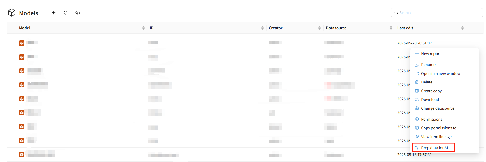

# **Preparing Data for AI**

Datafor AI Agent (Preview) provides a complete vectorization toolchain that converts analysis model metadata and text-based dimension level values into embeddings and stores them in **ChromaDB**. This enables the AI Agent to understand business semantics, improve analytical accuracy, and enhance natural-language query experiences.

This document introduces the three core features in Datafor—**Prep Data for AI**, **Vector Jobs**, and **Vector Indexes**—and explains how to use them effectively.

## ## 1. Overview: How Does AI Understand Your Business Data?

To answer business questions correctly, AI must understand the structure and semantics of your analysis model, including:

- Dimension names and their business meaning  
- Hierarchical levels  
- Common text values (e.g., city names, brand names)

Datafor converts these textual elements into vectors and stores them in **ChromaDB**.  
During natural-language processing, the AI Agent retrieves these vectors to perform semantic matching, enabling more accurate field recognition and business understanding.

## ## 2. Prep Data for AI (Model Page Action)

Location: **Models → Action Menu → Prep data for AI**

In the model list, you can find the **Prep data for AI** action from the menu on the right side of each model.

### **Purpose**

- Vectorize the model’s **metadata**
- Vectorize **text-based dimension level values**
- Automatically save embeddings into ChromaDB
- Each execution performs **incremental vectorization**, processing only new or updated items

### **When to Use**

✔ A model has new dimensions, measures, or levels  
✔ New level values appear (e.g., new countries, new cities, new brands)  
✔ You want to manually refresh vectors  

This is the fastest way to perform on-demand vectorization.

---

## ## 3. Vector Jobs (Scheduled Vectorization Tasks)

Location: **Settings → AI Agent (Preview) → Vector Jobs**

As business data grows—new products, new regions, new customers—manually clicking “Prep data for AI” becomes inefficient.  
**Vector Jobs** allow you to create **automated scheduled vectorization tasks**.

### ### 3.1 Creating a Vector Job

Click **Create Job** to open the configuration dialog:

Configuration options include:

| Field                 | Description                                                         |
| --------------------- | ------------------------------------------------------------------- |
| **Analysis Model**    | Select the analysis model to vectorize                              |
| **Dimension Fields**  | Select dimension fields to vectorize (usually text-based levels)    |
| **Run Immediately**   | Whether to execute a vectorization run right away                   |
| **Schedule**          | Define the execution frequency (once, daily, weekly, etc.)          |
| **Description**       | Optional notes                                                      |

### ### 3.2 Job Behavior

- Each run vectorizes only incremental updates  
- Results are automatically saved into ChromaDB  
- Tasks can be enabled, disabled, edited, or deleted  

### ### 3.3 When to Use

✔ Level values change frequently (cities, brands, store names, etc.)  
✔ You want AI to always stay up-to-date with business semantics  
✔ Multiple models require continuous vector updates  

## ## 4. Vector Indexes (Viewing and Managing Vector Data)

Location: **Settings → AI Agent (Preview) → Vector Indexes**

After vector data is created, it appears in the Vector Indexes list. This section allows users to inspect and manage stored vector indexes.

### **Displayed Information Includes:**

- **Vector Index name** (usually associated with a model or job)
- **Number of vectors**
- **Status (completed/failed)**
- **Updated At timestamp**
- **Created At timestamp**

### **Available Actions**

| Action      | Description                                 |
| ----------- | ------------------------------------------- |
| **Delete**  | Permanently deletes the vector index         |

After deleting an index:

- The model remains available  
- But AI semantic understanding decreases  
- You must rerun Prep Data for AI or a Vector Job to rebuild the vectors  

## ## 5. Technical Notes: Datafor Uses ChromaDB

Datafor integrates **ChromaDB** as its vector database. All model metadata and text dimension embeddings are stored and retrieved through ChromaDB.

Benefits include:

- Fast semantic similarity search  
- Scalable vector storage  
- Provides rich semantic context for AI Agent  
- Supports incremental updates  

## ## 6. Best Practices

### **1) Run Prep Data for AI after creating or updating a model**

Ensures AI can recognize all model structures.

### **2) Use Vector Jobs for models with frequently changing level values**

Especially useful for geography, products, brands, or customer attributes.

### **3) Check Vector Indexes regularly**

Ensures vectorization jobs are running correctly and data remains fresh.

### **4) Clean up unused vector indexes when removing models or fields**

Keeps the vector store clean and improves performance.

# **Conclusion**

Vectorization enables the Datafor AI Agent to truly *understand* your analysis model and business semantics.  
By utilizing **Prep Data for AI**, **Vector Jobs**, and **Vector Indexes**, you can easily manage vector data and ensure the AI delivers more accurate, natural, and intelligent analytical experiences.
