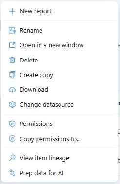
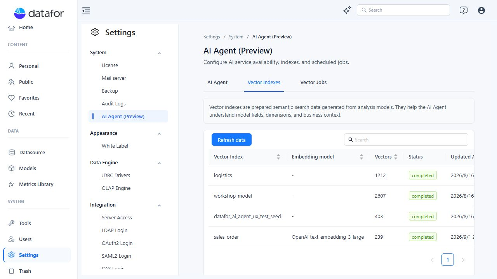
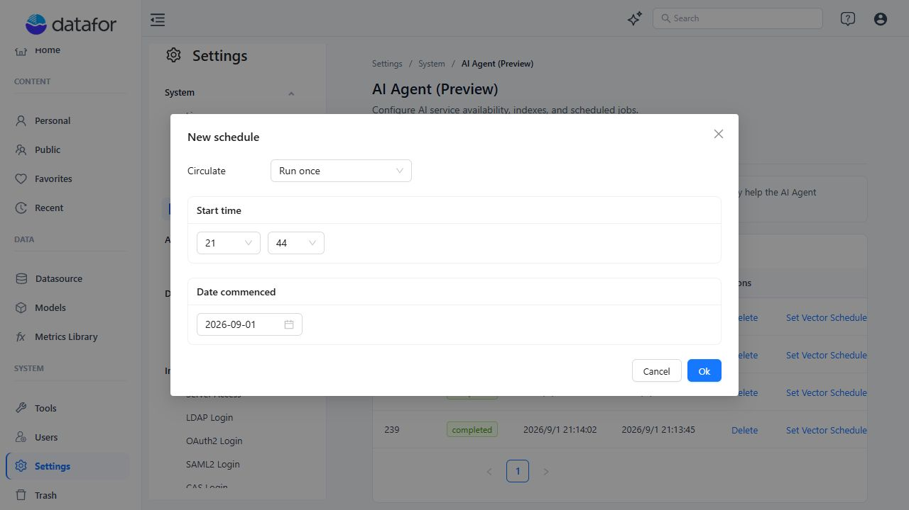
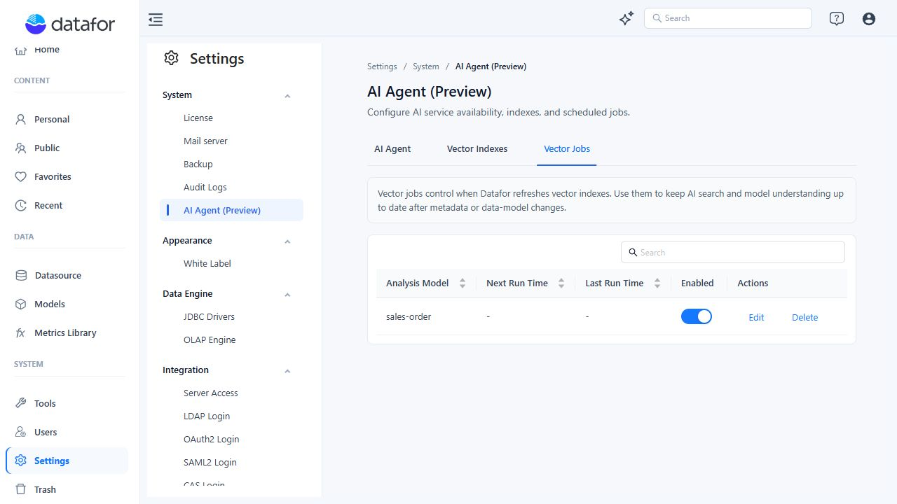

# Preparing Data for AI

Datafor prepares vector indexes from analysis models so the AI Agent can retrieve model fields, dimensions, and business context. The current workflow uses an embedding profile assigned in **LLM**, an on-demand action on each analysis model, and the **Vector Indexes** and **Vector Jobs** pages under system settings.

## 1. Assign an embedding model

1. Open **Home → AI Agent → LLM**.
2. In **Assignments**, find **System Roles → Embedding Model** (`retrieval_embedding`).
3. Select a compatible embedding profile.
4. Click **Save**.

If the required profile does not exist, click **Manage models → Add Model** and create it first. Embedding models now use the same model-profile form as generative models; there is no separate Embedding Model configuration page.

## 2. Prepare an analysis model on demand

1. Open **Models**.
2. Open the action menu for the analysis model.
3. Click **Prep data for AI**.

Use this action after creating a model or after changing metadata that the Agent should retrieve. It starts on-demand data preparation for the selected model; verify the resulting state on **Vector Indexes**.

## 3. Review vector indexes

Go to **Settings → System → AI Agent (Preview) → Vector Indexes**.

The current table shows:

- **Vector Index**
- **Embedding model**
- **Vectors**
- **Status**
- **Updated At**
- **Created At**
- **Actions**

**Refresh data** reloads the table. To rebuild an index from the model, use **Prep data for AI** from the model action menu.

Available row actions are:

| Action | Effect |
| --- | --- |
| **Delete** | Opens the delete action for the selected vector index. |
| **Set Vector Schedule** | Opens the schedule form for that index. |

## 4. Configure a vector schedule

On **Vector Indexes**, click **Set Vector Schedule** for the required model.

The current frequency choices are **Run once**, **Daily**, **Weekly**, **Monthly**, **Yearly**, and **Cron**. Set the start time and commencement date; additional fields appear for frequencies that need them.

## 5. Monitor vector jobs

Go to **Settings → System → AI Agent (Preview) → Vector Jobs**.

The page shows the analysis model, next run time, last run time, enabled state, and **Edit**/**Delete** actions. Disable a job when a schedule should be paused without removing it.

## Recommended workflow

1. Verify the embedding profile and assignment.
2. Run **Prep data for AI** after important model-metadata changes.
3. Confirm that the index reaches **completed** status.
4. Use a schedule when metadata or the data model changes regularly.
5. Review **Vector Jobs** after changing a schedule.

The storage implementation is intentionally not part of this administrator workflow; use the Datafor UI and supported service interfaces instead of depending on a particular vector-database product.
