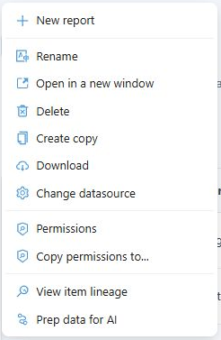
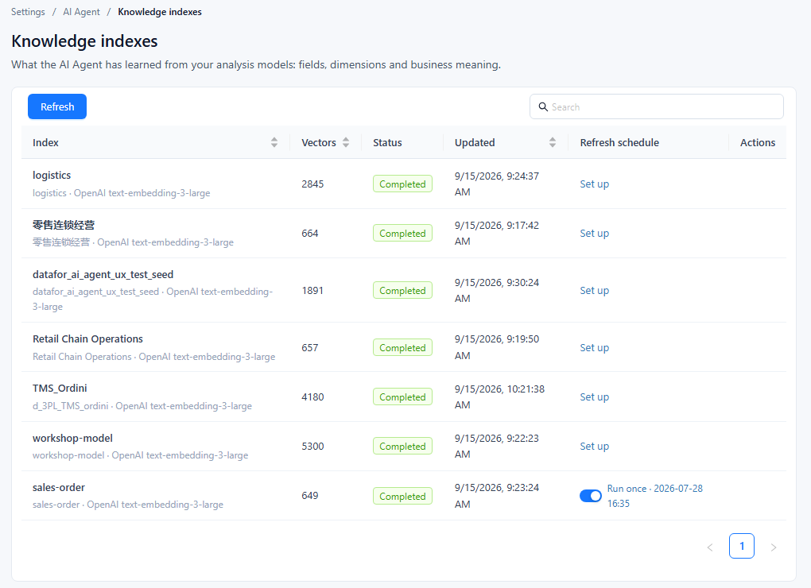

# Preparing Data for AI

A **knowledge index** holds what the AI Agent has learned from an analysis model: its fields, dimensions, business meaning and member values, stored as vectors made by the embedding model. Versions before 9.04.6 called it a *vector index*, and the AI Assistant's messages still use that term.

The Agent uses the index to recognise business terms, near-synonyms and member values ("East Region", "Completed"), to pick the relevant fields of a large model, and as evidence when it chooses the analysis model for a question that names none. Without an index the Agent still answers, but noticeably worse.

## 1. Assign an embedding model

1. Click **AI Agent** in the left navigation, then **LLM**.
2. In **Assignments**, find **System Roles → Embedding Model** (`retrieval_embedding`).
3. Select a compatible embedding profile.
4. Click **Save**.

If the required profile does not exist, click **Manage models → Add Model** and create it first. Embedding models use the same model-profile form as generative models; there is no separate Embedding Model configuration page.

Changing the embedding model later makes every existing index incompatible. Rebuild each one as described in section 4.

## 2. Let indexes build automatically

With **Auto-build knowledge index** on, Datafor builds or updates a model's index in the background whenever the model is written. The switch is in **Settings › General › System configuration**, group **AI Agent**: "Built in the background after an analysis model is saved or uploaded." It is **on by default**.

| Action on the model | Effect on its knowledge index |
| --- | --- |
| Save in the modeler, including **Save as** | Builds the index if the model has none; otherwise syncs the changes. |
| Copy the model | Builds an index for the new copy. |
| Import a ZIP file | Builds indexes for the models that did not exist before the import. A model the import overwrites keeps its old index until it is saved again. |
| Rename the caption only | No build. |

The build runs as the user who saved the model and only when AI is enabled. It never blocks or fails the save: if the build fails, the failure shows only on **Knowledge indexes**. Turning the switch on does not build indexes for existing models ("Applies to subsequent model saves or uploads. Does not rebuild existing indexes."). Use **Prep data for AI** for those.

## 3. Build an index on demand

1. Open **Models**.
2. Open the action menu for the analysis model.
3. Click **Prep data for AI**, then confirm.

The confirmation reads "Build or update the knowledge index for this model? It runs in the background; you can follow its progress under Settings › AI Agent › Knowledge indexes." Like an automatic build, it creates the index when there is none and otherwise syncs the changes.

Use it when **Auto-build knowledge index** is off, for models that have not been saved since the switch was turned on, and after a failed build.

## 4. Review knowledge indexes

Go to **Settings › AI Agent › Knowledge indexes**. The page lists one row per cube of each analysis model. **Refresh** reloads the list; while a build is running, the list refreshes itself every 10 seconds ("A build is running; refreshing every 10 seconds").

| Column | Content |
| --- | --- |
| **Index** | The cube, with the analysis model and the embedding model below it. |
| **Vectors** | Number of vectors in the index. |
| **Status** | **Pending**, **Indexing**, **Completed**, or **Failed**. A running build also shows its stage (for example **Fetching field values** or **Generating vectors**) and a progress bar; after 3 minutes without progress it shows "No progress for N min". A failed build shows its failure reason and a **Details** link. |
| **Updated** | When the index last changed. |
| **Refresh schedule** | **Set up**, or the model's schedule ("frequency · time") with an on/off switch. See section 5. |
| **Actions** | The row menu described below. |

| Action | Effect |
| --- | --- |
| **Details** | Opens the build record: analysis model, index, status, stage, embedding model, vectors, **Run started**, **Run finished**, **Duration**, **Last activity**, **Updated**, **Created at**. A failed build adds **Failure reason** and **Diagnostic details**, with **Copy**; the full log is in the AI service's `logs/app.log`. |
| **Rebuild index** | Deletes this index and builds it again from scratch. Not available while a build is running. Users get the "being built" message (section 6) until it completes, so rebuild outside busy hours. |
| **Set refresh schedule** / **Delete refresh schedule** | Create, edit or remove the model's refresh schedule. Deleting the schedule keeps the index. |
| **Mark as failed** | Only while a build is **Pending** or **Indexing**. Use it for a build that stopped making progress, for example after the AI service restarted, so that it can be rebuilt. If the build is in fact still running, it overwrites this status when it finishes. |
| **Delete** | Deletes the index of every cube in the model ("Indexes of every cube in this model are removed."). |

## 5. Set a refresh schedule

A refresh schedule re-reads the model's field values on a timetable, so that new members, such as new stores or products, become recognisable without a model save.

1. In the **Refresh schedule** column, click **Set up** (or **Set refresh schedule** in the row menu).
2. Choose the frequency: **Run once**, **Daily**, **Weekly**, **Monthly**, **Yearly**, or **Cron**. Set the start time and commencement date; additional fields appear for frequencies that need them.
3. Confirm. "Refresh schedule saved" appears.

A schedule belongs to the analysis model, so every index row of that model shows the same schedule. Use the switch to pause it; a paused schedule shows **Paused**. If a model has a schedule but no index, the page warns "These models have a refresh schedule but no index: …" and offers **Delete refresh schedule**.

## 6. What users see while an index is not ready

| Situation | What the AI Assistant does |
| --- | --- |
| No usable index: never built, the first build failed, or it was built with another embedding model | Shows the banner **Vector index is temporarily unavailable** at the top. A question that names specific values ends with "This question names specific values (such as a store or a region), and matching them to this model's data needs the model's vector index, which is not ready yet. Ask an administrator to build it; after that the question will work as asked." For a model with very many fields: "This model has too many fields to read all of them at once, and the vector index that picks the relevant ones is not ready yet. …" Asking again does not help until the index is built. |
| The first build is running | No banner. Questions that need the index end with the same messages, worded "…which is being built right now. It usually takes a few minutes; after that the question will work as asked." |
| An update or sync is running, or the last sync failed | The Agent keeps answering from the last completed build. The failure reason shows on **Knowledge indexes**. |
| **Rebuild index** is running | There is no previous build to fall back on, so users get the "being built" messages until the rebuild completes. |

## Recommended workflow

1. Verify the embedding profile and its assignment.
2. Keep **Auto-build knowledge index** on, and check **Knowledge indexes** after important model changes.
3. Run **Prep data for AI** for any model that has no index yet and has not been saved since auto-build was turned on.
4. Add a refresh schedule when member values change regularly.
5. After changing the embedding model, click **Rebuild index** for every index.

The storage implementation is intentionally not part of this administrator workflow; use the Datafor UI and supported service interfaces instead of depending on a particular vector-database product.
