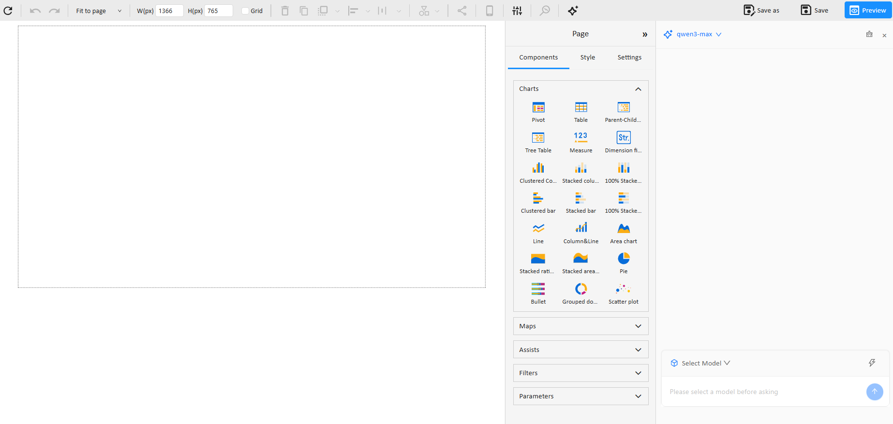
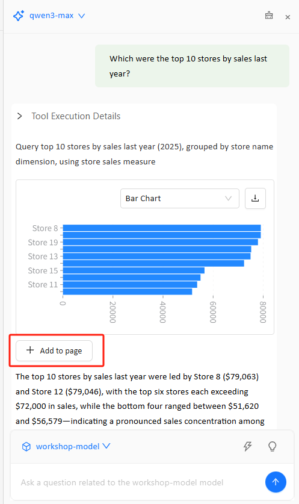
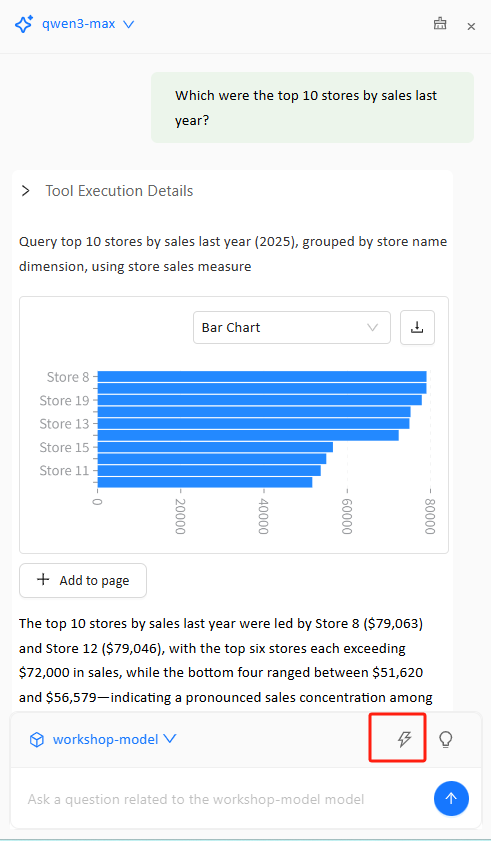
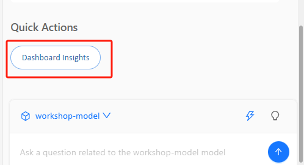
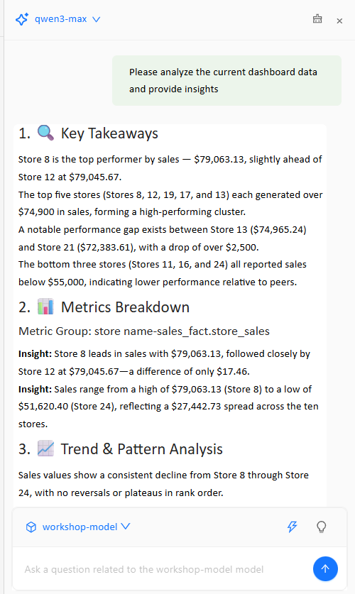

# AI Chat

  AI Chat is a conversational analytics assistant built into the Datafor dashboard editor. You can ask questions in natural language, and AI Chat will automatically generate query results and chart previews based on the selected **Analysis Model**. You can also add the generated charts to the dashboard with one click. In addition, AI Chat provides **Quick Actions** for fast, automated insights on dashboard data.

  ## 1. Overview

  AI Chat helps with three main scenarios:

  1. **Conversational query**: Ask questions in natural language (e.g., “Which were the top 10 stores by sales last year?”) to quickly get results and visual charts.
  2. **One-click chart creation and placement**: Add the chart returned in the conversation directly to the dashboard page via **Add to page**.
  3. **Dashboard insights**: Use **Quick Actions → Dashboard Insights** to automatically analyze and summarize the current dashboard data.

  ## 2. Entry and UI Overview

  ### 2.1 Open AI Chat

  On the page editor’s top toolbar, click the **✨ AI Chat** icon to open the chat panel on the right.

  

  ### 2.2 What You See in the AI Chat Panel

  After opening AI Chat, you will typically see:

  - **Conversation area**: Displays your questions and the AI responses.
  - **Tool Execution Details**: Shows the generated query intent/execution details (useful for verification).
  - **Chart preview**: Displays the resulting chart and allows switching chart types (e.g., Bar Chart).
  - **Add to page**: Adds the current chart to the dashboard canvas with one click.
  - **Suggested follow-up questions (optional)**: Buttons such as “You may also want to know …” to continue exploring.
  - **Quick Actions entry**: A shortcut menu at the bottom of the panel to access preset capabilities (e.g., Dashboard Insights).
  - **Analysis Model selector**: Displays the currently selected model name (e.g., `workshop-model`) at the bottom of the panel and allows switching the **Analysis Model** used for this conversation.

  

  ## 3. Basic Usage: Generate Charts via Conversation

  Before asking a question in AI Chat, you must first choose the **Analysis Model** for the conversation to ensure AI Chat generates executable queries and charts based on the correct data model.

  1. Click **AI Chat** on the toolbar to open the panel.
  2. **Select an Analysis Model**
     - In the model selection area at the bottom of the AI Chat panel (showing the current model name, such as `workshop-model`), click the dropdown arrow.
     - Choose the **Analysis Model** you want to analyze.
  3. Enter your question in the input box, for example:
     - “What was the total sales last year? Show me the monthly trend.”
     - “Which were the top 10 stores by sales last year?”
     - “What was the sales contribution share by region in Q1 this year?”
  4. After sending, AI Chat generates results based on the selected model and provides a chart preview plus a written summary.
  5. If needed, switch the chart type in the preview area (e.g., Bar/Line/Pie—based on what your system supports).

  

  ## 4. Add a Chart to the Dashboard: Add to page

  After AI Chat returns a chart preview, you can place it onto the current page:

  1. Under the chart preview in the AI result, click **+ Add to page**.
  2. The system adds the chart as a component onto the canvas on the left.
  3. After adding, you can continue editing it like any normal chart component:
     - Drag to reposition and resize
     - Configure styling (Style)
     - Configure interactions and filters (if available on the page)

  

  ## 5. Quick Actions

  AI Chat provides a **Quick Actions** entry at the bottom of the panel to quickly run preset capabilities (without having to craft complex questions manually).

  

  ### 5.1 Open Quick Actions

  1. At the bottom of the AI Chat panel, click **Quick Actions** (usually a shortcut button/icon).
  2. Expand it to see the available menu items.

  

  ### 5.2 Dashboard Insights

  In Quick Actions, click **Dashboard Insights**. AI Chat will analyze the data already displayed on the current dashboard page. Typical outputs include:

  - Key takeaways (Top takeaways)
  - Clear trends and comparisons
  - Unusual fluctuations or noteworthy patterns (when the data signals are obvious)
  - Directions for further exploration (often as suggested follow-up questions)

  

  ## 6. Prompting Tips (Better Questions → Better Results)

  To help AI Chat generate more reliable, executable queries and suitable charts, include:

  - **Time range**: this year / last year / last 30 days / by month / by quarter
  - **Metrics**: sales, cost, profit, margin, order count, etc.
  - **Dimensions**: store, region, city, category, customer, etc.
  - **Analysis actions**: Top N, trend, YoY/MoM, share, comparison, biggest volatility

  Example templates (replace the placeholders):

  - Top N: `Rank (dimension) by (metric) for (time range), top (N)`
  - Trend: `(metric) trend by (month/week/day) for (time range)`
  - Comparison: `Compare (metric) between (A) and (B) by (month/quarter)`
  - Share: `(metric) share by (dimension) for (time range)`
  - Volatility: `Find (dimension) with the largest fluctuation in (metric) for (time range)`

  ## 7. FAQs

  ### Q1: Why can’t AI Chat generate a chart / Why is there no data?

  - Verify you have selected the correct **Analysis Model**.
  - Check whether the page is associated with a usable model (Dataset/Cube/Model).
  - Check whether your account has permission to access the data (including RLS).
  - Make the question more specific (add time range, metrics, and dimensions).

  ### Q2: Does Dashboard Insights analyze “model data” or “page data”?

  - **Dashboard Insights** focuses on insights derived from what is already displayed on the current dashboard page (charts/data on the page).
  - If you want to know what fields/measures/dimensions exist in the Analysis Model, ask AI Chat something like:
    - “What fields, measures, and dimensions are available in this analysis model?”