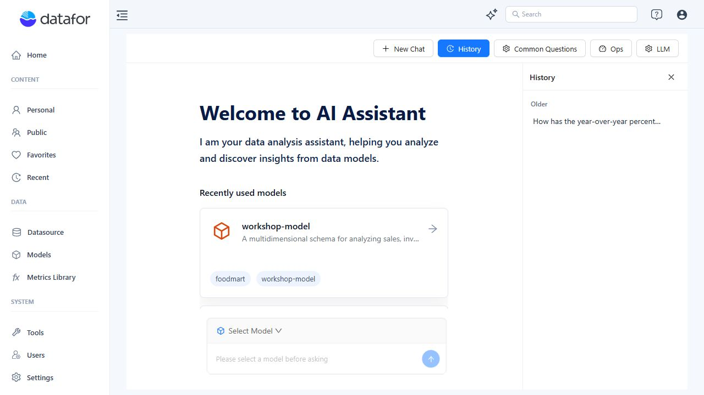
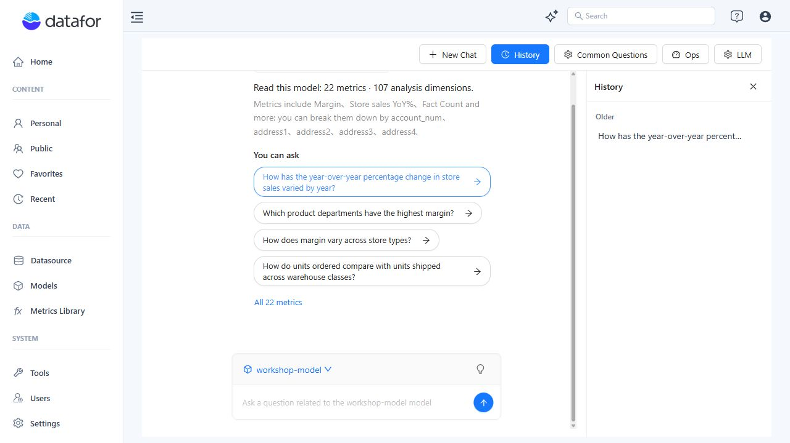

# AI Assistant

The current Datafor conversational-analysis experience is a standalone **AI Assistant** opened from the **AI Agent** card on Home. It is no longer limited to a panel inside the report editor.

## 1. Open AI Assistant

1. Open **Home**.
2. Click **AI Agent**.

The page provides **New Chat**, **History**, **Common Questions**, **Ops**, and **LLM** in the top toolbar.

## 2. Select an analysis model

Before asking a question, choose the analysis model that contains the required metrics and dimensions. You can select a recently used model card or use **Select Model** in the composer.

After selection, Datafor displays a model brief, the number of available metrics and analysis dimensions, suggested questions, and a link to the complete metric list.

## 3. Ask an analytical question

Enter a question in the composer and send it. Make the request easier to execute by including:

- the metric;
- the time range;
- the grouping dimension;
- the required comparison, ranking, share, or trend.

Examples:

- `Show monthly sales for last year.`
- `Rank product departments by margin, highest first.`
- `Compare units ordered with units shipped by warehouse class.`

The answer is governed by the selected analysis model and the current user's data permissions. Check returned metrics, filters, and time basis before relying on the interpretation.

## 4. Continue or review conversations

- Click **New Chat** to start a separate conversation.
- Click **History** to reopen an earlier conversation.
- Use the model's suggested questions to begin with a request that matches the available metadata.
- Select a different model when the question belongs to another business domain.

## 5. Related administration

- **Common Questions** maintains reusable questions by analysis model.
- **Ops** shows usage and manages daily question quotas.
- **LLM** manages model profiles, runtime assignments, and schemes.

## Troubleshooting

| Symptom | Check |
| --- | --- |
| No model can be selected | Confirm the user can access at least one analysis model. |
| Model brief or suggestions do not load | Check AI Agent connectivity, LLM assignments, and the selected model's prepared metadata. |
| A query returns no data | Check the model, metric, time range, filters, source data, and row-level permissions. |
| The Agent reports a model-stage error | Open **LLM** and confirm that all 15 required assignments are complete and verified. |
