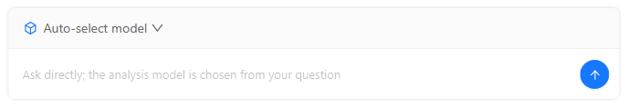
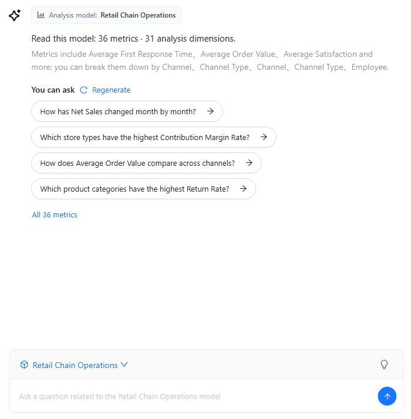

# AI Assistant

The **AI Assistant** is Datafor's full-page conversational analysis. You ask in your own words; the answer comes from a governed query on an analysis model, under your own data permissions.

## 1. Open the AI Assistant

Click **AI Agent** in the left navigation, directly below **Home**. The **AI Agent** card on **Home** opens the same page.

**AI Agent** appears only when an administrator has enabled the AI service. A user without AI access who clicks it sees "Please contact your administrator to enable AI for this user" and stays on the current page.

| Toolbar button | Use |
| --- | --- |
| **New Chat** | Start a separate conversation. |
| **History** | Reopen an earlier conversation. |
| **Connect AI** | Get the MCP address and ready-made configurations for AI clients such as Claude Desktop, Claude Code and Codex. See [Connect AI Clients](/documentation/AI-Agent/Connect-AI-Clients/). |
| **Common Questions**, **Ops**, **LLM** | Administrators only; see section 9. |

When the assistant is shown as a side panel, these functions are icon buttons, for example **Connect AI** and **Clear Chat**.

## 2. Choose the analysis model, or let the Agent choose

The model selector sits at the top of the composer. Its first item, **Auto-select model**, is the default: the placeholder reads "Ask directly; the analysis model is chosen from your question".

To fix the model yourself, click a model card on the welcome screen or pick the model in the selector. The placeholder then reads "Ask a question related to the *model* model", and Datafor displays a model brief, the number of available metrics and analysis dimensions, suggested questions under **You can ask**, and a link to the complete metric list.

The list has four places: Common Questions configured by an administrator come first, and the Agent generates the rest. **Regenerate** replaces the generated questions with a new batch. Generated questions are shared per model and interface language for seven days, so a regenerated batch is what other users of the model see too. The button is hidden when configured questions fill all four places.

To start from a metric instead of a question, pick the metric on the welcome screen and choose one of the **Quick Actions**: **Metric change check**, **Generate metric report**, **View trends**, **Breakdown analysis** or **Compare and rank**, with a time range of your choice.

### How Auto-select model chooses

The Agent considers only the analysis models you can see, in this order:

1. **Metrics Library bindings**: the models that the metrics named in your question are bound to.
2. **The models' content**: fields, member values and descriptions found in each model's knowledge index, and the models' names and descriptions.
3. **Your recent use**: the models you asked about most in the last seven days.

Two cases are decided without this search: if you can see only one analysis model, it is used, and a follow-up stays on the conversation's model.

When the choice remains unclear, the Agent asks you to pick one of the candidate models. With many models and weak evidence it asks you to choose in the model selector instead.

A metric bound in several models is answered from one of them when the dimensions in your question or your recent use point to it; the answer card then lists the others. When nothing separates them, the Agent asks. Because recent use covers only the last seven days, the same question can be answered directly one week and prompt a choice another.

Choosing the model adds a few seconds to the first answer of a conversation. When you know the model, select it.

### The answer card

An automatically chosen model is shown in a card above the answer, and the selector changes to **Auto · *model***.

The card's title reads `Answered from the analysis model "X"`, followed by the basis:

| Basis line | Meaning |
| --- | --- |
| Basis: the governed metric "…" is bound to this model. | A metric in your question is bound to this model in Metrics Library. |
| Basis: the models' fields, descriptions and your recent use. | The model's content and your recent use decided. |
| Basis: the only analysis model you can see. | You have access to one model. |
| Basis: your choice. | You picked the model when the Agent asked. |
| Basis: the model of the analysis this continues. | The question continues an earlier analysis. |

The next line lists the alternatives: `Also bound in: Y` when the metric is bound in other models too, or `Other models you can use: Y`. Each alternative has a button `Answer with "Y" instead`, which selects Y and asks the same question again as a new question on Y in the same conversation. The buttons are not shown when you reopen a conversation from **History**.

### Follow-ups and switching models

Once a model is settled, the next questions in the conversation are follow-ups on that model. The Agent does not switch models in the middle of a conversation. To ask about another model, pick it in the selector or click **New Chat**.

### When no model can be chosen

| Message | What to do |
| --- | --- |
| "You have no analysis model to ask this against. Ask an administrator for access to a model." | Ask an administrator for read access to an analysis model. |
| "No analysis model could be chosen for this question. Pick one from the model selector and ask again." | Select the model yourself. |
| "Which model to use is still unclear. Pick one from the model selector and ask again." | Select the model yourself. |
| "The chosen analysis model could not be opened. Pick a model from the selector and ask again." | Select another model, or ask an administrator to check the model. |
| "Your list of analysis models could not be read. Please try again." | Ask again; tell an administrator if it persists. |

## 3. Ask an analytical question

Enter a question in the composer and send it. Make the request easier to execute by including:

- the metric;
- the time range;
- the grouping dimension;
- the required comparison, ranking, share, or trend.

Examples:

- `Show monthly sales for last year.`
- `Rank product departments by margin, highest first.`
- `Compare units ordered with units shipped by warehouse class.`

The answer is governed by the analysis model named in the answer card or the selector and by your data permissions. A question about a definition, such as `How is net sales calculated?`, is answered from the model's declared definition (or the Metrics Library definition) without running a query.

### Time phrases

Vague time phrases still work: "recently" is read as the last 30 days and "the last few days" as the last 7 days. The answer states the date range it used, and one sentence is enough to correct it. A phrase that gives no usable range, such as "a while ago", makes the Agent ask.

### Progress and stopping

While the analysis runs, each step shows on screen: understanding the question, matching it to the model, querying, concluding. To cancel, click **Stop** in the composer. A cancelled question stays in the conversation, marked as cancelled, also when you reopen it from **History**.

### When the Agent asks for a detail

When something essential is missing, such as which metric, which date or which definition, the Agent asks before it queries. Pick one of the options it offers, or type the missing detail in your own words in the reply box and click **Send**. The analysis continues from there; you do not have to ask the question again.

### Answer language

Answers, follow-up suggestions, clarifying questions and progress labels are written in your **interface language**, not in the language of the question. To get another language, say so in the question, for example `Please answer in English`. AI clients connected through MCP can pass the language with the question.

## 4. Ask why a number changed

Questions such as `Why did net sales fall in Q3 compared with Q2?`, `Where did the increase in gross margin come from?` or `Which stores caused the drop?` are answered with a breakdown of the change:

- The Agent compares the two periods and splits the difference by **up to three dimensions**: the ones you name, otherwise ones taken from the measure's recommended dimensions, the metric's dimensions in Metrics Library, and the model's hierarchies.
- For each member it shows the **contribution** (the member's change) and the **share of the total change**, per period.
- The answer says first where the change is concentrated, then how much the three largest contributors explain, whether positive and negative contributions partly offset each other, and when local changes are larger than the net change. It ends with the dimensions it checked and the ones it did not.
- For a **ratio** whose numerator and denominator are declared (in the model formula or the Metrics Library calculation method), each member's contribution is split into the part caused by its share of the denominator changing and the part caused by its own ratio changing, and the answer says which dominates overall. A ratio without declared components gets levels and changes only, and the answer is marked partial.
- For **"is it A or B?"** questions about a metric declared as a quotient or difference of other metrics, for example `Did net sales grow because of more paid orders or a higher average order value?`, each factor gets a contribution in the metric's unit and a share; together they equal the total change.

One dimension runs as a single query. Several dimensions run as a multi-step analysis, which usually takes one to three minutes. A deeper level that the Agent would add on its own is offered as the first follow-up suggestion; one click runs it. Levels you name in the question are broken down directly.

Contributions show where a change sits in the data, not why it happened. A question about causes outside the data, or about a change the model cannot measure, gets an answer that states that boundary.

## 5. Multi-step analysis, time limit and partial answers

A question that no single query can answer, such as `Which stores have both high sales and a high return rate?`, runs as a multi-step analysis. The Agent sets a plan of a few steps before it starts, runs independent steps in parallel, shows the result and evidence of each step, and then combines them into one conclusion. It does not explore open-endedly.

The query steps of one multi-step analysis may run for 180 seconds in the AI Assistant and in embedded applications. Writing the answer afterwards is not cut off by this limit. At the limit:

- steps that have not started are skipped, and running steps stop;
- the steps that finished are combined into a **partial** answer that names what did not finish.

If no step finished, the answer reads "The multi-step investigation ran past its time limit before any of its steps finished, and was stopped. A narrower question, or one dimension at a time, fits within the limit." Ask about one dimension, a shorter period, or use the follow-up suggestions to go one step at a time.

## 6. Reading the result

### No matching data

When the query returns no rows, the answer is a **No matching data** card and nothing else: no insight text and no follow-up suggestions. The card lists the conditions that were actually used (**Metrics**, the filters, **Period** with its date dimension, **Grouped by**) and suggests removing a breakdown or a filter, or widening the time range. Compare these conditions with what you meant before asking again.

### Rankings with ties

"Top 5", "bottom 3" or "the highest" also return the members that tie with the last place, and the answer names them as tied. Two stores with the same order count in fifth place are both shown. When more than 32 members tie, the first 32 are used and the answer is marked incomplete.

### Comparison columns

Calculated columns are named after what they hold:

| Column | Holds |
| --- | --- |
| *Net Sales* (Y-1), (Q-1), (M-1), (D-1) | The value of the comparison period. |
| *Net Sales* (Δ vs M-1) | The difference from the comparison period. |
| *Net Sales* (Δ% vs Y-1) | The growth rate. |
| *Net Sales* (YTD), (QTD), (MTD) | Running totals. |

The same names are used in every interface language, in exports and when a follow-up refers to a column. Only rates are shown as percentages.

### Pie charts

When you ask for a pie chart and the result has one grouping with more than six categories, the pie shows the five largest slices and one slice **Other (N)** for the remaining N categories. A truncated or sampled result, or one with two groupings, is shown as a table. **Add to page** inserts the full pie, without the combined slice.

### Special values

A cell that is infinite or undefined, for example the result of a division by zero, is kept and shown as **∞**, **−∞** or **NaN** instead of failing the whole result. Rows whose only values are special values are kept too.

- The answer discloses that NaN values are not used in calculations or rankings.
- In threshold filters such as "above 10%", ∞ and −∞ compare normally. Rows with NaN are kept, and the answer warns that it could not decide whether they meet the condition.

### Views, export and Add to page

- **Switch the view**: the view selector above a result offers the views that fit it, for example **Table**, **Bar**, **Line** or **KPI**. A follow-up such as `show it as a pie chart` also works. Either way the chart changes in seconds, from the data already fetched; nothing is queried again.
- **Export image** saves the chart; **Export Excel** saves the table. The screen shows only the first rows of a large result, but the export takes the complete result. When a full export is not possible, the export contains the rows shown on screen and says so.
- **Add to page**: when the Agent runs beside the dashboard editor, **Add to page** inserts the result into the page as a component. The component runs the same query the answer ran. A result that cannot be reproduced as a component shows "This result cannot be added to the page."

### Evidence and limits

- Conclusions cite their evidence: hover over or click a citation to reach the exact figure it refers to.
- A **Limitations** box lists what limits the answer, for example a time range that was not given and was taken from the available data, a result that was cut to keep it manageable, or context hidden by your permissions.
- An answer that reuses the data of the previous question instead of running a new query says "These figures reuse the data fetched for your previous question; no new query was run."

### What was sent to Datafor

Under the progress steps, **Technical details** opens **How I read the question** (the metrics, groupings, time with its date basis, and filters the Agent used) and the **Query model**: the request the Agent sent to Datafor for this answer, loaded when you expand it. An answer that needed several requests lists them in order, with their role, for example "selects the ranked members", "current period" and "comparison period"; a request that failed is marked "did not succeed". Only the user who asked can open it. Use it to check which measures, filters and dates were really queried.

**Copy** and **Export** on a **Business brief** or **Complex report** card copy or save its text as Markdown, with headings in the interface language.

## 7. Messages about access and knowledge indexes

| Message | Meaning and next step |
| --- | --- |
| "You do not have access to this analytical model's metadata, so the analysis could not start. Ask an administrator for access." | You lack read permission on the analysis model or its data connection. Asking again does not help; ask an administrator for access. |
| Banner **Vector index is temporarily unavailable** | The model has no usable knowledge index. You can keep asking, but recognition of business terms and member values is weaker. |
| "This question names specific values (such as a store or a region), and matching them to this model's data needs the model's vector index, which is not ready yet. …" | The question needs the knowledge index. An administrator has to build it. |
| "…which is being built right now. It usually takes a few minutes; after that the question will work as asked." | The first build is running. Ask again in a few minutes. |

The AI Assistant still says "vector index" where the console now says **knowledge index**. See [Preparing Data for AI](/documentation/AI-Agent/Preparing-Data-for-AI/).

## 8. Continue or review conversations

- **Follow-up suggestions** under each answer are drawn from the objects and findings in that result; one click asks the next question.
- Build on the previous answer without restating it: `only East China`, `break it down by month`, `exclude returned orders`. Follow-ups stay on the conversation's model.
- A question that fails does not break the conversation. Rephrase it and ask again.
- A conversation reopened from **History** restores the model used at the time; failed questions show their original message.

## 9. Related administration

- **Common Questions** maintains reusable questions by analysis model.
- **Ops** shows usage and manages daily question quotas.
- **LLM** manages model profiles, runtime assignments, and schemes.
- **Connect AI** is available to every user; administrators set up the MCP address and personal tokens as described in [Connect AI Clients](/documentation/AI-Agent/Connect-AI-Clients/).

## Troubleshooting

| Symptom | Check |
| --- | --- |
| No model can be selected | Confirm the user can access at least one analysis model. |
| The answer card names the wrong model | Click `Answer with "Y" instead`, or select the model in the selector and ask again. |
| The Agent keeps asking which model to use | Select the model yourself. Ask the model author to bind each metric to its primary model in Metrics Library. |
| Model brief or suggestions do not load | Check AI Agent connectivity, LLM assignments, and the selected model's knowledge index. |
| A query returns no data | Read the conditions on the **No matching data** card (section 6), then check source data and row-level permissions. |
| A "top N" answer has more than N rows | Members tie with the last place (section 6). |
| The answer is in the wrong language | Answers follow the interface language. Ask for another language in the question. |
| The Agent reports a model-stage error | Open **LLM** and confirm that all 16 required assignments are complete and verified. |
| A multi-step answer stops at the time limit | Ask a narrower question, or one dimension at a time (section 5). |
| The progress title stays at **Understanding your question** until the whole answer appears at once | Datafor is running behind a reverse proxy that buffers the progress stream. Configure the proxy as described in [Deploying Datafor Behind Nginx](/documentation/Setup/Deploying-Datafor-Behind-Nginx/). |
