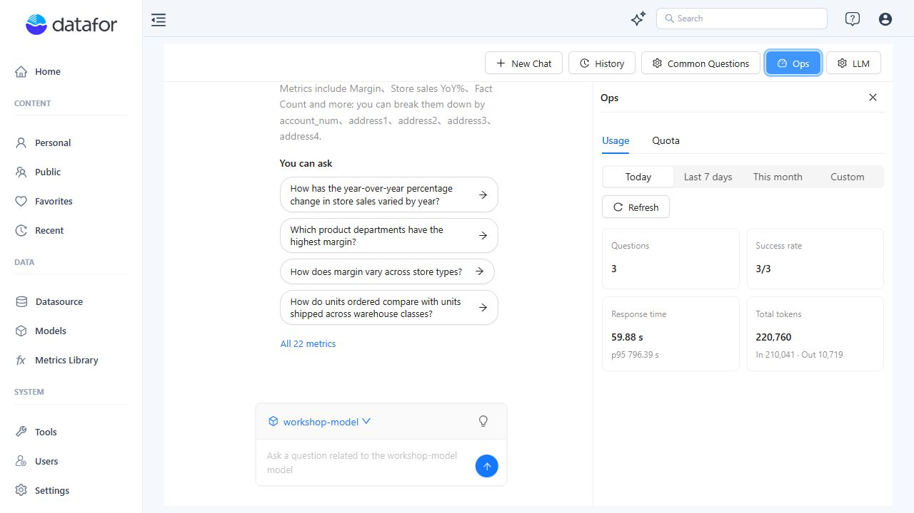
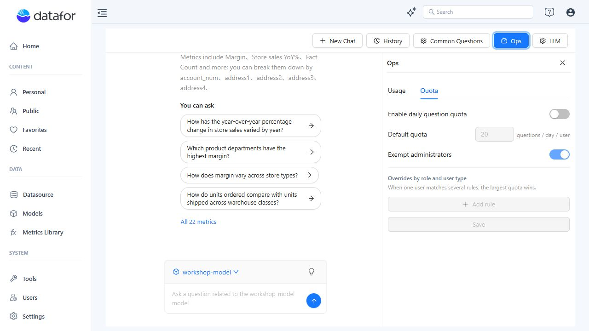

# AI Operations and Quotas

The current AI Assistant provides operational usage and question-quota controls under **Ops**. The previous per-LLM **Authorized Object** permission action is not present in the current **LLM → Models** view. Current model cards show **Edit**/**Delete**, assignment usage, and structured-output verification status.

## 1. Open Ops

1. Open **Home → AI Agent**.
2. Click **Ops** in the top toolbar.

The panel contains **Usage** and **Quota** tabs.

## 2. Review usage

Use **Today**, **Last 7 days**, **This month**, or **Custom** to select a period, then click **Refresh**.

The current summary shows:

- Questions
- Success rate
- Response time and p95
- Total input and output tokens

Use these values to identify usage growth, failed requests, latency changes, and token consumption. They are operational indicators; investigate request details and provider logs before assigning a cause to an anomaly.

For queue monitoring, worker configuration, and a repeatable capacity test, see [Managing High Concurrency](/documentation/AI-Agent/Managing-High-Concurrency/). The Response time card uses recorded run durations; measure submission-to-answer time separately when evaluating queue waiting.

## 3. Configure daily question quotas

Open **Quota**.

Available controls are:

| Control | Purpose |
| --- | --- |
| **Enable daily question quota** | Turns per-user daily question limits on or off. |
| **Default quota** | Sets the default questions per day per user. |
| **Exempt administrators** | Excludes administrators from the daily limit when enabled. |
| **Overrides by role and user type** | Adds more specific quota rules. |

When one user matches several rules, the current UI applies the largest quota. Click **Save** after changing quota settings.

Daily quotas control usage over a day; they do not cap simultaneous questions or increase processing capacity. Size analysis workers separately using [Managing High Concurrency](/documentation/AI-Agent/Managing-High-Concurrency/).

## 4. Access control

LLM profiles no longer expose a separate permission-management action in the current **LLM → Models** view. Continue to use Datafor's user, role, model, folder, report, datasource, and row-level permissions to govern access to analytical data. Quotas control request volume; they do not grant access to data that the user cannot otherwise read.
