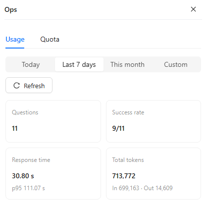
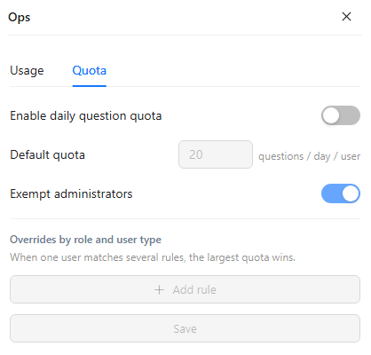

# AI Operations and Quotas

The **Ops** panel of the AI Assistant shows usage statistics and holds the daily question quota.

## 1. Open Ops

1. Click **AI Agent** in the left navigation, directly below **Home**.
2. Click **Ops** in the top toolbar. **Ops** is shown to administrators only.

The panel contains **Usage** and **Quota** tabs.

## 2. Review usage

Use **Today**, **Last 7 days**, **This month**, or **Custom** to select a period, then click **Refresh**.

The current summary shows:

- Questions
- Success rate
- Response time and p95
- Total input and output tokens

Use these values to identify usage growth, failed requests, latency changes, and token consumption. They are operational indicators; investigate request details and provider logs before assigning a cause to an anomaly.

For queue monitoring, worker configuration, and a repeatable capacity test, see [Managing High Concurrency](/documentation/AI-Agent/Managing-High-Concurrency/). The Response time card uses recorded run durations; measure submission-to-answer time separately when evaluating queue waiting.

## 3. Configure daily question quotas

Open **Quota**.

Available controls are:

| Control | Purpose |
| --- | --- |
| **Enable daily question quota** | Turns per-user daily question limits on or off. Off by default. |
| **Default quota** | Sets the default questions per day per user. |
| **Exempt administrators** | Excludes administrators from the daily limit when enabled. On by default. |
| **Overrides by role and user type** | Adds more specific quota rules. |

When one user matches several rules, the largest quota wins. Click **Save** after changing quota settings.

How questions are counted:

- **The day follows the server's time zone.** The count restarts at midnight on the AI Agent server, not at midnight for each user.
- **Failed and cancelled questions are not counted.** A question counts on the day it was asked, even if it finishes after midnight.
- **Questions asked at the same moment** can each pass the check, so a user can exceed the limit by the number of questions still being submitted.

A user who has reached the limit sees:

> You have used up the question allowance for today (_quota_ per day). You can ask again after _time_. Contact your administrator if you need a higher limit.

_quota_ is the user's daily quota, and _time_ is the next midnight of the server, shown in the user's local time. The question is not started.

Daily quotas control usage over a day; they do not cap simultaneous questions or increase processing capacity. Size analysis workers separately using [Managing High Concurrency](/documentation/AI-Agent/Managing-High-Concurrency/).
