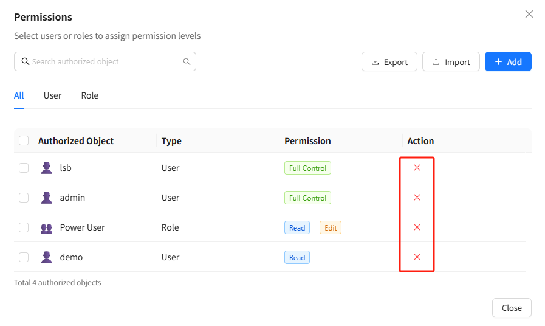

# LLM Permission Management

## Overview

Datafor AI Agent allows administrators to assign usage permissions for specific Large Language Models (LLMs) to selected users and roles.
 Through the **Permission Management** interface, you can:

- Control which users or roles are allowed to use a given LLM
- Assign different permission levels (Read / Edit / Delete / Full Control)
- Manage or revoke access at any time

This guide explains how to view, add, modify, and remove permission assignments for an LLM.

# 1. How to Access the LLM Permission Management Interface

1. Open the left navigation menu and go to **AI Agent → LLM**
2. Select an LLM from the model list (e.g., *qwen3-max*)
3. Click the **More Actions (…)** icon beside the model
4. Choose **Permission Management**

The permission management window for the selected LLM will then open.

# 2. Understanding the Permission Management Interface

After entering the permission management window, you will see all users and roles currently authorized to access the selected LLM.

### Top Action Bar

- **Search Bar** – Search by username, role name, email, etc.
- **Export / Import** – Export or import permission configurations (if enabled)
- **+ Add** – Add new users or roles to the permission list

### List Fields

| Field                 | Description                                    |
| --------------------- | ---------------------------------------------- |
| **Authorized Object** | Name of the user or role granted access        |
| **Type**              | Indicates whether the object is a User or Role |
| **Permission**        | The permission level assigned                  |
| **Action**            | Button to remove the authorization             |

# 3. How to Add a New Authorized User or Role

Click the **+ Add** button to open the add-permission dialog.

1. Use the search bar to locate a user or role
   - Supports searching by username, role name, phone number, or email
2. Select the permission level you want to assign:

| Permission Level | Description                                                  |
| ---------------- | ------------------------------------------------------------ |
| **Read**         | Allows using the LLM (within assigned quota)                 |
| **Edit**         | Allows editing LLM settings                                  |
| **Delete**       | Allows deleting the LLM                                      |
| **Full Control** | Grants full administrative rights, including managing permissions |

1. Select one or multiple users/roles
2. Click **Confirm** to complete the assignment

# 4. Modifying or Removing Permissions

### **Removing Permissions**

To revoke access, click the **×** icon at the end of the corresponding row in the permission list.
 The user or role will immediately lose access to the LLM.

### **Modifying Permission Levels**

The current version uses a “remove then reassign” approach for permission changes:

1. Remove the existing permission entry
2. Click **+ Add** again and assign the new permission level

# 5. Recommendations for Assigning Permissions to Users vs. Roles

To manage permissions efficiently, especially in larger organizations, consider the following best practices:

| Scenario                          | Recommended Approach                                         |
| --------------------------------- | ------------------------------------------------------------ |
| Large organizations               | Prefer **role-based** authorization to avoid configuring many individual users |
| Sensitive or high-value models    | Grant **Full Control** only to administrators                |
| Regular business users            | Assign **Read** to prevent accidental configuration changes  |
| Report builders or modeling teams | Use roles such as **Power User** or **Business Analyst** for consistent access control |

**Note:**
 LLM permissions do **not** inherit from report or folder permissions. They must be configured independently.