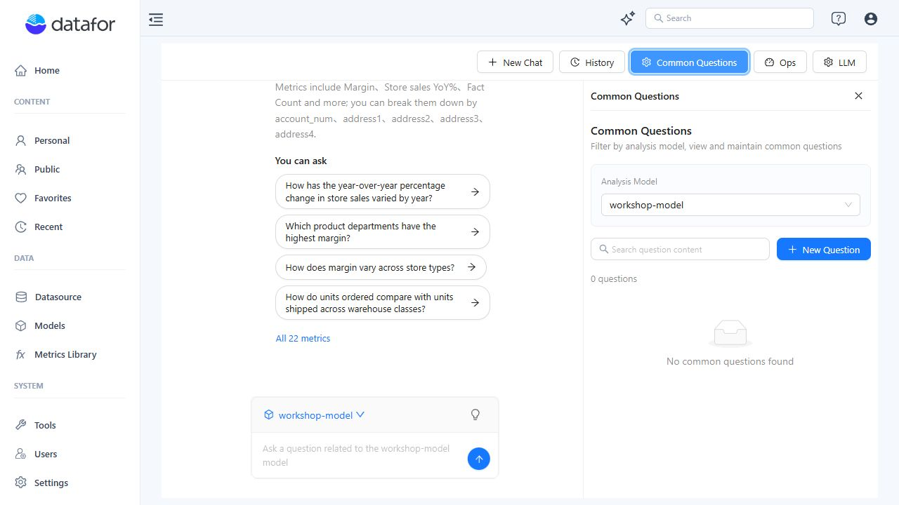
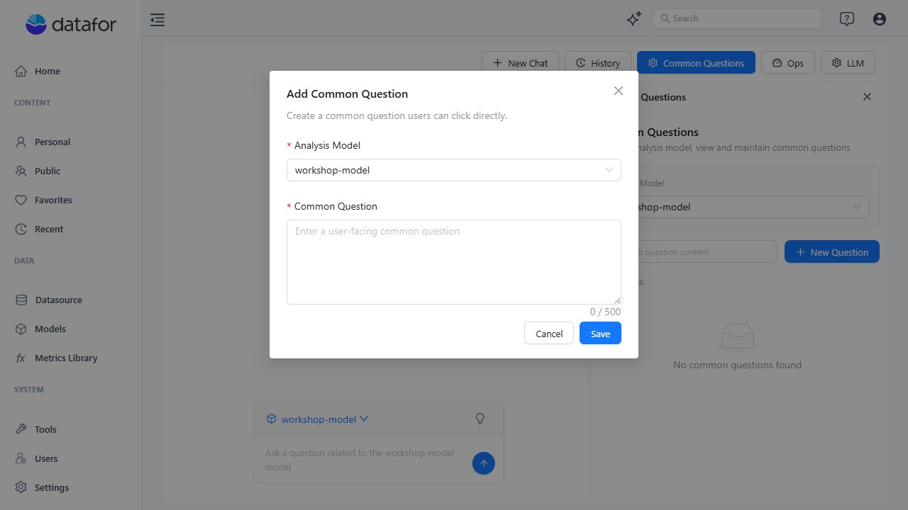

# Common Questions

**Common Questions** lets authorized users maintain reusable, user-facing questions for each analysis model. The questions provide a controlled starting point for common analytical tasks without replacing the model's metrics, metadata, or permissions.

## 1. Open Common Questions

1. Open **Home → AI Agent**.
2. Click **Common Questions** in the top toolbar.
3. Select an **Analysis Model**.

The list is scoped to the selected model and can be searched by question content.

## 2. Add a question

Click **New Question**. Select the target analysis model and enter the user-facing question, then click **Save**.

Write questions that can be answered from the selected model. Include a clear metric, grouping, comparison, or time basis when needed.

Examples:

- `Which product departments have the highest margin?`
- `How does margin vary across store types?`
- `Compare units ordered with units shipped by warehouse class.`

## 3. Maintain the list

For an existing item, use the row actions to edit or delete the question. Use the analysis-model filter before editing to avoid changing a similarly worded question that belongs to another model.

## Writing guidance

- Use business language that users recognize.
- Keep one analytical intent per question.
- Avoid credentials, personal data, or confidential values.
- Do not hard-code a time period that will quickly become stale unless that fixed period is intentional.
- Validate the question in **New Chat** with the same analysis model before publishing it for broad use.
