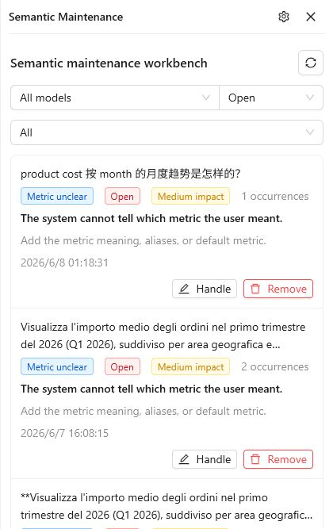
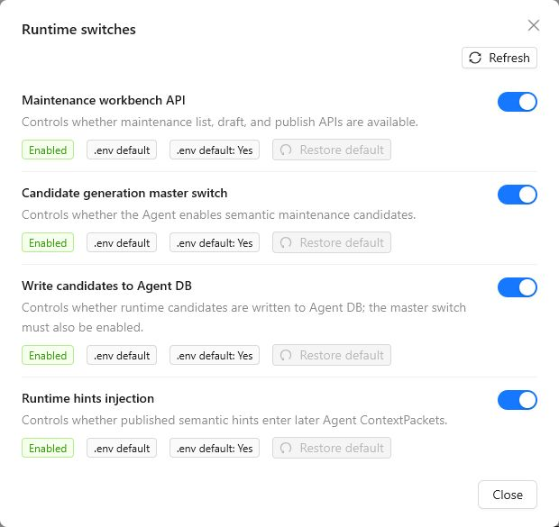
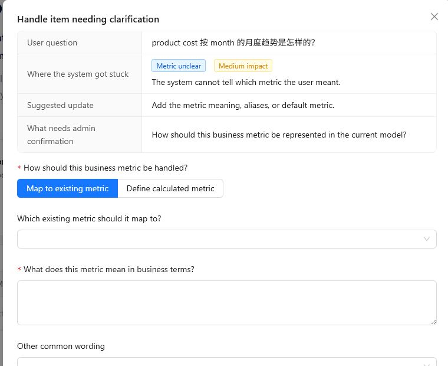

# Semantic Maintenance

Semantic Maintenance helps administrators turn repeated Agent understanding gaps into reviewed, model-scoped semantic hints. It is designed for cases where the Agent cannot safely decide which metric, dimension, time field, calculation, or filter value the user meant.

A maintenance item is only a to-do item until an administrator reviews and publishes it. Published semantic hints help future Agent requests understand the current model more accurately, but they do not modify the underlying model or data, and they do not bypass permissions, grounding validation, or backend query validation.

## 1. Open Semantic Maintenance

1. Open the Datafor console.
2. Sign in with an administrator account.
3. Open AI Agent.
4. Click **Semantic Maintenance** in the top toolbar.

The **Semantic Maintenance** panel opens on the right side of AI Agent.

## 2. Understand the Workbench

The workbench lists items that need administrator review. Each item usually comes from a runtime clarification, a grounding ambiguity, or an imported quality diagnosis.

Each item shows:

- **User question**: a safe preview of the question that exposed the semantic gap.
- **Issue type**: for example, **Metric unclear**, **Dimension unclear**, **Time basis unclear**, **Calculation missing**, or **Filter value unclear**.
- **Status**: such as **Open**, **Drafting**, **Ready to publish**, or **Published**.
- **Impact**: the estimated effect on answer quality.
- **Occurrences**: how many times a similar issue has appeared.
- **System judgement**: where the Agent got stuck.
- **Suggested update**: what kind of semantic explanation the administrator should add.

Use the filters at the top of the panel to narrow the list:

| Filter | Purpose |
| --- | --- |
| **Model** | Show items for all models or a specific analysis model. |
| **Status** | Show open, drafting, published, archived, or other status groups. |
| **Issue type** | Show only metric, dimension, time, calculation, or filter value issues. |

Click **Refresh** to reload the list.

## 3. Configure Runtime Switches

Click the settings icon in the **Semantic Maintenance** panel header to open **Runtime switches**.

The switches control whether the workbench and runtime hint flow are active:

| Switch | Description |
| --- | --- |
| **Maintenance workbench API** | Controls whether maintenance list, draft, and publish APIs are available. |
| **Candidate generation master switch** | Controls whether the Agent creates semantic maintenance candidates. |
| **Write candidates to Agent DB** | Controls whether runtime candidates are written to the Agent database. The master switch must also be enabled. |
| **Runtime hints injection** | Controls whether published semantic hints enter later Agent ContextPackets. |

Each switch shows its effective value and whether it comes from the `.env` default or a workbench override. Use **Restore default** to remove the workbench override and return to the environment default.

## 4. Handle a Maintenance Item

On an item card, click **Handle**.

The detail dialog shows:

- **User question**: the source question preview.
- **Where the system got stuck**: the issue and impact labels.
- **Suggested update**: the recommended administrator action.
- **What needs admin confirmation**: the question the administrator needs to answer.

The form changes depending on the issue type:

| Issue type | What the administrator usually provides |
| --- | --- |
| **Metric unclear** | Map the wording to an existing metric, or define how a calculated metric should be represented. Add a business explanation and common aliases. |
| **Dimension unclear** | Select the correct dimension or level and explain its business meaning. Add aliases if users commonly use different wording. |
| **Time basis unclear** | Select the default time field or explain when a date field should be used. Optionally mark it as the default for similar questions. |
| **Calculation missing** | Define the calculation basis, involved component fields, and calculation relationship. |
| **Filter value unclear** | Choose the default field for the value, define the canonical value, and add value aliases. |

Use **Save draft** when the explanation is not ready to apply. Drafts do not affect runtime behavior.

Use **Save and apply** when the explanation is ready to publish. Publishing creates a semantic hint for the current model. It helps later Agent requests, but it remains advisory and does not override Datafor metadata, permissions, or backend validation.

## 5. Remove an Item from the To-Do List

Click **Remove** when an item should no longer appear in the default to-do list. This is useful when the item is not a semantic maintenance problem, has been superseded by another item, or should be handled by product or model changes instead.

Removing an item hides it from the default list while keeping the history available.

## 6. When to Use Semantic Maintenance

Use Semantic Maintenance when the Agent repeatedly needs business clarification, such as:

- Users refer to a business metric with wording that does not clearly map to one model measure.
- A phrase may refer to multiple dimensions or levels.
- A time phrase could use more than one date field.
- A calculated business metric needs an approved definition or component mapping.
- A filter value may belong to more than one field.
- Users use aliases, abbreviations, or local business terms that are not clear from the model metadata.

Do not use Semantic Maintenance to solve:

- Missing backend query capability.
- Missing data in the source system.
- Permission problems.
- Incorrect formulas in the actual model.
- One-off user questions that should be clarified directly.
- Product defects or Agent behavior issues that need engineering changes.

## 7. Verify Published Hints

After publishing a semantic hint:

1. Go back to **New Chat**.
2. Select the same analysis model.
3. Ask a question similar to the original item.
4. Confirm that the Agent now resolves the metric, dimension, time field, calculation, or filter value more accurately.

If the result is still wrong, review whether the hint was published for the correct model, whether **Runtime hints injection** is enabled, and whether the underlying model metadata supports the requested analysis.

## 8. Troubleshooting

| Problem | How to fix it |
| --- | --- |
| The workbench shows no items | Confirm that candidate generation and candidate writing are enabled. Items appear only after the Agent encounters relevant semantic gaps. |
| The workbench API is disabled | Open **Runtime switches** and check **Maintenance workbench API**. If it cannot be enabled, check the server environment configuration. |
| **Save and apply** fails | Check required fields in the dialog. Some issue types require selecting a metric, dimension, time field, or candidate object. |
| A published hint does not affect later answers | Check that **Runtime hints injection** is enabled and that the hint belongs to the same model used in chat. |
| The item is not suitable for semantic maintenance | Use **Remove**, or handle the root cause through model design, data preparation, permissions, or product changes. |

## 9. Safety Notes

- Semantic hints are model-scoped. They should not be used as global business rules across unrelated models.
- Published hints are advisory evidence for the Agent. They do not become backend metadata truth.
- Do not include credentials, private user data, raw SQL, raw backend payloads, or sensitive business data in explanations or aliases.
- Keep explanations concise and reusable. Write business meaning, aliases, and default basis in terms that future users are likely to use.
