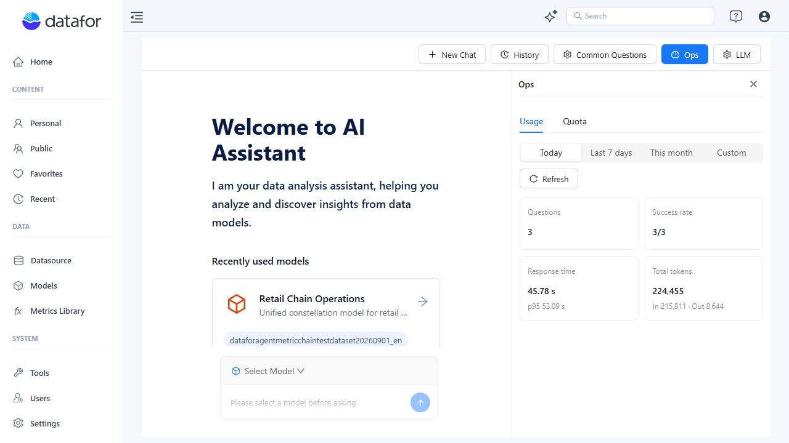
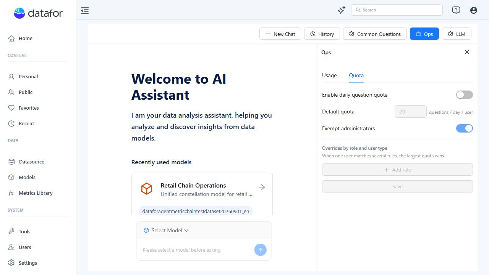

# Managing High Concurrency

An installation administrator can increase the number of AI Agent analysis workers when questions are waiting in a queue. Configure the count on the **server**, in the installed Agent's `.env` file. Ordinary users share this capacity; they do not need separate Agent installations.

This guide covers the packaged deployment with the supplied startup scripts. The current scripts support **1–8 dispatch workers**, with **1 worker by default**. Worker count is a manual deployment setting. There is no worker-count control in **Ops**, **LLM**, or the console's AI Agent settings.

## 1. Increase the worker count

Use this procedure when analysis tasks are backing up and the model service, Datafor backend, and server still have capacity.

### Before changing it

- Obtain access to the server account that manages the Agent installation. Console administrator access alone does not give access to server files.
- Find the installed `ai-agent` directory containing `app-console.bat` or `app-console.sh` and the `ai-agent-dispatch-worker` executable. Use the deployment directory, not a frontend configuration directory.
- Record the current worker setting so you can restore it. Schedule a low-traffic window and let active questions finish: **restart stops the API and workers and can interrupt active analysis**.

### Edit the deployment configuration

Open `.env` in that directory. Create it as a plain-text file if it does not exist. Add or update this single line:

```dotenv
AI_AGENT_DISPATCH_WORKERS=2
```

Start with **2** when the current count is **1**. Keep all other existing settings. Save the file as UTF-8 without a BOM, with the exact name `.env`, not `.env.txt`. Keep only one entry for this key.

| Setting rule | Behavior |
| --- | --- |
| Valid values | Whole numbers from **1 to 8**, inclusive. |
| No setting | The launcher starts **1** dispatch worker. |
| Invalid value | A nonnumeric or out-of-range value, such as `two`, `0`, or `9`, causes a warning and a fallback to **1**. |
| Configuration precedence | A nonempty environment variable inherited by the startup script takes precedence over `.env`. |
| Scope | Changes dispatch workers only. The supplied launcher keeps one API instance and one routing worker. |

If your operating-system service or startup environment already defines `AI_AGENT_DISPATCH_WORKERS`, update that value as well or remove the override. Otherwise, editing `.env` will not change the effective count. Do not edit `instance-secrets.env` to change capacity.

### Restart the Agent processes

Run the command for your operating system **from the installed `ai-agent` directory**, using the normal service-management account.

**Windows — PowerShell or Command Prompt**

```powershell
.\app-console.bat restart agent
```

**Linux — shell**

```bash
./app-console.sh restart agent
```

The `agent` target restarts the Agent API, routing worker, and configured dispatch workers. It leaves the separately managed MCP process running; Agent requests through MCP still depend on the restarting backend.

If your installation is managed by an external service supervisor, use its approved restart procedure and ensure that it invokes the supplied launcher with the intended environment. Do not start a second, separately managed copy of the deployment.

::: tip Applying increases and decreases
The supplied `start` action brings missing processes up to the configured count. It does **not** stop healthy extra workers when you reduce the count. Use `restart agent` for a repeatable configuration change, especially when scaling down.
:::

### Verify the change

1. Check the startup output for the expected dispatch replicas and any fallback or startup errors. Re-running `start agent` with the same configuration reports the current count if all expected instances are already running; it can also start missing instances.
2. Check current log timestamps in `ai-agent/logs/`. With two workers, expect both `ai-agent-dispatch-worker.log` and `ai-agent-dispatch-worker-2.log`, plus their corresponding `-err.log` files. Old log files alone do not prove that workers are running.
3. Check the health endpoint as described in [section 4](#check-the-queue-from-the-server).
4. Submit a small set of representative questions from separate user sessions or chats. Confirm that answers complete and that the backlog clears when submissions stop.

Packaged components can appear as a parent and child with the same executable name. Two matching processes in Task Manager do not necessarily mean two workers; use the launcher's instance count and fresh replica logs.

**To roll back:** restore the previous valid value in `.env` and any startup-environment override, then run the same restart command and repeat verification.

## 2. Understand what more workers change

The API accepts a question and records work. A routing worker selects the workflow when routing is needed. **Dispatch workers perform the analysis work**, including waiting for model responses and Datafor query results. Each dispatch worker handles one claimed task at a time; excess work waits in the queue.

More dispatch workers can reduce waiting behind other analyses. They do not make an individual model response or database query faster. One question can require several model calls, and a complex analysis can execute multiple queries, so worker count is not a model-request limit or a database-connection limit.

Distinguish these three quantities:

| Quantity | What it tells you |
| --- | --- |
| Signed-in users | How many people have sessions. Idle sessions do not each occupy an analysis worker. |
| Questions submitted per minute | The sustained arrival rate the deployment must handle. |
| Simultaneous analysis work | The work competing for workers and downstream resources right now. |

For example, many users reading previous answers can place less analysis load on the system than a small team submitting complex questions together. Size the deployment for the expected peak submission rate and question mix, not the number of accounts.

Increasing `LIMIT_CONCURRENCY` does not add analysis workers: it controls HTTP concurrency. Changing an LLM profile parameter also does not change the number of dispatch processes.

## 3. Choose a count by measuring

There is no universal “users per worker” or CPU/RAM specification for every analysis model and LLM provider. Treat **8** as the startup script's supported maximum, not a recommended default or a guarantee that every server can run eight workers effectively.

Use a repeatable comparison:

1. **Define your target.** Specify the expected peak questions per minute, a realistic simultaneous burst, and an acceptable wait for an answer. Include the normal mix of simple questions, follow-ups, and complex analyses.
2. **Measure the current count.** Record successful answers per minute, submission-to-answer time, failures, and queue depth. Include some different questions and sessions; repeating one warm, cached question is not a complete workload.
3. **Increase one step.** For example, compare `1 → 2`, then consider `4` if needed. Keep the analysis models, LLM assignments, question mix, and submission rate comparable.
4. **Observe sustained traffic and recovery.** Continue long enough to see whether the queue grows during steady traffic. After submissions stop, confirm that pending work drains. Keep a margin for bursts and slower questions.
5. **Keep the smallest count that meets the target.** Stop increasing if answer throughput stops improving, failures rise, or the model provider, Datafor, database, CPU, or memory becomes the bottleneck.

Use a record like this for each comparison:

| Workers | Questions/min submitted | Successful answers/min | Submit-to-answer p95 | Peak pending tasks / time to drain | Errors and resource observations |
| --- | --- | --- | --- | --- | --- |
| Current count | Measured | Measured | Measured | Measured | Measured |
| Candidate count | Same target load | Measured | Measured | Measured | Measured |

**p95** is the time within which approximately 95% of measured responses finish. It helps reveal the long waits that a median can hide. Use enough representative samples and record the sample count; a handful of questions cannot establish production capacity.

### Check the resources that workers share

| Resource | Check while increasing workers |
| --- | --- |
| LLM and embedding services | Provider request/token allowances, rate-limit responses such as HTTP 429, and timeouts. Several Agent stages or applications may share the same provider account allowance. |
| Datafor and analytical data sources | Query duration, backend timeouts, database CPU and I/O, and whether ordinary reports also become slower. |
| Agent host | Memory use, CPU, and process restarts. Additional processes consume additional resources even while waiting for remote services. |
| Agent PostgreSQL database | Active connections, connection errors, and slow database operations. Worker processes maintain their own connection pools. |

If reports and AI share infrastructure, include normal report traffic in your capacity test. Where your operations schedule permits, move heavy vector-index rebuilds or other batch work away from peak interactive use.

## 4. Monitor response quality and queue health

### Review Usage in the console

1. Sign in as an administrator and open **Home → AI Agent**.
2. Click **Ops**, then **Usage**.
3. Select **Today**, **Last 7 days**, **This month**, or **Custom**, then click **Refresh**.

<div align="left"></div>

*Captured from a local development installation. These values illustrate the controls; they are not a capacity benchmark.*

| Indicator | How to use it |
| --- | --- |
| **Questions** | Track activity in the selected period. This is not a count of concurrently running questions or completed answers per minute. |
| **Success rate** | Check whether higher load coincides with more unsuccessful finished runs. Small samples appear as succeeded/finished counts, such as `3/3`. |
| **Response time / p95** | Compare recorded run durations for similar workloads. The main value is the median, or p50. |
| **Total tokens** | Track model usage, including the input/output split. Use your provider's billing tools for actual charges. |

**Measure the user wait separately.** The current Response time card is calculated from recorded run trace durations. It is not a dedicated measurement of the entire interval from clicking Submit to seeing an answer, including all queue waiting. For a capacity test, time that interval explicitly and pair it with the queue observations below. Usage also does not display the number of worker processes.

### Check the queue from the server

Run this locally on the Agent server. Replace the port if your installation uses a different `SERVER_PORT`.

**Windows**

```powershell
curl.exe --include --silent --show-error --max-time 10 http://127.0.0.1:28081/ai/health
```

**Linux**

```bash
curl --include --silent --show-error --max-time 10 http://127.0.0.1:28081/ai/health
```

The response reports database reachability and separate `queues.routing` and `queues.dispatch` objects. Read the fields together and compare several observations during a busy period:

| Field or result | Meaning and next action |
| --- | --- |
| HTTP **200** | No health fault was detected at that instant. This does not prove every configured worker is running or that response times meet your target. |
| `pending` | Queued work. A short burst is normal; a sustained increase means work is arriving faster than it is being cleared, or processing is failing. |
| `inProgress` | Claimed work, not a live process count. An idle, healthy worker does not add to this number. |
| `dueAgeSeconds` | How long the oldest pending item has been ready to run. Use its trend to judge whether waiting is increasing. |
| `oldestAgeSeconds` | Age since creation of the oldest live pending item. A persistently old item can indicate repeated retries. |
| `expiredLeases` | Work whose processing lease expired. Check worker exits, restarts, and resource problems. |
| `parked` | Work scheduled far in the future, excluded from the live pending/age measures. This value alone is not a reason to add workers. |
| `stalled: true` or HTTP **503** | Investigate worker, database, migration, or queue problems before treating the condition as normal capacity pressure. |

`stalled` can reflect old ready work with nothing in progress, very old pending work, or an expired lease. It does not exclusively mean “no workers are running.” A **200** response with growing `pending` can still mean users are waiting too long.

## 5. Use quotas to manage daily demand

Open **Home → AI Agent → Ops → Quota**.

<div align="left"></div>

*Controls are disabled in this screenshot because the daily question quota is off.*

1. Turn on **Enable daily question quota**.
2. Set **Default quota** in **questions / day / user** to match your usage policy.
3. Decide whether **Exempt administrators** should remain enabled. Exempt administrators will not exercise the daily limit during a quota test.
4. Use **Add rule** under **Overrides by role and user type** if groups need different allowances. When a user matches several rules, the largest matching quota wins.
5. Click **Save**.

Daily quotas help manage demand and usage budgets. **They do not limit how many questions arrive at the same instant or reserve a worker for a user.** Concurrent submissions can exceed the daily ceiling because the allowance is checked without reserving a slot. Quotas therefore complement worker sizing; they are not an overload-protection mechanism. See [AI Operations and Quotas](/documentation/AI-Agent/LLM-Permission-Management/) for the full settings guide.

## 6. Troubleshoot before adding more workers

| What you observe | What to check or change |
| --- | --- |
| Dispatch `pending` and waiting time grow, but work is completing and downstream resources have headroom | Test a higher dispatch-worker count. Compare throughput, user wait, and failures at the same load. |
| Routing queue grows while dispatch is lightly used | Check routing-worker logs and its model service. Adding dispatch workers does not increase routing capacity. |
| One question is slow even when no other work is queued | Investigate model response time, query duration, retrieval, and question complexity. More dispatch workers will not remove that question's processing time. |
| Provider rate-limit errors or timeouts increase after scaling | Return to the previous worker count. Check the provider allowance and other traffic sharing it before increasing again. Distinguish provider limits from a user's daily quota message. |
| Datafor reports also slow down | Check shared query resources and database capacity. Keep a worker count that leaves capacity for normal reporting. |
| Questions stay queued and workers show no activity | Inspect startup failures and fresh worker logs; use the supplied launcher to restore missing processes. Do not assume that opening the Assistant page proves the workers are healthy. |
| `.env` was changed but only one worker starts | Check the actual installation directory, `.env.txt` mistakes, invalid values, inherited environment overrides, startup output, and whether this package includes a launcher supporting the setting. |
| Reducing the count did not stop extra workers | Apply the lower value using `restart agent`; `start agent` only brings missing processes up. |

Logs are under the installed `ai-agent/logs/` directory. Start with `ai-agent-dispatch-worker.log` and `ai-agent-dispatch-worker-err.log`; replica 2 uses `ai-agent-dispatch-worker-2.log` and `ai-agent-dispatch-worker-2-err.log`. Routing uses `ai-agent-routing-worker.log` and `ai-agent-routing-worker-err.log`.

For support, record the product version, configured worker count, affected time window and time zone, arrival rate, queue observations, failure messages, and representative run IDs. Share relevant log excerpts with sensitive content removed. Do not include `.env`, `instance-secrets.env`, passwords, or API keys.

## 7. When one installation is not enough

If a measured workload still misses its response-time target at the largest count the host and downstream services can sustain, involve the deployment administrator and Datafor support in capacity planning. The limiting resource may require more provider capacity, faster queries, or additional infrastructure.

**This setting scales workers within the supplied deployment; it does not enable a multi-server cluster or automatic scaling.** The current API also holds worker authorization credentials in process memory, so copying API instances behind a load balancer requires a supported design for authorization and shared state. Do not treat additional API instances as a configuration-only extension of this procedure.

Related guides: [Enable the AI Feature](/documentation/AI-Agent/AI-Feature/), [LLM Configuration](/documentation/AI-Agent/LLM-Configuration/), and [Preparing Data for AI](/documentation/AI-Agent/Preparing-Data-for-AI/).
