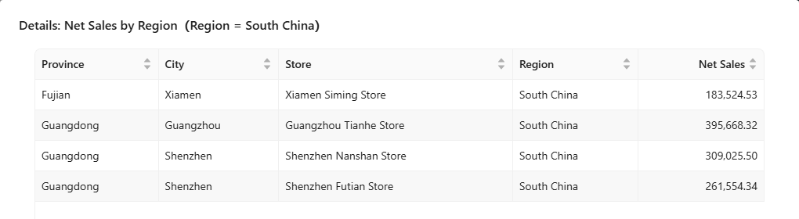
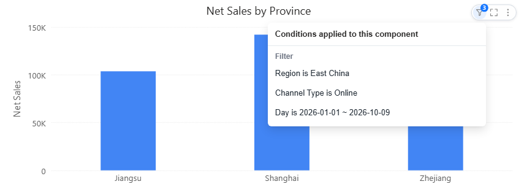

# Exploratory Analysis

Readers explore a report through the components themselves: clicking, right-clicking and the component toolbar.

## Right-click a data point

| Item | Shown when | Does |
| --- | --- | --- |
| **Filter other charts** | The chart has linked components | Filters them by this point, like a click. See [Cross-Filtering](/documentation/Analysis/Cross-Filtering/). |
| **Drill down to “{level}”** | The field has a lower hierarchy level | Drills to that level. See [Drill Down](/documentation/Analysis/Drill-down/). |
| **Drill up one level** | The chart is drilled | Goes back one level. |
| **View details** | The author turned it on | Opens the detail rows of this point. |
| **Drill through** | A drill-through is set up | Opens the target report or URL. See [Drill through](/documentation/Analysis/Drill-through/). |
| **Copy value** | Always | Copies the value as displayed. |

The menu is available on charts in the report and in the editor, not on tables, GIS maps or phones. The *Others* item of a row limit offers only **Copy value**.

### View details

**View details** shows a table of the clicked point broken down to the most detailed level of every hierarchy on the chart, under the same filters and links.

To offer it, select the chart and turn on **Actions → Interactions → View details** (off by default). The rows are aggregated at the most detailed model level, not raw fact rows; data permissions apply; the table stops at the page's **Max query records**.

## The component toolbar

Point to a component (tap on a touch screen) to show its toolbar:

| Button | Does |
| --- | --- |
| **Drill up**, drill-down, drill-through | Drill buttons, on charts that can drill. Only one of drill-down and drill-through is on at a time; with both off, a click filters other charts. |
| **Conditions** (funnel with a count) | Lists every condition behind the numbers: **Link**, **Filter**, **Passed in**, **Own**. Blue when a click on another chart filters this one. |
| **Zoom in** | Opens the component large. |
| **⋮** | **Export**, **Data preview**, **Execution cost**. |

Authors set when the toolbar appears in **Style → Toolbar → Display mode**: **Show on hover** (default), **Always visible** or **Hidden**.

## Choose the right tool

| Question | Use |
| --- | --- |
| Limit one chart permanently | [Component filters](/documentation/Analysis/Component-Level-Filtering/) |
| Let readers pick values | [Filter components](/documentation/Visualization/Filters/) |
| Focus other charts on a clicked member | [Cross-filtering](/documentation/Analysis/Cross-Filtering/) |
| See the next level of detail | [Drill down](/documentation/Analysis/Drill-down/) |
| Open another report for the clicked member | [Drill through](/documentation/Analysis/Drill-through/) |
| Keep the top or bottom N | [Row limit](/documentation/Analysis/Top-Bottom-N/) |
| Compare with a target | [Reference lines](/documentation/Analysis/Chart-Reference-Lines/) |
| Test an assumption | [What-if Analysis](/documentation/Analysis/What-if-Analysis/) |

Before interpreting an unexpected number, open **Conditions**: saved filters, filter components, clicks and URL values all narrow the data.
