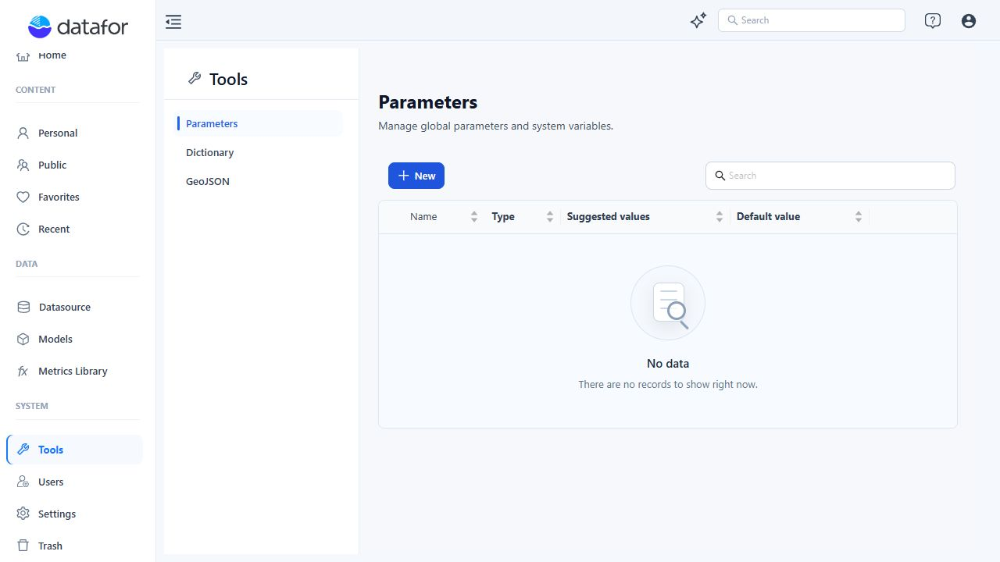
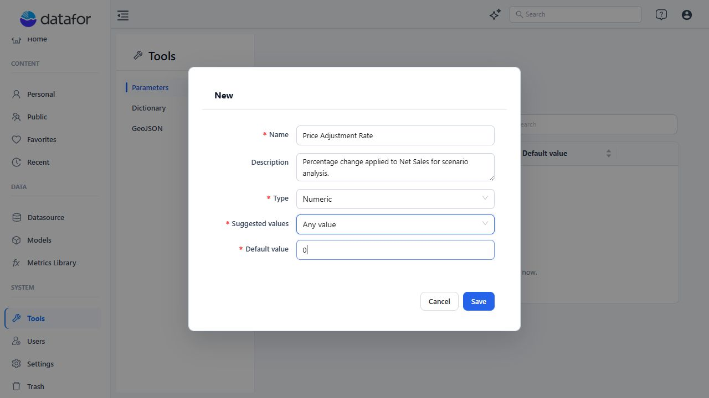
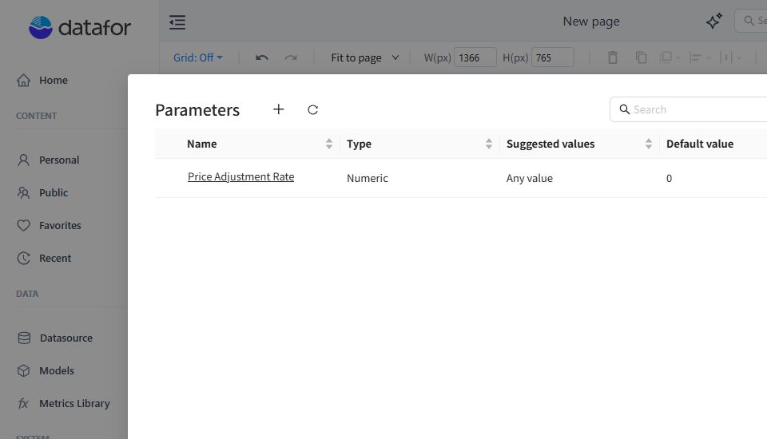

# Creating Parameters

A parameter is a named runtime input. Its definition supplies a data type, an allowed-value source, and a default value. A Parameter Controller changes the current value while a report is open; it does not change the parameter's saved default value.

## Choose the scope

| Scope | Where to manage it | Availability | How it is saved |
| --- | --- | --- | --- |
| **Global Parameter** | **Tools > Parameters** | Stored centrally for the current tenant and selectable in reports. | **Save** in the parameter editor writes the definition immediately. |
| **Report Parameter** | The report designer's parameter management action | Stored only in the current report. | **Save** updates the report draft; click the report-level **Save** to persist it. |

Use a Global Parameter when reports should share one definition. Use a Report Parameter for report-specific logic or when the report must remain self-contained.

Avoid using the same name in both scopes. Parameter references contain a name but no scope, so duplicate names make the intended definition unclear.

## Create a Global Parameter

1. Open **Tools > Parameters**.
2. Click **New**.
3. Complete the parameter fields described below.
4. Click **Save**.

## Create a Report Parameter

1. Open the report in the report designer.
2. Open the toolbar overflow menu (`...`) and select **Parameters management**.
3. Click **New**, complete the parameter fields, and click **Save**.
4. Close the Parameters window and click the report-level **Save**.

The first **Save** adds the definition to the current report draft. The report-level **Save** writes that draft to the report file.

## Configure the definition

| Field | What to enter |
| --- | --- |
| **Name** | Use a stable, descriptive name. Existing names are read-only. Names cannot contain `[ ] + / \ ? % # & = < > ' "`. |
| **Description** | State the business meaning, expected unit, and intended use. |
| **Type** | Select **Text**, **Numeric**, or **Date**. Use **Numeric** for arithmetic in a calculated measure. |
| **Suggested values** | The options depend on **Type**: Numeric supports **Any value**, **SQL**, and **List of values**; Text supports **SQL** and **List of values**; Date uses **Any value**. |
| **Default value** | Set the persisted starting value. This field is required. |

The value-source options behave as follows:

| Suggested values | Configuration | Typical controller |
| --- | --- | --- |
| **Any value** | Enter the default directly; there is no candidate list. | **Numeric Slider** for a Numeric parameter. |
| **SQL** | Select a connection, enter the query, and run **Execute query**. The first result column becomes the candidate list. | **List/Dropdown** or **Button**. |
| **List of values** | Add the allowed values manually. Duplicate values are removed when the definition is saved. | **List/Dropdown** or **Button**. |

## Add a Parameter Controller

In the report designer, open **Components > Parameters** and add a compatible controller:

| Controller | Compatible parameter definition |
| --- | --- |
| **Numeric Slider** | **Numeric** + **Any value** |
| **List/Dropdown** | **Text** or **Numeric** + **SQL** or **List of values** |
| **Button** | **Text** or **Numeric** + **SQL** or **List of values** |

Text + **Any value** and Date parameters created in the current editor are not compatible with the current controller set. See [Parameter Controllers](/documentation/Analysis/Parameter-Controllers/) for binding, selection, search, slider, and troubleshooting guidance.

## Use a parameter

| Use | Syntax or guide |
| --- | --- |
| Calculated measure | `ParamRef("ParameterName")` — see [Using Parameters in Calculated Measures](/documentation/Analysis/Using-Parameters-in-Calculated-Measures/). |
| Component title | `${ParameterName}` — see [Using Parameters in Component Titles](/documentation/Analysis/Using-Parameters-in-Component-Titles/). |
| Scenario input | See [What-if Analysis](/documentation/Analysis/What-if-Analysis/). |
| Embedded report URL | See [Pass parameters through URL](/documentation/Pass-parameters-through-URL/). |
| Tab switching | See [Parameter-Driven Tab Switching](/documentation/Visualization/Parameter-Driven-Tab-Switching/). |

## Common issues

| Symptom | Check |
| --- | --- |
| A parameter is missing from a controller's picker. | Confirm the controller and definition match the compatibility table above. |
| A controller selection does not become the next default. | Edit **Default value**. The current runtime value and the saved default are different states. |
| An SQL parameter has no choices. | Run **Execute query** and verify that the first result column contains the intended values. |
| You need to rename a parameter. | Names are read-only after creation. Create the replacement, update every controller, title, and formula, then remove the old definition. |
| You plan to delete a parameter. | Check all reports first. Deleting a Global Parameter does not rewrite reports, and deleting a Report Parameter is not guaranteed to repair every free-text reference or controller. |
