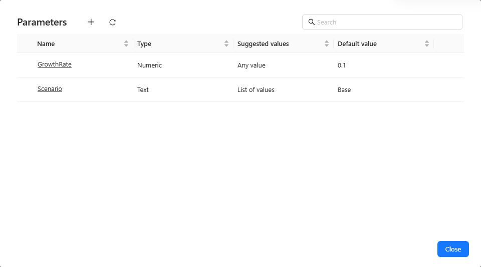
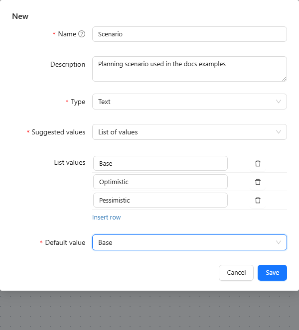
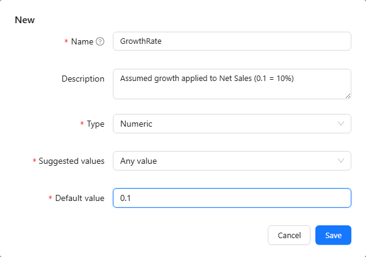
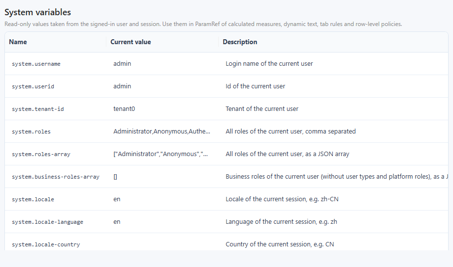

# Creating Parameters

A parameter is a named value, such as `GrowthRate = 0.1` or `Scenario = Base`, that formulas, titles, text and queries read. Readers change it through a filter bound to the parameter, or through the report URL.

| Kind | Scope | Where you manage it |
| --- | --- | --- |
| **Report parameter** | One report | Report editor toolbar → **Manage parameters** (sliders icon) |
| **Global parameter** | Every report and analysis model | Console → **Tools → Parameters** (administrators only can change them) |
| **System variable** | The signed-in user and session, read-only | Listed under **Tools → Parameters → System variables** |

If a report parameter and a global parameter have the same name, the report uses its report parameter and the editor warns you.

## Create a report parameter

1. In the report editor, click **Manage parameters** in the toolbar.
2. Click **+**.
3. Fill in the dialog and click **Save**. Then save the report.

| Field | Rules |
| --- | --- |
| **Name** | 1–32 characters: letters, digits, underscores, dots and Chinese characters; must not start with `system.`. Names are case sensitive. |
| **Description** | Optional; shown to authors. |
| **Type** | **Text**, **Numeric** or **Date**. Changing the type clears the value source and default. |
| **Suggested values** | **Any value**, **SQL** or **List of values**. |
| **Default value** | A number box, a date picker (stored as `YYYY-MM-DD`) or a choice from the list, depending on the type. |

 

The value source decides which filters can drive the parameter:

| Suggested values | Bind it to |
| --- | --- |
| **List of values** or **SQL** (any type) | Dropdown, List box, Button group, Radio/Checkbox |
| **Any value**, Numeric | Numeric slider |
| **Any value**, Date | Date component |

### SQL values

With **SQL**, enter a single `SELECT` (or `WITH … SELECT`) statement on a connection you can read. The first column supplies the values, and the preview reports *12 rows returned; the first column "region" is used for the values*. At most 1,000 rows are used; statements that write data are rejected.

### Delete a parameter

Deleting a parameter lists where it is used (*Used in 3 places: …*). A report parameter deletion can be undone until you save the report.

## Global parameters

Administrators create global parameters in **Tools → Parameters** with the same dialog. Other users see a read-only list. Delete a global parameter only after checking that no report or model still references it.

## System variables

System variables describe the current user and session. Use them in calculated measures (`ParamRef("system.username")`), dynamic text (`{{param.system.username}}`), default tab rules and row access policies. They cannot be bound to a filter.

| Variable | Value |
| --- | --- |
| `system.username`, `system.userid` | Login name and id of the user |
| `system.tenant-id` | Tenant of the user |
| `system.roles`, `system.roles-array` | All roles, comma separated or as a JSON array |
| `system.business-roles-array` | Business roles only (without user types and platform roles), as a JSON array |
| `system.locale`, `system.locale-language`, `system.locale-country` | Locale of the session, such as `zh-CN`, `zh`, `CN` |

The user profile fields (name, company, department, title, email, mobile, birthday, description) are available as `system.name`, `system.company`, `system.dept` and so on.

## Use a parameter

| Where | Syntax | Example |
| --- | --- | --- |
| Calculated measure | `ParamRef("name")` or `${name}` | `[Measures].[Net Sales] * (1 + ParamRef("GrowthRate"))` |
| Component title | `${name}` | `Sales Scenario (rate: ${GrowthRate})` |
| Text, Shape text, Web page address | `{{param.name}}` | `Scenario: {{param.Scenario}}` |
| Model SQL (SQL views, custom SQL) | `${name}` | `WHERE sales_year = ${ReportYear}` |
| Report URL | `?name=value` or `?param_name=value` | `?GrowthRate=0.15` |
| Default tab rules, visibility rules | Pick the parameter in the dialog | Show the *Details* tab when `Scenario` is *Optimistic* |

The current value of a parameter is, in order: the value of a filter bound to it, the value in the URL, the parameter's **Default value**. Several values (from a multiple selection or a comma-separated URL value) are passed as a JSON array, which only `${name}` in model SQL expands to an `IN` list.

When the value changes, only components that reference the parameter re-query.

## Let readers change the value

Bind a filter to the parameter: choose **Data → Data source → Parameter** on a Dropdown, List box, Button group, Radio/Checkbox, Numeric slider or Date. See [Bind Filters to Parameters](/documentation/Analysis/Parameter-Controllers/).

Related: [What-if Analysis](/documentation/Analysis/What-if-Analysis/) · [Using Parameters in Calculated Measures](/documentation/Analysis/Using-Parameters-in-Calculated-Measures/) · [Using Parameters in Component Titles](/documentation/Analysis/Using-Parameters-in-Component-Titles/)
