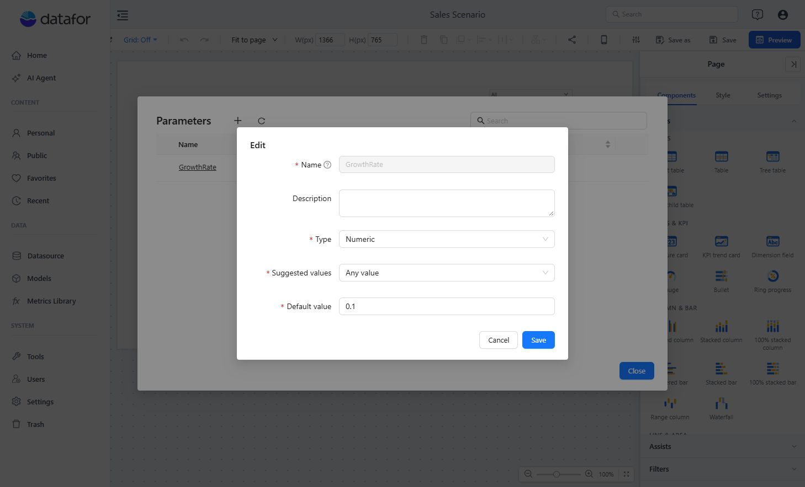
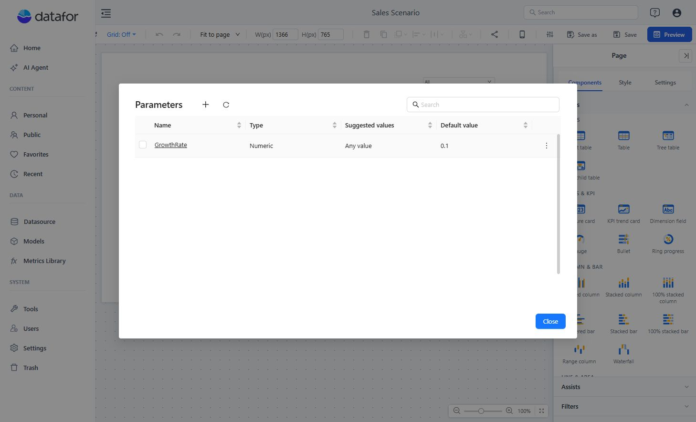

# Creating Parameters

A parameter is a named input used by report calculations, text, navigation, or filtering. Create a report parameter when the input belongs to one report.

## Create a report parameter

1. Open **Manage parameters** in the report toolbar (the sliders icon).
2. Click **New**.
3. Enter a stable **Name** and a short **Description**.
4. Choose **Type**: Text, Numeric, or Date. Choose the available **Suggested values** source and set a **Default value**.
5. Click **Save**, close Parameters, then save the report itself.

For Numeric parameters, suggested values include **Any value**, **SQL**, and **List of values**. Choose a list source when readers will use a dropdown or list; choose Any value for a numeric slider.

## Use the value

| Location | Reference |
| --- | --- |
| Calculated measure | `ParamRef("GrowthRate")` |
| Component title | `${GrowthRate}` |
| Text, shape text, or web-page content | `{{param.GrowthRate}}` |
| Report-opening URL | A parameter query value such as `?GrowthRate=0.1` |

Names must match the definition. Prefer the interface's value picker where available. See [dynamic component titles](/documentation/Analysis/Using-Parameters-in-Component-Titles/) for a title example.

Global parameters are managed centrally through **Tools → Parameters** and appear separately in the picker. Use distinct names to keep the intended source clear.

Add a [Parameter Controller](/documentation/Analysis/Parameter-Controllers/) to let readers change the value. Verify both the initial state and the result after changing it.
