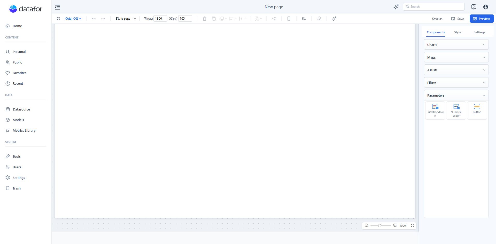

# Parameter Controllers

A Parameter Controller lets a report user change a parameter's current value. Query components that use the parameter refresh after the controller publishes a value. The controller does not rewrite the parameter definition's **Default value**.

## Choose a compatible controller

| Parameter definition | Compatible controller |
| --- | --- |
| **Numeric** + **Any value** | **Numeric Slider** |
| **Text** or **Numeric** + **SQL** | **List/Dropdown** or **Button** |
| **Text** or **Numeric** + **List of values** | **List/Dropdown** or **Button** |
| **Text** + **Any value** | No compatible controller |
| **Date** created in the current parameter editor | No compatible controller |

Only compatible parameters appear in a controller's parameter picker.

## Add and bind a controller

1. Open a report in the designer.
2. Open **Components > Parameters**.
3. Add **List/Dropdown**, **Numeric Slider**, or **Button** to the canvas.
4. With the controller selected, open **Data > Parameter** and choose a Report or Global Parameter.
5. Configure the controller under **Style**, test it in preview, and save the report.

The picker groups definitions under **Report parameters** and **Global parameters**. Choose **New parameter** when the report needs a new Report Parameter. For the full definition workflow, see [Creating Parameters](/documentation/Analysis/Creating-Parameters/).

## List/Dropdown

Use **List/Dropdown** when users choose from an SQL result or a maintained list of values.

- Under **Style > Style**, choose **List** to keep the choices visible or **Dropdown** to save canvas space.
- Selection is single by default. Turn on **Multiple selection** only when the consuming query supports several values.
- Turn on **Search** for a long list. Search is case-insensitive and filters the displayed choices; space-separated terms must all match.
- When **Multiple selection** is turned off, the last selected item remains selected.

Clearing every selection does not create a durable blank query value: query evaluation falls back to the parameter's **Default value**. Define a deliberate default instead of relying on an empty selection.

## Numeric Slider

Use **Numeric Slider** for one **Numeric** parameter whose **Suggested values** setting is **Any value**. It selects one value, not a minimum-to-maximum range.

Set **Minimum Value**, **Maximum Value**, and a positive **Step** explicitly. Then choose the required presentation options:

- **Layout**: Horizontal or Vertical.
- **Input box**: lets the user type a value. Press **Enter** to apply it.
- **Slider**: lets the user drag to a value. The value is applied when the handle is released.
- **Slider Label** and **Track Labels**: show the current value or scale labels when needed.

Keep at least **Input box** or **Slider** visible so the report remains operable.

## Button

Use **Button** for a short set of choices. Each candidate is rendered as a button, and selection is single. The controller does not provide search or multiple selection.

Use **Content fit** when button widths should follow their labels, or **Same size** for an aligned group. For long candidate lists, use **List/Dropdown** instead.

## Default value and current value

| Value | Where it is defined | What it controls |
| --- | --- | --- |
| **Default value** | Parameter definition | Starting fallback value. |
| **Current value** | Bound controller or runtime input | Value used by report interactions and affected queries. |

When no runtime value has already been supplied, binding a controller initializes it from the parameter default. A controller interaction changes runtime state; it does not edit that default. To change the starting fallback, edit the parameter definition.

## Common issues

| Symptom | Check |
| --- | --- |
| The parameter is missing from the picker. | Match its type and **Suggested values** setting to the compatibility table. |
| The List/Dropdown has no choices. | For SQL, execute and validate the query. For **List of values**, add and save the candidates. |
| A slider change is not applied yet. | Release the slider handle, or press **Enter** after typing a value. |
| The controller appears blank when the report opens. | Set a valid parameter **Default value** and confirm that it exists in the controller's candidate list. |
| A tab opens from the wrong multi-select value. | Use single selection for tab navigation. Tab switching uses only the first selected value. |

## Related topics

- [Creating Parameters](/documentation/Analysis/Creating-Parameters/)
- [Using Parameters in Calculated Measures](/documentation/Analysis/Using-Parameters-in-Calculated-Measures/)
- [What-if Analysis](/documentation/Analysis/What-if-Analysis/)
- [Parameter-Driven Tab Switching](/documentation/Visualization/Parameter-Driven-Tab-Switching/)
