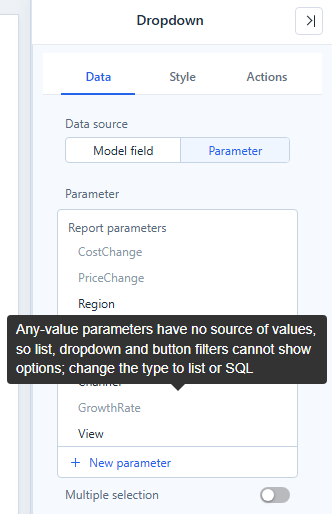

# Bind Filters to Parameters

Any list filter, the Numeric slider and the Date component can set a parameter instead of filtering by a model field. This replaces the separate parameter controllers of earlier versions; reports that still contain them keep working.

## Bind a filter

1. Create the parameter (see [Creating Parameters](/documentation/Analysis/Creating-Parameters/)), or create it from the filter in step 3.
2. Add the filter and choose **Data → Data source → Parameter**.
3. Select the parameter in the list. The list shows **Report parameters** and **Global parameters**; **+ New parameter** at the end opens the parameter dialog with a matching type.
4. Save, preview and change the value. Check the formula, title or text that uses the parameter.

## Which parameters a filter can use

Parameters that a filter cannot use are greyed out, not hidden. Hover one to see why.

| Filter | Parameter it needs | Reason shown otherwise |
| --- | --- | --- |
| Dropdown, List box, Button group, Radio/Checkbox | **List of values** or **SQL**, any type | *Any-value parameters have no source of values, so list, dropdown and button filters cannot show options; change the type to list or SQL* |
| Numeric slider | **Numeric** with **Any value** | *A numeric slider can only bind an any-value parameter of number type…* |
| Date (**Filter by → Field**) | **Date** with **Any value** | *A date component can only bind an any-value parameter of date type…* |

Hierarchy table filter, Search and Paginate cannot bind parameters. System variables are not listed: they are read-only.

## What changes when a filter is bound

- The options come from the parameter's list or SQL query; the initial selection is the parameter's default. **Default value** and **Show 'All'** are hidden.
- The title defaults to the parameter name.
- The selection writes the parameter. It adds no filter condition to other components; only components whose query, title or text references the parameter re-query.
- **Multiple selection** writes a JSON array such as `["Base","Optimistic"]`. Only `${name}` in a model's SQL expands it to a list; `ParamRef()` and titles receive the text.
- Several controls bound to the same parameter stay in sync.
- When nothing is selected, the parameter's default is used.
- If the parameter is deleted, the filter shows *Parameter … no longer exists. Pick another parameter on the Data tab*.

Switching back to **Data source → Model field** restores the field box and keeps the analysis model; you choose the field again.

For a worked example, a Numeric slider bound to a *GrowthRate* parameter that drives a scenario measure, see [What-if Analysis](/documentation/Analysis/What-if-Analysis/); the slider's own range and step settings are in [Numeric Slider](/documentation/Visualization/Number-Range-Filter/#drive-a-parameter).

## Write a Date component's value to a parameter

A Date component that filters by a field can also copy its value into a parameter: **Actions → Interactions → Write to parameter**. A single date is written as `YYYY-MM-DD`, a range as `["start","end"]`.

## Troubleshooting

| Symptom | Check |
| --- | --- |
| The parameter is greyed out. | Hover it; adjust its type or value source, or use the filter that matches it. |
| The value changes but nothing re-queries. | No component references the parameter, or the reference name differs in case or spelling. |
| A multiple selection breaks a formula. | `ParamRef()` receives a JSON array text; use a single selection, or use the parameter in model SQL. |

Related: [Filters](/documentation/Visualization/Filters/) · [Parameters in component titles](/documentation/Analysis/Creating-Parameters/#component-titles)
