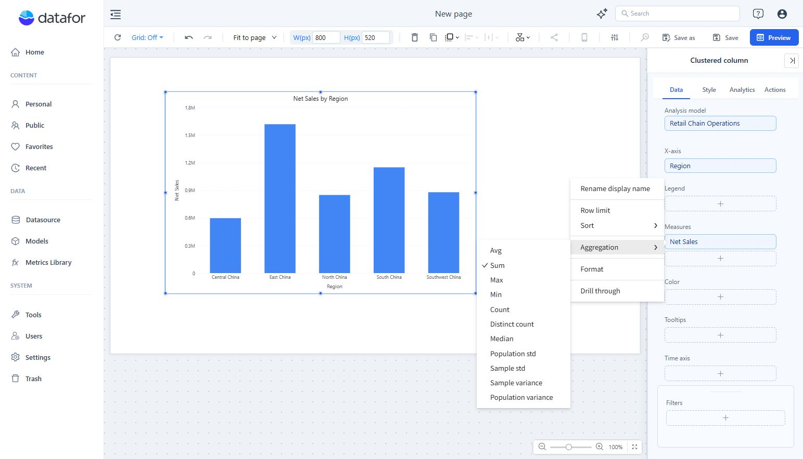

# Aggregation for Measures

Aggregation determines how source values are summarized. Use the model’s default when the business definition should be shared; change a component field only when that chart needs another valid summary.

1. Select the component and open **Data**.
2. Open the measure’s **More → Aggregation** menu.
3. Choose an enabled method and check the result.
4. Save the report.

The menu includes Avg, Sum, Max, Min, Count, Distinct count, Median, population/sample standard deviation, and population/sample variance. Availability depends on the field and model.

| Need | Consider |
| --- | --- |
| Add transaction amounts | Sum. |
| Count records or non-empty values | Count, with the field’s null behavior understood. |
| Count unique identifiers | Distinct count. |
| Find extremes | Min or Max. |
| Calculate a ratio or weighted result | A calculated measure with an explicit numerator and denominator. |

Do not sum percentages or average already aggregated rates without checking the business meaning. If totals are unexpectedly inflated, inspect relationships and row duplication as well as aggregation.

For reusable definitions, see [Measures and Calculated Measures](/documentation/Model/Measures-and-Calculated-Measures/).
