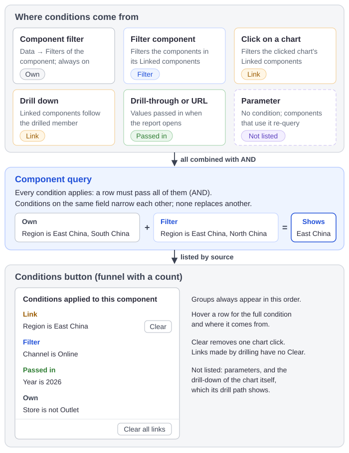

# How Filters, Clicks, Drilling and Parameters Combine

The numbers in a chart can be narrowed by several things at once: its own filters, filter components, clicks on other charts, drilling and values passed into the report. The chart's query applies all of them, and its **Conditions** button lists them by source.

## Where conditions come from

| Source | Narrows | Reader can undo it | Listed under |
| --- | --- | --- | --- |
| [Component filter](/documentation/Analysis/Component-Level-Filtering/) (**Data → Filters**) | That component only, always | No | **Own** |
| [Filter component](/documentation/Visualization/Filters/) with **Data source → Model field** | The components checked in its **Linked components**. A Date component with **Filter all components** (the default) filters every component the date can filter. | Change or clear the filter | **Filter** |
| [Click on a chart](/documentation/Analysis/Cross-Filtering/) | The clicked chart's **Linked components** | Click again, or **Clear** in **Conditions** | **Link** |
| [Drill down](/documentation/Analysis/Drill-down/) | The drilled chart shows the next level of the clicked member, and its **Linked components** are filtered by that member | **Drill up** or the drill path | **Link**, without **Clear** |
| [Drill-through](/documentation/Analysis/Drill-through/) or the report URL | The components of the opened report whose model has the field | No | **Passed in** |
| [Parameter](/documentation/Analysis/Creating-Parameters/) | Nothing: it adds no condition. Components whose formula, title, text or model SQL uses it re-query with the new value. | Change the filter bound to it | Not listed |

A value passed as `default_<filter>=…` in the URL is the opening selection of that filter component, so it is listed under **Filter**, not **Passed in**.

## How the conditions combine

All conditions apply together: a row is counted only if it passes every one of them. A chart filtered by *Channel is Online* (filter component) and by a click on *East China* shows online sales in East China.

Clicks follow their own rule: with **Ctrl**+click, points in the same chart are combined with OR, and selections in different charts with AND. See [Cross-Filtering](/documentation/Analysis/Cross-Filtering/#clicking-rules).

Conditions on the same field narrow each other; none of them replaces another. This is also true when a component filter and a filter component use the same field:

| Component filter (Own) | Filter component | The component shows |
| --- | --- | --- |
| Region is East China, South China | Region is East China, North China | East China |
| Region is not East China | Region is East China, South China | South China |
| Region is not East China | Region is East China | No data |

So a filter component cannot show more than a component filter allows. To let readers choose freely on a chart, remove the component filter on that field, or leave the chart out of the filter's **Linked components**.

Changing any filter component clears the chart clicks on the page.

## Components on another model

A filter or a click reaches a component on another analysis model only through a matching field: the server looks for the same level by unique name, then by caption. Members are matched by name, so both models must use the same member names. A condition without a matching field is dropped for that component; if a click has no matching field at all, the component is not re-queried and its **Conditions** list shows no link. See [Cross-Model Analysis](/documentation/Analysis/Cross-Model/).

## Apply mode

With a [Filter button](/documentation/Visualization/Filter-Button/) set to **Action → Apply** on the page, changes to filter components wait until the reader clicks **Apply**. Clicks on charts, drilling, paging and tab switches stay immediate and use the filter values of the last **Apply**. Clicking **Apply** clears the chart clicks, the same as changing a filter on a page without the button. Filters bound to a parameter are not deferred.

## What each button undoes

**Refresh** in the report toolbar, and the **Reset filters** and **Clear filters** actions of a Filter button, when the report is opened or previewed:

| | **Refresh** | **Reset filters** | **Clear filters** |
| --- | --- | --- | --- |
| Filter components | Back to the opening value, including `default_` URL values | Back to the opening value | Set to **All**. Required single selections and changed Date components go back to the opening value. |
| Chart clicks (Link) | Cleared | Cleared | Cleared |
| Drill-downs | Back to the top level | Kept | Kept |
| Changes waiting for **Apply** | Discarded | Applied with the reset | Applied with the clear |
| Component filters (Own) | Kept | Kept | Kept |
| Passed-in values | Kept | Kept | Kept |
| Server cache | Cleared, then every component re-queries | Kept | Kept |

To undo a single condition:

| To remove | Do this |
| --- | --- |
| One chart click | **Clear** next to it in **Conditions**, or click the point again |
| All chart clicks | **Clear all links** in **Conditions** |
| One filter's selection | **Clear selections** (eraser) in the filter's toolbar, or **×** in a Dropdown; on a Date component, **Reset to default** |
| A drill-down | **Drill up**, or click an earlier segment of the drill path |

## Read the Conditions list

Point to the component and click the funnel with a count in its toolbar. The list **Conditions applied to this component** groups the conditions in this order; empty groups are left out:

| Group | Contains |
| --- | --- |
| **Link** | Clicks on other charts, and the members drilled in other charts. Each click has **Clear**; **Clear all links** removes them all. Links from drilling have no **Clear**. |
| **Filter** | Filter components on the page that filter this component |
| **Passed in** | Values from a drill-through or the URL |
| **Own** | The component's own filters |

Each row reads *Field is value* or *Field is not value*. A rule such as *contains* or a relative period reads *Field matches a custom condition*, and *Field is (none)* means the conditions on that field left no member. Hover a row to see the full condition and where it comes from, for example *From: Passed from jump*.

Parameters and the drill-down of the chart itself are not listed; the drill path shows the drill. When a component is empty, it says *No data under the current link conditions* with **Clear links**, or *No data under the current filters* with **View conditions**, which opens the same list.

Related: [Exploratory Analysis](/documentation/Analysis/Exploratory-Analysis/) · [Linking and Cascading Filters](/documentation/Visualization/Filter-Subscriptions/) · [Creating Parameters](/documentation/Analysis/Creating-Parameters/)
