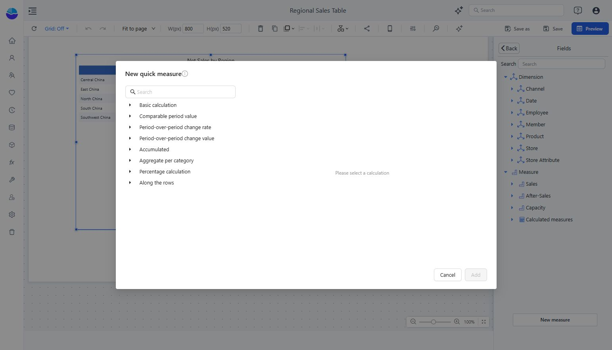

# Quick Calculated Measures

Create a calculation from a template, then check its result and generated formula.

1. Select a component and open a field or measure picker from **Data**.
2. Click **New measure → New quick measure**.
3. Search for or expand a calculation group and choose a template.
4. Enter a unique name, complete the required inputs, and choose the result format.
5. Click **Add**, select the measure for the component, and return with **Back**.
6. Check the result in Preview and save the report.

Groups include **Basic calculation**, **Comparable period value**, **Period-over-period change rate**, **Period-over-period change value**, **Accumulated**, **Aggregate per category**, **Percentage calculation**, and **Along the rows**.

For time calculations, use a correctly configured time hierarchy and test the beginning of a year, a missing period, and the selected filter range. For percentages, confirm the denominator. For calculations along rows, check the displayed order.

Create model-level calculations when the definition should be reused across reports. See [Measures and Calculated Measures](/documentation/Model/Measures-and-Calculated-Measures/).
