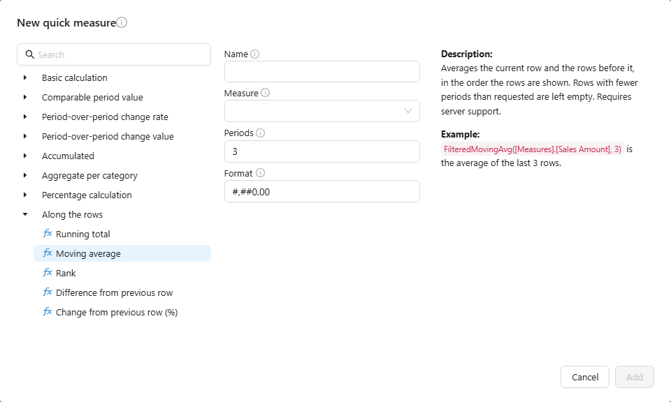
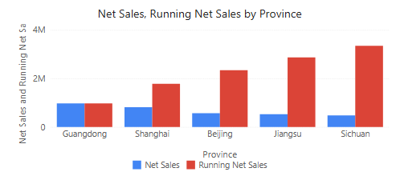

# Quick Calculated Measures

A quick measure is a calculated measure made from a template: choose a calculation, pick the measure, and Datafor writes the formula.

## Create one

1. Select a component, open **Data** and click **+** under a measure group.
2. At the bottom of the picker click **New measure ▾ → New quick measure**.
3. Choose a template from a group, or search for it.
4. Enter a **Name**, pick the **Measure** and fill the template's options.
5. Check **Format**. Rate and share templates start as `0.0%`, the others as `#,##0.00`; a format you type is kept when you switch templates.
6. Click **Add**. The new measure is added to the component and saved with the report.

## Template groups

| Group | Templates |
| --- | --- |
| **Basic calculation** | Addition, Subtraction, Multiplication, Division |
| **Comparable period value** | Yearly, Quarterly, Monthly and Weekly comparable period value; Sequential comparable value |
| **Period-over-period change rate** | YOY, QOQ, MOM, WOW; Period-over-period change rate |
| **Period-over-period change value** | ΔYOY, ΔQOQ, ΔMOM, ΔWOW; Period-over-period absolute change value |
| **Accumulated** | YTD, QTD, MTD, WTD |
| **Aggregate per category** | Aggregate, Average, Sum, Max and Min per category; Category correlation; Overall and Sample covariance |
| **Percentage calculation** | Percentage, Row Percentage, Column Percentage |
| **Along the rows** | Running total, Moving average, Rank, Difference from previous row, Change from previous row (%) |

Period templates need a time hierarchy in the model; see [Time Semantics and Default Time Settings](/documentation/Model/Time-Dimensions-and-Time-Intelligence/).

### Which period a comparison uses

| Situation | Compared with |
| --- | --- |
| No date filter | Each row's own period, shifted: with months on rows, every month is compared with the same month a year earlier (YOY) or the month before (MOM). |
| A date range filter and a finer time level on rows | Each row's part of the range, shifted. Before 10.00 every row was compared with the shifted total of the whole range. |
| A date range filter and no time level on rows | The whole range, shifted. |
| **Sequential** and **Period-over-period** templates | The window just before the current one, of the same length in calendar periods: Apr–Aug is compared with Nov–Mar. |
| A window of whole months | Whole months: February is compared with all of January, not January 1–28. |

A row with no comparable period gets an empty value. See [MDX Functions → Period comparisons](/documentation/Advanced/MDX-Functions/) for the functions behind the templates.

## Along the rows

These templates work on the rows **in the order they are shown**, after sorting, filters and row limits:

| Template | Result | Options |
| --- | --- | --- |
| **Running total** | Adds up the measure from the first row to the current row. | – |
| **Moving average** | Average of the current row and the rows before it. | **Periods** (default 3). The first rows with fewer periods stay empty. |
| **Rank** | Position of the row by the measure. Ties share a rank: 1, 2, 2, 4. | **Order**: Descending (default) or Ascending |
| **Difference from previous row** | Current row minus the row above. | – |
| **Change from previous row (%)** | Change against the row above, in percent. Empty when the row above is empty or 0. | – |

- With several row fields, the calculation restarts in each outer group.
- Total and subtotal rows stay empty for these measures.
- *Previous row* is the row above on screen, not the previous calendar period. For month-over-month growth use the period templates.
- Sort by value in descending order and add a share template to build a Pareto (80/20) chart from a running total.
- Set Rank's **Format** to `#,##0`, otherwise ranks show as *1.00*.

These templates need the 10.00 query engine on the server.

## Check the result

Test at the start of a year, with a missing period and with filters. For shares, confirm the denominator. Measures needed in many reports belong in the model; see [Measures and Calculated Measures](/documentation/Model/Measures-and-Calculated-Measures/).

Related: [Calculated Measures](/documentation/Analysis/Calculated-Measures/) · [Row Limit](/documentation/Analysis/Top-Bottom-N/)
