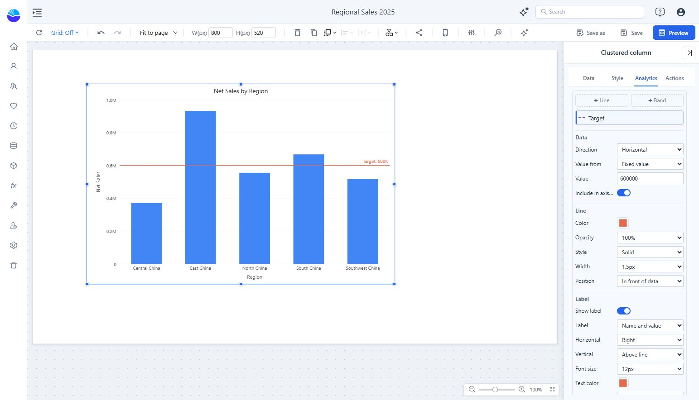

# Chart Reference Lines

Reference lines and bands mark targets, thresholds, and statistics on a chart, so readers can compare each data point with them at a glance. You add and edit them in the **Analytics** tab of the property panel.

## Add a target line

1. Select the chart and open **Analytics**.
2. Click **+ Line** and name it **Target**.
3. Choose **Direction → Horizontal** and **Value from → Fixed value**.
4. Enter **600000** for the example sales chart. Move focus out of the input to apply it.
5. Enable **Show label**, check the rendered line, then save.

## Where to Find It

Select a chart in the editor. The property panel shows the tabs **Data**, **Style**, **Analytics**, and **Actions**. Charts that can't use reference lines don't have the **Analytics** tab.

The tab has:

- **+ Line**, **+ Band**, and, for scatter charts, **+ Diagonal** at the top.
- A list of the lines on this chart. Each row shows the name and the current value. Hover a row to show or hide the line, or delete it. Click the name to rename it.
- The settings of the selected line below the list. Changes apply right away. Use **Undo** to revert them.

## Reference Lines

A reference line takes its value from **Value from**:

| Value from | Value |
| --- | --- |
| Fixed value | A number you type, such as a sales target |
| Average, Median, Minimum, Maximum | Calculated from the data points shown in the chart, for the chosen measure |
| Percentile | The Pth percentile (1–99) of the data points, for the chosen measure |

Notes on calculated values:

- Empty values are ignored. The "Others" group created by a Top N limit is ignored.
- The value is recalculated after filtering, cross-filtering, and drilling.
- **Calculate over** appears when the chart has a legend or stacked series:
  - **All data points**: one line over every point (default for non-stacked charts).
  - **Category totals**: add up each category first (default for stacked charts).
  - **Each series**: one line per series, in the series color.
- An average is the simple average of the points in the chart. For a ratio measure such as margin rate, it is not the same as the overall rate.

**Direction**: a fixed-value line can also be drawn across the category axis, for example at a month or a product category. On a continuous date axis you pick a date; on a scatter chart, a value of the X measure.

**Include in axis range**: extends the value axis so that a fixed-value line outside the data range is still visible. It is on for new lines.

**Axis** (combo charts only): whether a fixed-value line or band belongs to the bar axis or the line axis. Lines calculated from a measure follow that measure's axis.

## Bands

A band shades the area between a lower and an upper bound. Each bound is a fixed value or a statistic of a measure, for example **Percentile 25** to **Percentile 75** for the middle half of the data. Bands are drawn behind the data by default.

## Style and Labels

| Group | Settings |
| --- | --- |
| Line | Color, opacity, style (solid, dashed, dotted), width, in front of or behind the data |
| Label | Show label; content (name, value, name and value, or custom text with `{name}` and `{value}`); horizontal (left, center, right) and vertical (above, below) position; font size; text color; display units; decimal places; background |
| Shade | None, above the line, or below the line; color and opacity |

Label values follow the measure's format by default. Hover a line or band to see its name and value; for calculated lines the tooltip also says how many points the value is based on.

## Supported Charts

| Chart | Fixed value | Statistics | Across category axis | Band |
| --- | --- | --- | --- | --- |
| Column, bar (clustered and stacked) | Yes | Yes | Yes | Yes |
| Line, area, stacked area | Yes | Yes | Yes | Yes |
| Combo | Yes | Yes | Yes | Yes |
| 100% stacked column, bar, area | Yes (0–100) | No | Yes | Yes |
| Scatter | Yes | Yes (X or Y measure) | Yes (X value) | Yes |
| Box plot | Yes | No | No | Yes |
| Waterfall | Yes | No | Yes | Yes |
| Range column | Yes | Yes (min or max measure) | Yes | Yes |
| Histogram | Yes (count or percentage) | Yes (sample values, estimated) | Yes (sample value) | Yes (sample values) |

Scatter charts can also show a **diagonal** (y = x).

**Range column**: statistics use the original minimum and maximum measures, over all data points.

**Histogram**: horizontal lines mark a count (or percentage). Lines across the X axis, statistics, and bands use sample values. The histogram only receives bin counts, so the average, median, and percentiles are estimated from the bins and shown with "≈"; the error is at most half a bin width. Minimum and maximum come from the data.

Reference lines are kept when you switch between chart types that support them. Lines a chart type can't draw are hidden and come back when you switch back.
