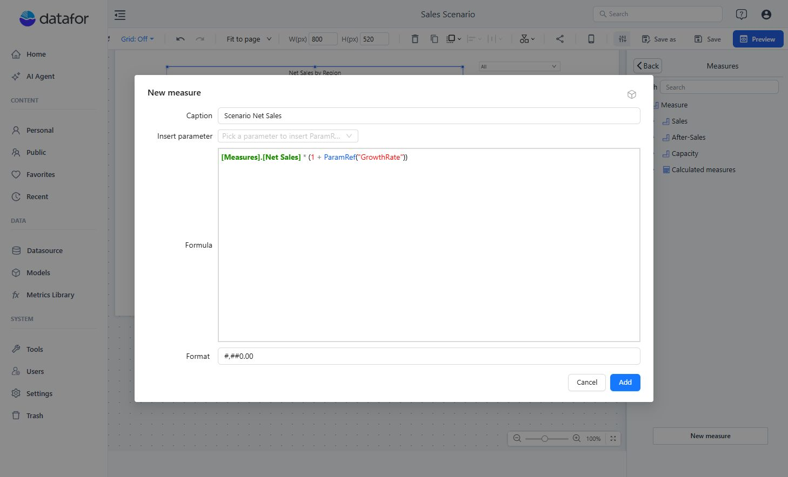
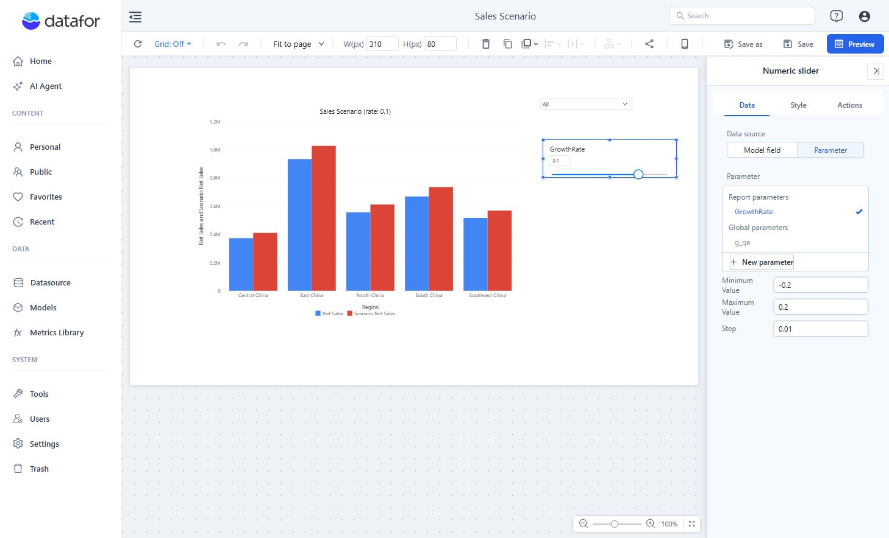
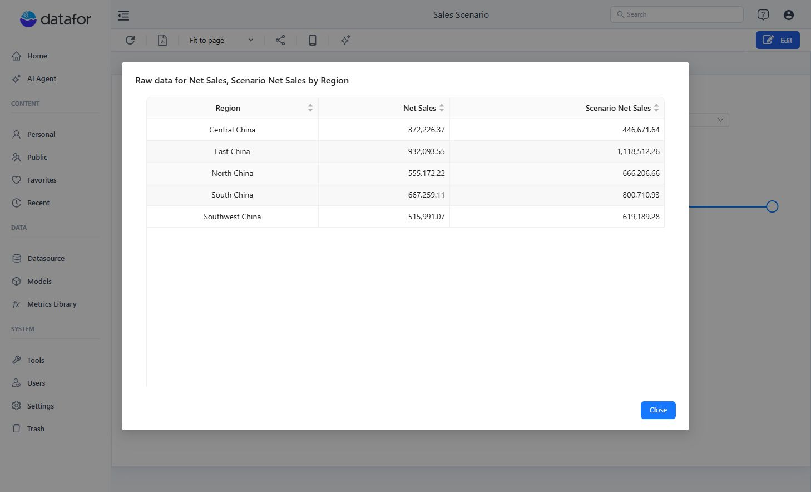
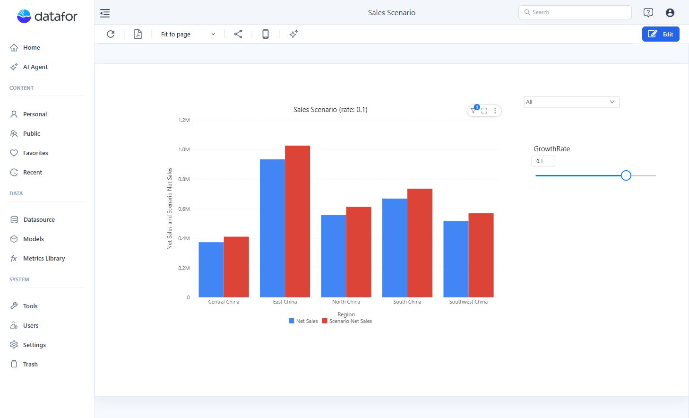

# What-if Analysis

What-if analysis recalculates an existing measure under an explicit assumption. It is deterministic scenario analysis, not a forecast.

This example compares **Net Sales** with a scenario that applies the same growth rate to each region. Use the **Retail Chain Operations** model, **Region**, and **Net Sales**, with a component filter of **Year = 2025**. The scenario scales the existing result; it does not model changes in demand, costs, or product mix.

Start with a **Clustered column** chart: put **Region** in **X-axis** and **Net Sales** in **Measures**. If you are new to the editor, follow [Create Your First Report](/documentation/Start/Create-Your-First-Analysis-Report/) first.

## 1. Create the scenario input

Open **Manage parameters** in the report toolbar, click **+**, and use these settings:

| Field | Value |
| --- | --- |
| **Name** | `GrowthRate` |
| **Type** | **Numeric** |
| **Suggested values** | **Any value** |
| **Default value** | `0.1` |

The value is a decimal rate: `0.1` means a 10% increase; `-0.2` means a 20% decrease. Save the parameter and close the manager.


For the complete parameter workflow, see [Creating Parameters](/documentation/Analysis/Creating-Parameters/).

## 2. Create the scenario measure

In the target component's Measures picker, select **New measure → New measure**. Create a report-level measure named `Scenario Net Sales` with this MDX formula:

```mdx
[Measures].[Net Sales] * (1 + ParamRef("GrowthRate"))
```

Use **Format → #,##0.00** and click **Add**. Keep both **Net Sales** and **Scenario Net Sales** in the chart's **Measures** slot so readers can compare them.



Start from a valid aggregated business measure. Do not substitute an expression such as aggregated unit price multiplied by aggregated quantity; that usually differs from summing transaction-level sales.

If you choose to store percentage points such as `10` instead, divide the parameter value by `100` in the formula.

## 3. Add the control and result

1. Add **Numeric slider** from **Components → Filters**.
2. In **Data**, set **Data source → Parameter** and select **GrowthRate**.
3. In the same panel, set **Minimum value → -0.2**, **Maximum value → 0.2**, and **Step → 0.01**.
4. In the chart's **Style → Title**, enter `Sales Scenario (rate: ${GrowthRate})`.
5. Save and open **Preview**. Move the slider or type a value in its input and press **Enter**.



## 4. Validate the result

Use the base **Net Sales** value as the control case:

| Parameter value | Expected result |
| --- | --- |
| `-0.2` | `0.80 × Net Sales` |
| `0` | `1.00 × Net Sales` |
| `0.2` | `1.20 × Net Sales` |

Use the chart's **⋮ → Data preview** to compare exact values. For example, with Central China's base Net Sales of **372,226.37**, the three results are **297,781.10**, **372,226.37**, and **446,671.64**. Your values may differ if the source data or filters change.



Return to `0.1` and check that the title reads **Sales Scenario (rate: 0.1)**. Reopen the saved report to check its initial state.



## Troubleshooting

| Symptom | Check |
| --- | --- |
| `Unknown parameter` appears when the component queries. | Match the parameter name exactly, including case and spaces. |
| The parameter is absent from Numeric slider. | Choose **Data source → Parameter** and check the parameter type; this example uses **Numeric / Any value**. |
| The result does not change. | Confirm the slider and `ParamRef()` reference the same parameter and the component uses `Scenario Net Sales`. |

See [Using Parameters in Calculated Measures](/documentation/Analysis/Using-Parameters-in-Calculated-Measures/) for `ParamRef()` rules.
