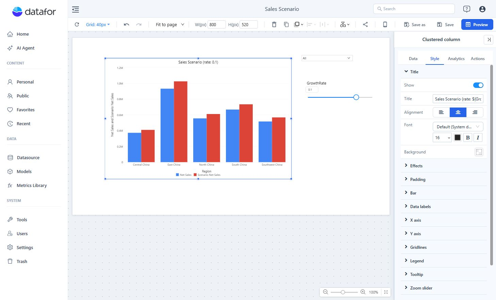

# Using Parameters in Component Titles

Insert a parameter's current value in a component title with this placeholder:

```text
${ParameterName}
```

For example:

```text
Sales Scenario (rate: ${GrowthRate})
```

When `GrowthRate` is `0.1`, the title becomes **Sales Scenario (rate: 0.1)**. A title placeholder inserts the value; adding a percent sign does not convert a decimal rate into percentage points.

## Configure the title

1. Create the parameter and set a valid **Default value**.
2. Select the component and open **Style → Title**. Enable **Show** if needed.
3. Enter static text and one or more `${...}` placeholders.
4. Add a Parameter Controller if viewers should change the value.
5. Save and open **Preview**. Change the parameter and check the title after the component refreshes.



## Rules

- The name inside `${...}` must match the parameter name exactly, including case and spaces.
- Use `${GrowthRate}` without padding spaces inside the braces.
- A title can contain multiple parameter placeholders.
- Set a valid **Default value** and verify the title when reopening the report. Check the parameter name and definition if a value is missing.
- Title placeholders are not MDX. Use `${ParameterName}` in titles and `ParamRef("ParameterName")` in calculated measures.
- The resolved title is returned with a successful component query. Do not rely on a fixed fallback title when that query fails.

See [Creating Parameters](/documentation/Analysis/Creating-Parameters/) for parameter scope and controller compatibility.
