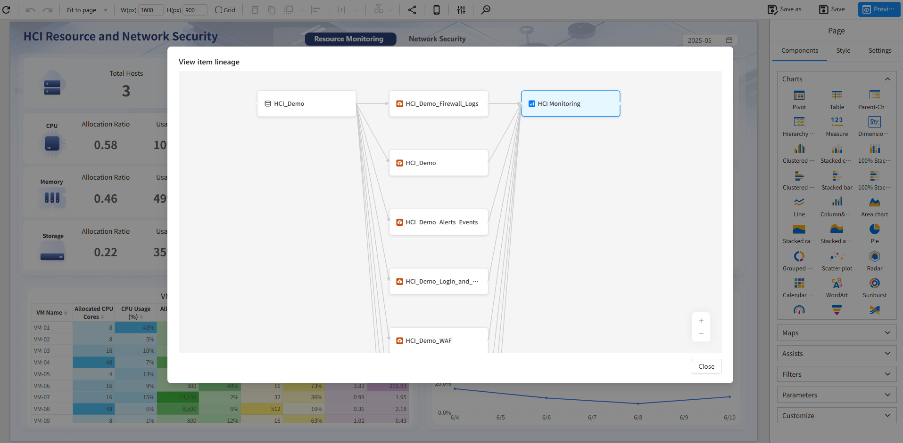
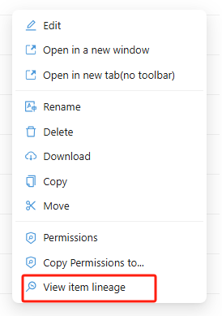
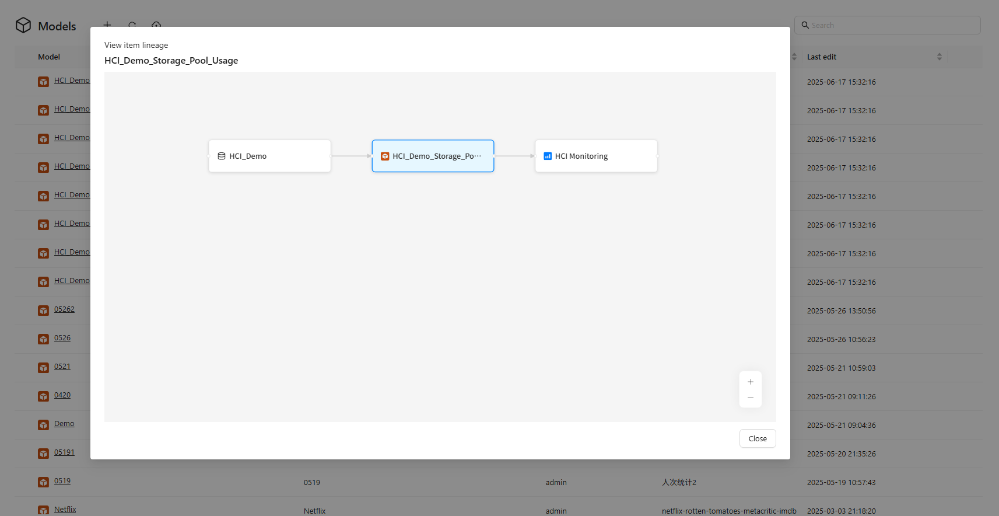
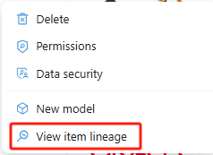
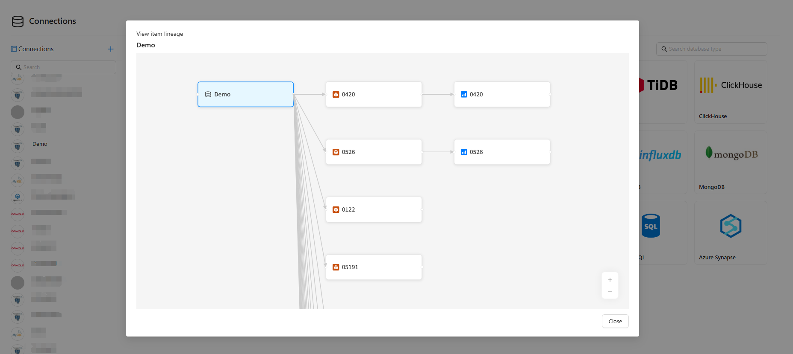

# 🔗 Lineage Analysis

**Lineage Analysis** is a powerful feature provided by Datafor BI that helps users trace the dependencies between reports, analytical models, and data sources. It offers a clear end-to-end view from the data source to the final report, supporting data governance, impact analysis, and troubleshooting.

With the lineage graph, you can easily understand:

- Which models and data sources a report depends on  
- Which reports use a given analytical model, and what data sources it relies on  
- Whether a data source affects multiple models and reports

## 1️⃣ View Report Lineage

1. In the **Report List**, find the report you are interested in and open it in "Edit" mode.

2. Click the `Lineage Analysis` button on the toolbar to open the lineage graph page.

   

3. The lineage graph displays the analytical models and data sources the report depends on.

   

## 2️⃣ View Analytical Model Lineage

1. Go to the **Model Management** page and select the target model.

2. Expand the model operation menu and click the `View item lineage` option.

   

3. The lineage graph will show the original data sources the model depends on, as well as the reports that reference it.

   

## 3️⃣ View Data Source Lineage

1. Go to the **Data Source Management** page and select the data source you want to inspect.

2. In the data source operation menu, choose the `Lineage Analysis` option.

   

3. The graph will show all models and reports that depend on the selected data source.

   

