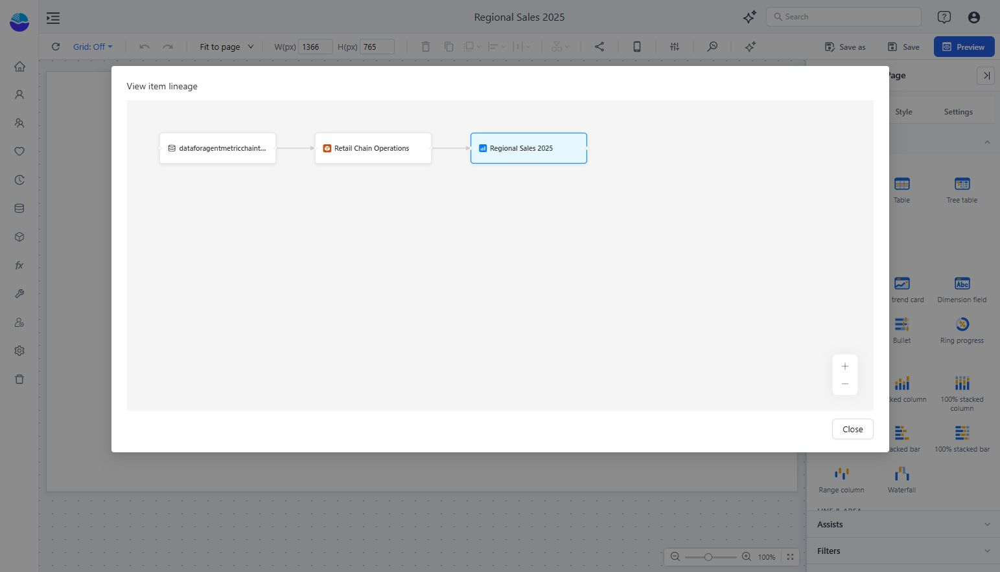

# Lineage Analysis

The lineage graph shows how items depend on each other, from left to right: **data source → analysis model → report**. Use it to find the model behind an unexpected chart, or the reports affected before you change or delete a model or a connection.

## Open it

| Starting point | Where | Graph shows |
| --- | --- | --- |
| A report | Report editor toolbar → **View item lineage**. A new report must be saved first; the button is disabled until then. | The report, the models its components use, and their data sources |
| A report in the content list | The file's actions menu → **View item lineage** (not offered on folders) | Same as above |
| An analysis model | The model's actions menu in the model list → **View item lineage** | The model, its data source, and the reports that use it |
| A data source | The connection's **Actions** menu → **View item lineage** | The connection, the models built on it, and their reports |

## Read the graph

- Nodes are colored by type, with an icon for report, model or data source. The item you started from is highlighted.
- A report that another report embeds or opens through drill-through appears in an extra column to the right of the reports that reference it.
- Hover a report to see its folder path.
- Click a node to highlight what it is connected to: for a report, its models and data sources; for a data source, its models and their reports; for a model, its direct neighbours. Click it again to clear the highlight.
- Use **+** and **−** to zoom, then **Close** to return.

## What you can see

The graph is built with your permissions. It lists models you can open and reports from **Public** and your own **Home** folder that you can read. Reports in other users' home folders and models you have no access to are not shown, so a data source can be used by more reports than the graph lists.
