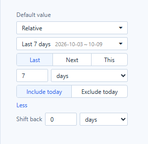
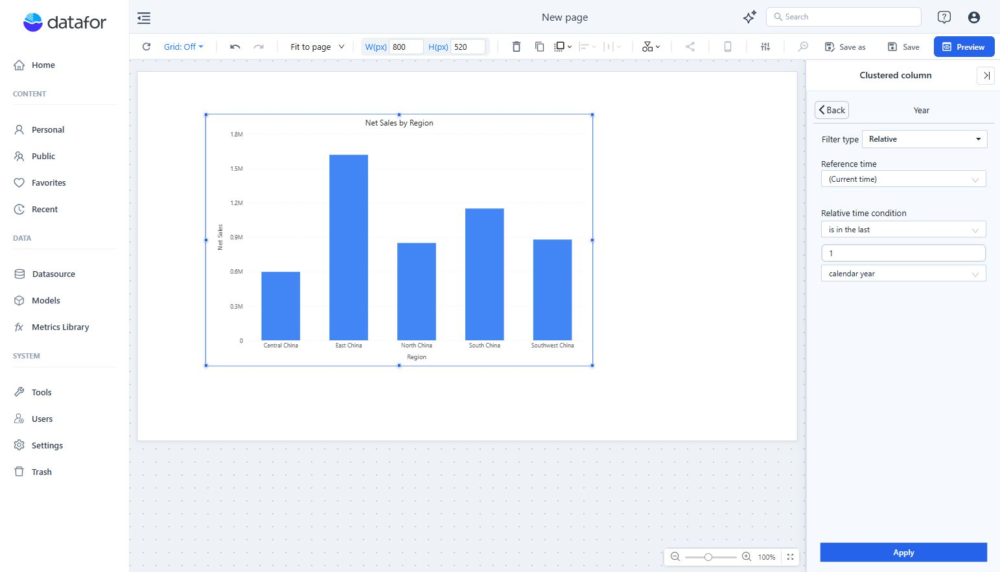

# Relative Date Filtering

A relative period, such as *Last Month* or *Year to Date*, is computed from the viewer's current date each time the report opens or refreshes, so the report never needs a manually updated date.

You can use relative periods in three places:

| Where | Setting | Use it for |
| --- | --- | --- |
| **Date** component | **Default value → Relative** | A date range or period that readers can still change. |
| **Dropdown**, **List box**, **Button group**, **Radio/Checkbox** on a year, quarter, month, week or day field | **Default value → Relative** | Preselecting the current or previous period in a member list. |
| Component filter | **Data → Filters → +**, then **Filter type → Relative** | A fixed rule on one chart, such as *the last 12 months*. |

## Presets

Each preset name means one exact range:

| Group | Presets (range selection) |
| --- | --- |
| Current period | Today, Week to Date, Month to Date, Quarter to Date, Year to Date, This Year to Last Month |
| Recent | Yesterday, Last 7 Days, Last 15 Days, Last 30 Days, Last 1 Month, Last 2 Months, Last 6 Months, Last 365 Days |
| Calendar months and years | This Month, This Quarter, This Year to This Month, Last 2/3/6/12/24/36 Calendar Months, This Year, Last Year, Last 2/3/10 Years |

- **Last N days, months or years** include today: on 9 October 2026, *Last 7 Days* is 3–9 October and *Last 365 Days* is 10 October 2025 – 9 October 2026.
- **Last N Calendar Months** are whole calendar months, while *Last 365 Days* is a rolling window; *Month to Date* is the current month up to today. Check the range shown next to each preset.
- The list in the Date component shows the range each preset resolves to today, so you can check it before saving.

## Custom rules

At the end of every relative list, **Custom…** builds a rule from parts:

- **Direction**: **Last**, **Next** or **This** for a range; **Current**, **Back** or **Ahead** for a single period.
- **Number and unit**: 1–9999 days, weeks, months, quarters or years, never finer than the field.
- **Rolling** (exactly N units back from today) or **Calendar** (whole units); for **This**: **To date** or **Whole period**.
- **Include today** / **Exclude today** (or the current week, month… for calendar units).
- **More → Shift back**: move the whole range back, for example *the last 7 days, one year ago*.

Examples:

| Question | Rule |
| --- | --- |
| The last three full months | Last · 3 · months · Calendar · Exclude current month |
| The same month last year | Back · 12 · months (single period) |
| The last 7 days a year ago | Last · 7 · days · Include today · Shift back 1 year |

## Component filters

1. Select the chart and open **Data → Filters → +**.
2. Select a date field or a time level.
3. Set **Filter type → Relative**, then choose **Reference time**, the **Relative time condition**, the number of periods and the unit.
4. Click **Apply**.

## Things to check

- **No data yet.** A relative period after the last loaded date returns no data. In a list filter the period is shown in red with a strikethrough and still applied; charts say *No data under the current filters*, and **View conditions** shows the range.
- **Weeks** start on the day set in **Settings › General › System configuration › Modeling › First day of the week**.
- **Older reports**: *Last 7 Days* and the other *Last N* presets cover one day less than before 9.04.6, and *Last Year*, *Last Month*, *Last Quarter*, *This Year to Last Month* and *Year to Date* were corrected for edge cases.
- **URL values win**: a default passed in the URL replaces the relative default on the first load.

Related: [Date](/documentation/Visualization/Datepicker/) · [Dropdown, List Box, Button Group and Radio/Checkbox](/documentation/Visualization/List-Box/) · [Time Semantics and Default Time Settings](/documentation/Model/Time-Dimensions-and-Time-Intelligence/)
