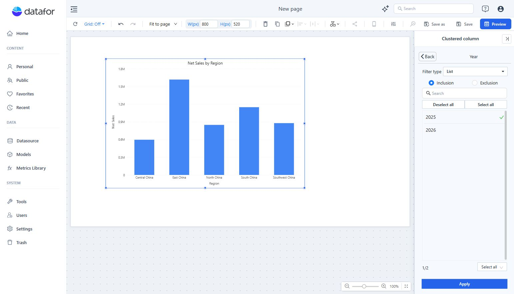
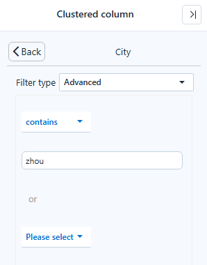

# Component-Level Filtering

Use a component filter to restrict one chart or table without adding a control to the page. Readers cannot change it.

## Apply a condition

1. Select the component and open **Data**.
2. Click **+** in the **Filters** area at the bottom.
3. Find and select the dimension or measure to filter.
4. Choose the **Filter type** and configure its condition.
5. Click **Apply**, then **Back**. The field is listed under **Filters**.

## Filter types

The **Filter type** list depends on the field:

| Field | Filter types |
| --- | --- |
| Text dimension | **List**, **Advanced** |
| Numeric dimension | **List**, **Advanced**, **Numeric** |
| Date or time level | **List**, **Relative**, **Advanced** |
| Measure | A value condition (no type list) |

**List** shows the field's members. **Inclusion** keeps the selected members and **Exclusion** removes them. Search narrows the member list; **Select all** and **Deselect all** help with a large selection.

**Advanced** on a text or numeric dimension matches members by a rule: **Equal**, **Is in**, **contains**, **does not contain**, **starts with** or **ends with**, for example *Product contains "Organic"*. A second condition can be added, joined with *or*. Use it when the members that should pass change over time, so a fixed list would go stale.

**Numeric** filters a numeric dimension by value: **is less than**, **is less than or equal to**, **is**, **is not**, **is greater than or equal to**, **is greater than**, a range such as **is greater than or equal to & less than**, **is blank** or **is not blank**.

**Relative** keeps a period relative to today; see [Relative dates](#relative-dates) below.

**Advanced** on a date or time level compares the dates with **before**, **before or equal to**, **equal to**, **after** or **after or equal to**, and can combine conditions with *and* or *or*, for example after 2025-01-01 and before 2025-07-01.

## Relative dates

**Relative** keeps a period relative to today, such as this year or the last 3 months, and is recalculated every time the report opens or refreshes. It is offered only when the field's date format starts with the year (for example `yyyy-MM`); a level such as Month name without the year offers **List** and **Advanced** only.

1. Select the chart and open **Data → Filters → +**.
2. Select a date field or a time level.
3. Set **Filter type → Relative**, then choose **Reference time**, the **Relative time condition**, the number of periods and the unit.
4. Click **Apply**.

Presets and custom rules are described in [Relative Date Filtering](/documentation/Analysis/Relative-Date-Filtering/).

## Filter by a measure value

Selecting a measure under **Filters** opens a value condition with the same operators as **Numeric**. It keeps the categories whose measure value meets the condition, for example only the regions with Net Sales greater than 1,000,000. The value tested is the one the component shows for that category, with the other filters applied.

## Change or remove a filter

Click its field under **Filters** to edit it. Hover the field and use its remove control to remove the condition.

The component's own filters are listed under **Own** in the toolbar's **Conditions** button, next to filter components, clicks on other charts and URL values. If a result is unexpectedly empty, open **Conditions** first: the empty component says *No data under the current filters* and offers **View conditions**.

For a condition readers can change on the canvas, add a [filter component](/documentation/Visualization/Filters/) and configure its linked components.
