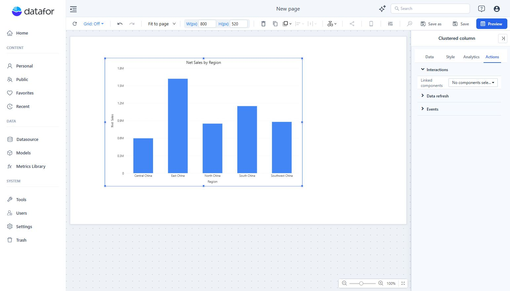

# Cross-Filtering

Select a data point in one chart to focus linked components on that category.

## Set up the interaction

1. Place the source chart and the target components on the report.
2. Select the source chart. Open **Actions → Interactions → Linked components**.
3. Choose the components that should respond.
4. Open **Preview**, select a category in the source, and inspect the targets.

For example, use a sales-by-region chart to filter a product table. Confirm that selecting a region changes the table's values to that region. A chart with no linked targets should not be used as evidence that the interaction is broken.

Component filters continue to restrict each target. Inspect the component toolbar's conditions indicator when a result seems too small or empty.

Use a visible filter control when readers need an explicit list, date range, or search input. See [Link Filters and Charts](/documentation/Visualization/Filter-Subscriptions/) for target configuration.
