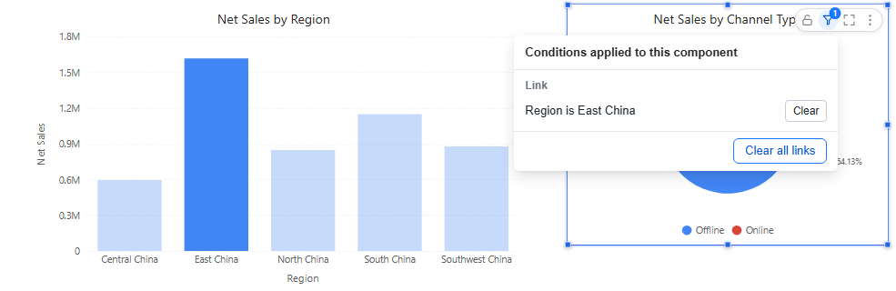

# Cross-Filtering

Clicking a data point filters the components linked to the chart: click *East China* in a sales-by-region chart and the channel pie shows East China only. The clicked chart keeps its data and highlights the selection.

## Set it up

1. Select the source chart and open **Actions → Interactions → Linked components**.
2. Choose the components that should follow the clicks.
3. Check **Page → Settings → Interaction → Enable chart interactions** (on by default). It turns cross-filtering on or off for the whole page.

Cross-filtering also works in the editor, so you can test it without previewing.

## Clicking rules

| Action | Result |
| --- | --- |
| Click a point | Filters the linked components by that point only. Selections in other charts are cleared. |
| **Ctrl**+click (**Cmd** on a Mac) | Adds to the selection. Points in the same chart are combined with OR, selections in different charts with AND. |
| Click the selected point again, or blank space in the chart | Cancels the selection. |
| Right-click → **Filter other charts** | Same as a click. |
| Change any filter component | Clears all chart selections. |

In a table, a click highlights the clicked row only. In a decomposition tree, click a selected node again to cancel; the root's **Clear selection** cancels links in other components.

## See and clear link conditions

A component filtered by a click shows a blue funnel with a count in its toolbar: **Conditions applied to this component**. Click it to see the conditions grouped by source:

| Group | Contains |
| --- | --- |
| **Link** | Clicks on other charts. Each has **Clear**; **Clear all links** removes them all. Links created by drilling are listed but cannot be cleared here. |
| **Filter** | Filter components on the page, such as a Date or Dropdown. |
| **Passed in** | Values from the URL or from a drill-through. |
| **Own** | The component's own filters (Data → Filters). |

When a link leaves no rows, the component says *No data under the current link conditions* and offers **Clear links**.

## Components on another model

A click on a chart from model A filters a component on model B only by the fields that exist in model B. If none of the clicked fields exist there, the component is not re-queried. See [Cross-Model Analysis](/documentation/Analysis/Cross-Model/).

For an explicit choice readers can see, use a [filter component](/documentation/Visualization/Filters/) instead.

Related: [Drill Down](/documentation/Analysis/Drill-down/) · [Linking and Cascading Filters](/documentation/Visualization/Filter-Subscriptions/)
