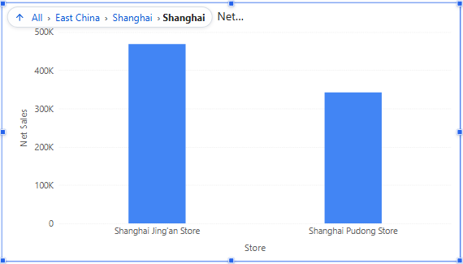
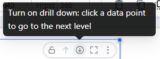

# Drill Down

Drilling down replaces a level with the next, more detailed level for the clicked member: *Region → Province → City → Store*. Readers can drill in the report and authors in the editor.

## Requirements

- The field on the category axis (or the table's row field) is a level of a model hierarchy with a level below it. See [Creating Hierarchies](/documentation/Model/Creating-Hierarchy/).
- Legend fields do not drill.
- Not available on Calendar chart, Radar, filter components and the Hierarchy table filter. The Decomposition tree has its own **Reset drill**.

## Drill down

Either:

- **Right-click** a bar, point or cell and choose **Drill down to “Province”**. This works without turning anything on.
- Or point to the component, click the drill-down button in its toolbar, then click data points. While it is on, the button shows a dark filled circle; clicking a point drills instead of filtering other charts. Click the button again to go back to filtering.

Hold **Ctrl** (**Cmd** on a Mac) while clicking to filter other charts even while drill-down is on. At the most detailed level, a click shows *Has reached the most detailed data level and cannot continue to drill down*.

## Go back

| To | Do this |
| --- | --- |
| Go up one level | **Drill up** (the up arrow) in the toolbar or in the drill path, or right-click → **Drill up one level** |
| Go back to an earlier level | Click that segment in the drill path, for example *East China* |
| Return to the start | Click **All** in the drill path |

The drill path lists the members you clicked: *All › East China › Shanghai › Shanghai*. When the component is narrow it is shortened to the last segments; hover it to see the full path. The title and the axis name show the current level. The drill path is not included in image or PDF exports.

Going back also restores what drilling did to linked components: they re-query for the level you return to.

## Troubleshooting

| Symptom | Check |
| --- | --- |
| No drill item in the menu | The field is not a hierarchy level, or it is the lowest level. |
| Drilling filters other charts instead | Ctrl was held, or you clicked a legend item. |
| The chart drills but other charts do not follow | They are not linked: Actions → Interactions → **Linked components**. |

Changing a hierarchy in the model changes drilling in every report that uses it; re-test those reports.

Related: [Cross-Filtering](/documentation/Analysis/Cross-Filtering/) · [Drill through](/documentation/Analysis/Drill-through/) · [Exploratory Analysis](/documentation/Analysis/Exploratory-Analysis/)
