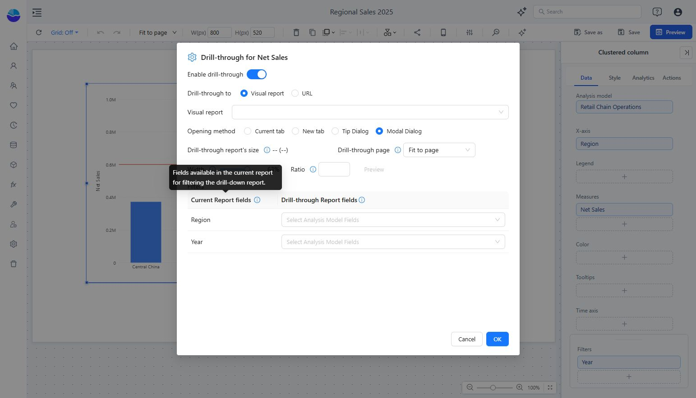

# Drill through

Open a detailed report or URL from a selected value in a summary component.

1. Select the component and open the field’s **More → Drill through** menu.
2. Enable **Enable drill-through**.
3. Choose **Drill-through to → Visual report** or **URL** and set the destination.
4. Choose **Opening method**: Current tab, New tab, Tip Dialog, or Modal Dialog.
5. For a dialog, configure **Drill-through page**, **Width**, and **Ratio** as needed.
6. Under **Filters**, map **Current Report fields** to **Drill-through Report fields**. Review both the selected category and existing filters, such as Year.
7. Click **OK** and test the configured field in Preview.

Check that the destination opens with the expected context and that the intended reader can access it. Test two different categories; an unchanged destination result often indicates a missing or incorrect mapping.

[Drill down](/documentation/Analysis/Drill-down/) changes the hierarchy level within the current chart. Drill through opens another destination.
