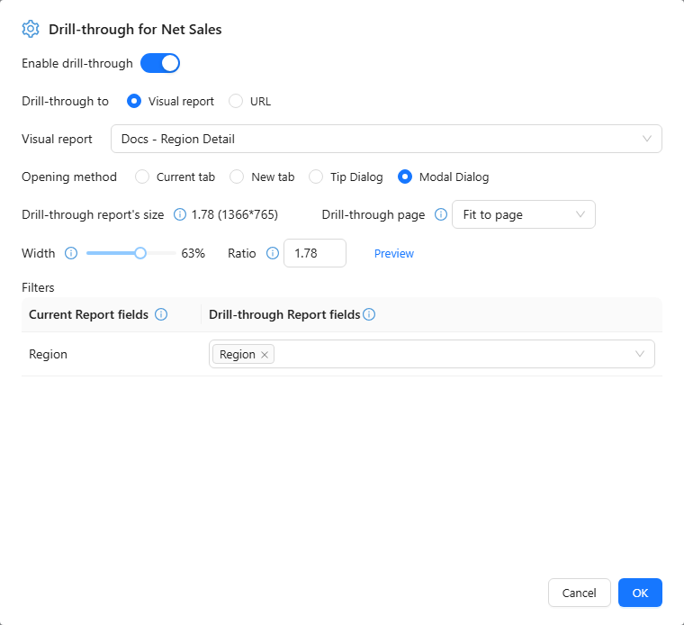

# Drill through

Drill through opens a detail report or a web address from a value the reader clicks, and passes the clicked member along: click *East China* in a summary and the store report opens filtered to East China.

## Set it up

1. Select the component, hover the measure field in **Data** (for example Net Sales) and choose **⋮ → Drill through**. Readers then drill through by clicking a data point.
2. Turn on **Enable drill-through**.
3. Choose **Drill-through to**: **Visual report** (pick the report) or **URL** (enter the **Address**).
4. Choose the **Opening method**: **Current tab**, **New tab**, **Tooltip** or **Pop-up**. For these two set **Drill-through page**, **Width** and **Ratio**.
5. Under **Filters**, map **Current Report fields** to **Drill-through Report fields**, for example *Region → Region* and *Year → Year*.
6. Click **OK** and test with two different members.

### URL placeholders

A URL **Address** can contain placeholders that are replaced by the clicked row, URL-encoded:

| Placeholder | Replaced by |
| --- | --- |
| `{{Region}}` or `{{[Store].[region].[region]}}` | The member of that field in the clicked row (by caption or unique name) |
| `{{value}}` | The raw value of the clicked cell |
| `{{formatted}}` | The displayed value of the clicked cell |

Example: `https://crm.example.com/accounts?region={{Region}}&sales={{value}}`. `{{value}}` and `{{formatted}}` are filled when the click comes from a Table or Pivot table cell. Missing values become empty. Only `http`, `https` and relative addresses are accepted.

## How readers use it

- **Tables and pivot tables**: click the cell.
- **Charts**: point to the chart and turn on the drill-through button in its toolbar (*Turn on drill through: click a data point to open the target report*), then click a data point. Only one of drill-down and drill-through is on at a time; with both off, a click filters other charts.
- **Right-click → Drill through** opens the target from the data point menu, without turning anything on.

The target report lists the passed values under **Passed in → Passed from jump** in each component's **Conditions**. A pivot table click that opens a drill-through does not also filter other charts.

## Checks

- The reader needs permission to open the target report.
- An unchanged target after clicking two different members usually means a missing or wrong field mapping.
- [Drill down](/documentation/Analysis/Drill-down/) changes the level inside the same chart; drill through opens a different report.
