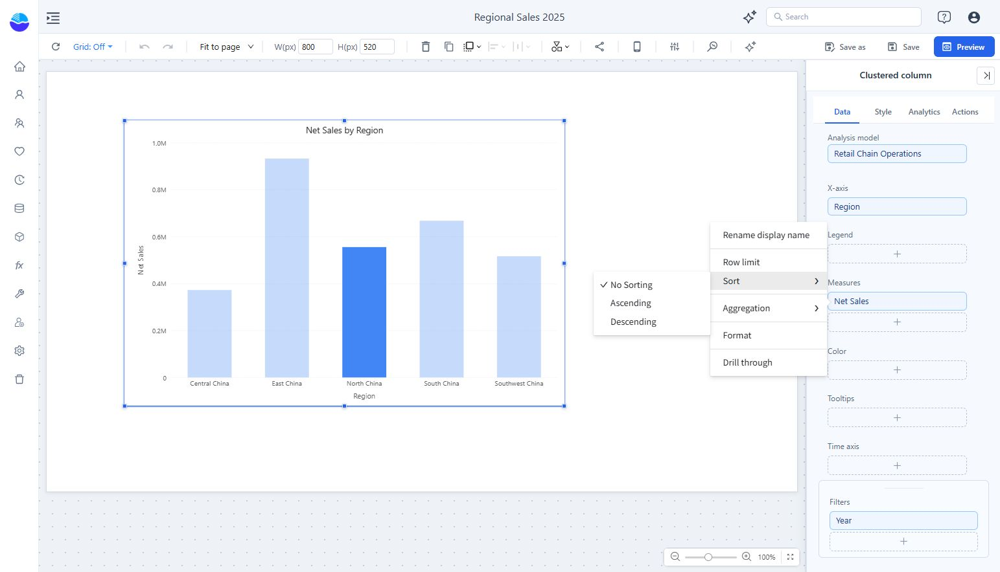

# Sorting

Sort categories by their own values or rank them by a measure.

1. Select the component and open **Data**.
2. Open the field’s **More** menu.
3. Choose **Sort → Ascending**, **Descending**, or **No Sorting**.
4. Check the displayed order in Preview, then save the report.

For a sales ranking, sort **Net Sales** descending. For an ordered time series, sort the time field rather than the measure.

If text labels require a business order, such as month names or priority labels, configure a suitable sort field in the Analysis Model. Alphabetical order and chronological order are different requirements.

Sorting changes order. Use [Row limit](/documentation/Analysis/Top-Bottom-N/) to restrict how many rows are returned.
