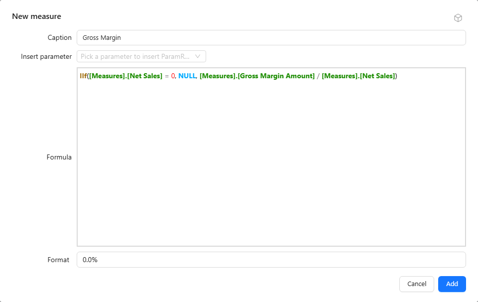

# Calculated Measures

Use a calculated measure for a ratio, variance, scenario, or other calculation that must respond to the query's grouping and filters. A calculated measure created in a report belongs to that report; to reuse it in other reports, define it in the model instead.

## Create one in a report

1. Select a component and open its field or measure picker in **Data**.
2. Choose **New measure → New measure**.
3. Enter **Caption**, **Formula**, and **Format**. **Format** starts as `#,##0.00`; change it to `0.0%` for a ratio.
4. Use **Insert parameter** when the formula needs a parameter reference.
5. Click **Add**, select the measure, and return with **Back**.



Formulas use MDX measure references, for example **[Measures].[Net Sales]**. A simple scaling expression is **[Measures].[Net Sales] / 1000**; label and format the result as thousands.

## Example: gross margin with a zero guard

Caption `Gross Margin`, Format `0.0%`:

```mdx
IIf([Measures].[Net Sales] = 0, NULL, [Measures].[Gross Margin Amount] / [Measures].[Net Sales])
```

The formula is evaluated for each cell of the result, including totals, so the total row shows the margin of the total, not the sum or average of the rows' margins.

Without the `IIf`, a category with Net Sales of 0 and a non-zero Gross Margin Amount returns infinity. A category where either measure is empty returns an empty cell, and Gross Margin Amount of 0 returns 0. The guard turns the zero case into an empty cell, which **Empty values as** can then display as `-` in tables.

## Where report measures appear

The measure picker lists report measures in the **Calculated measures** group at the end, together with the model's calculated measures. Report measures have an edit (pencil) and a delete (bin) icon; model calculated measures do not.

- A report measure is available to every component in the report that uses the same analysis model.
- **Edit** opens **Edit calculated measure**; click **Save**. Components that use the measure query again.
- **Delete** asks for confirmation and removes the measure from the report. Other components that use it query again, so check them after deleting.

## Report, model or calculated column

| Level | Scope | Evaluated |
| --- | --- | --- |
| Report calculated measure | This report | MDX, at query time on the aggregated result |
| [Model calculated measure](/documentation/Model/Measures-and-Calculated-Measures/) | Every report on the model | MDX, at query time on the aggregated result |
| [Calculated column](/documentation/Model/Calculated-Field/) | Every report on the model | SQL of the data source, row by row before aggregation |

For ready-made calculations such as year-over-year or percentage of total, see [quick measures](/documentation/Analysis/Quick-Calculated-Measures/). For parameter references, see [parameter formulas](/documentation/Analysis/Using-Parameters-in-Calculated-Measures/).
