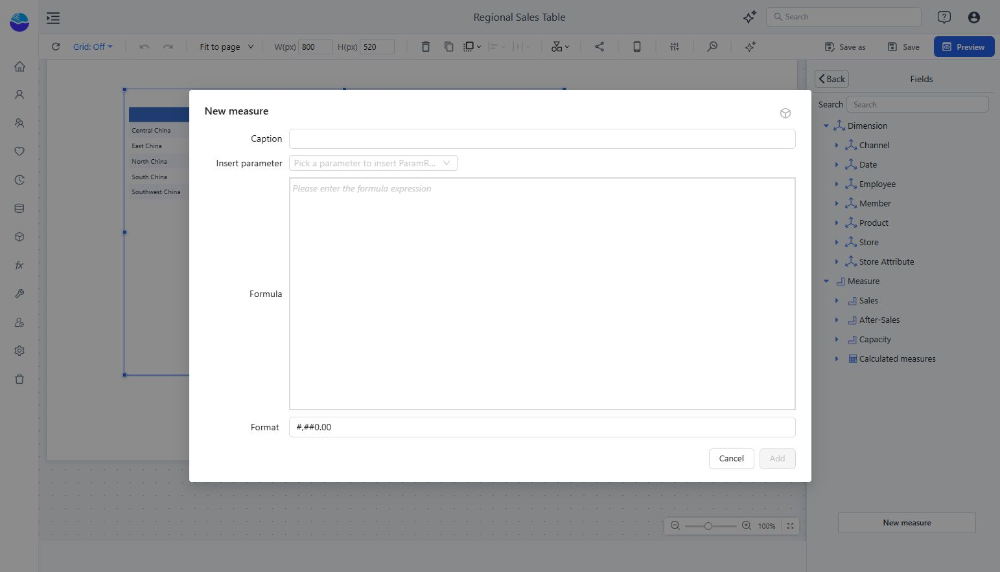

# Calculated Measures

Use a calculated measure for a ratio, variance, scenario, or other calculation that must respond to the query’s grouping and filters.

## Create one in a report

1. Select a component and open its field or measure picker in **Data**.
2. Choose **New measure → New measure**.
3. Enter **Caption**, **Formula**, and **Format**.
4. Use **Insert parameter** when the formula needs a parameter reference.
5. Click **Add**, select the measure, and return with **Back**.
6. Validate the rendered result and save the report.

Formulas use MDX measure references, for example **[Measures].[Net Sales]**. A simple scaling expression is **[Measures].[Net Sales] / 1000**; label and format the result as thousands.

Model-level calculated measures are reusable across reports. A calculated column instead evaluates row-level logic using the source’s SQL syntax. Choose the level that matches the calculation.

Test at more than one grouping level and with different filters. Saving a formula is not proof that its result is correct.

See [model-level measures](/documentation/Model/Measures-and-Calculated-Measures/), [quick measures](/documentation/Analysis/Quick-Calculated-Measures/), and [parameter formulas](/documentation/Analysis/Using-Parameters-in-Calculated-Measures/).
