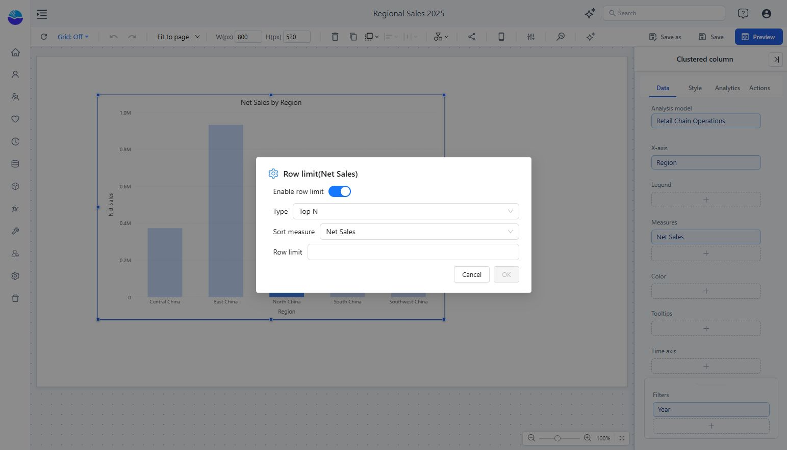

# Row Limit: Top and Bottom N

Return the highest or lowest categories according to a measure. The current field-menu entry is **Row limit**.

1. Select the component and open its measure’s **More** menu in **Data**.
2. Choose **Row limit** and enable **Enable row limit**.
3. Select **Type**: Top N or Bottom N.
4. Choose **Sort measure** and enter a positive **Row limit**, such as 10.
5. Click **OK**, then verify the returned categories and values.

For example, Top N with Net Sales and a limit of 10 gives a short sales ranking. Apply the intended period and business filters before interpreting the result. Recheck the ranking after changing those filters.
